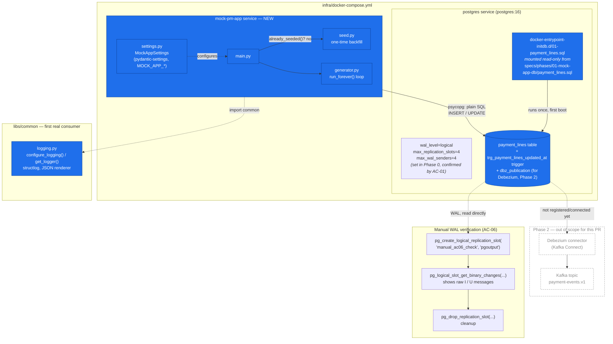
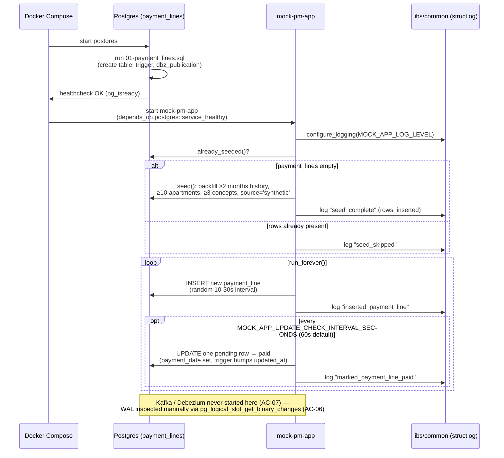

# Phase 1 — Mock App & `payment_lines` DB (PR #3)

Diagrams for reviewers of [PR #3 "Restructure phase 1 mock app db"](https://github.com/moradabaz/pms-price-engine/pull/3).
Scope is intentionally narrow: **Postgres + a synthetic data generator only**. Kafka, Zookeeper, and
Debezium already exist in `infra/docker-compose.yml` from Phase 0 but are **not started or touched** by
this PR (AC-07) — they're shown dashed/out-of-scope below for orientation, not because this PR changed them.

## 1. Component / data-flow diagram

**Legend:** solid blue boxes = built/changed in this PR. Dashed gray = exists conceptually (Phase 2 spec) but not started, wired, or touched here.

## 2. Runtime sequence — seed once, then generate forever

## What this PR does *not* include

- No Debezium, Kafka Connect, or `payment-events.v1` topic (Phase 2).
- No market ingestion, Flink, pricing logic, DynamoDB/Iceberg, or dashboard (Phases 3–6).
- No retry/failure handling in the generator beyond Compose's `restart: unless-stopped`.
