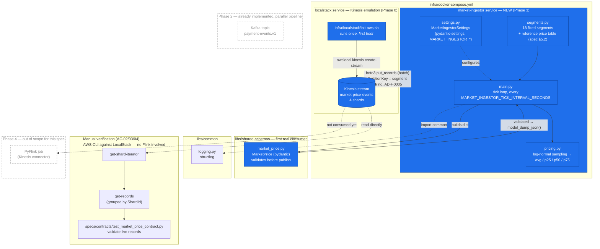
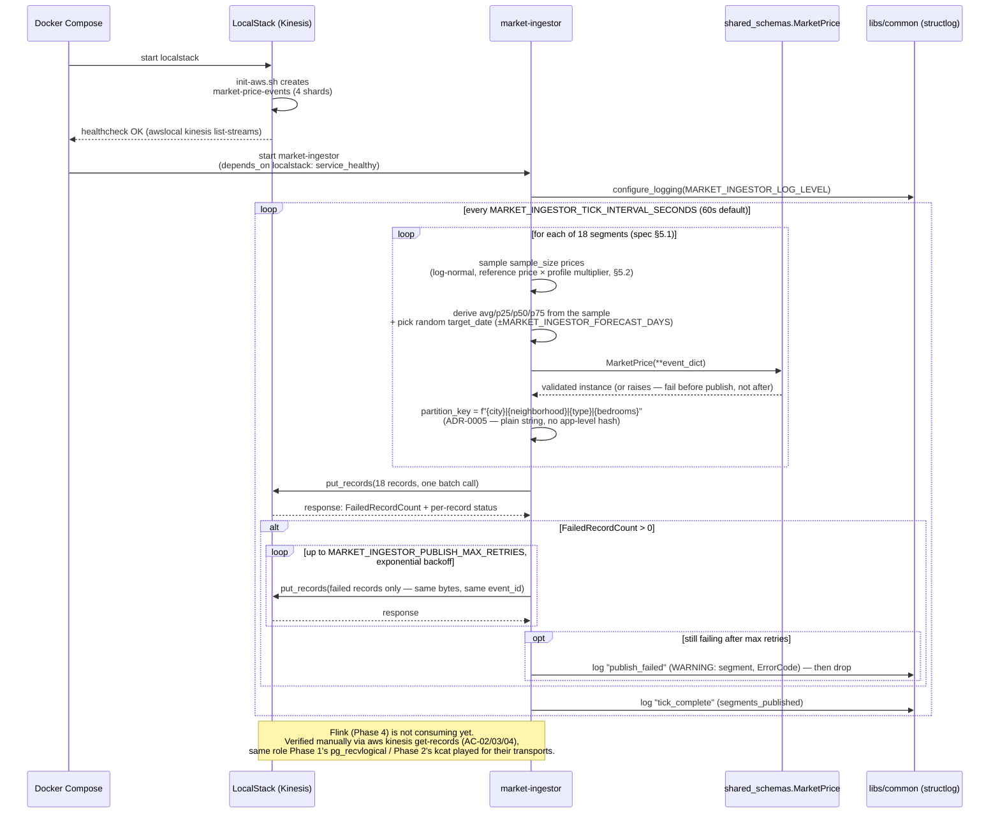
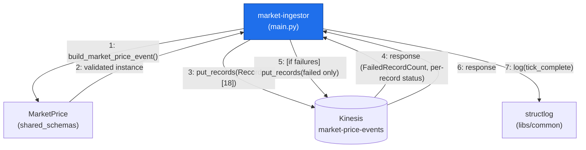
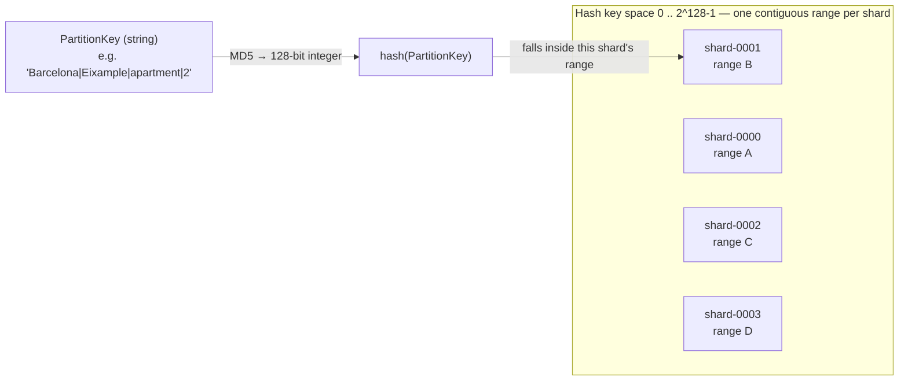
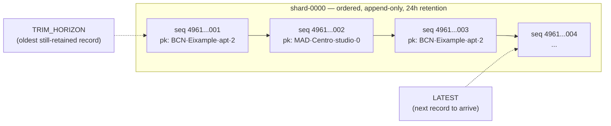
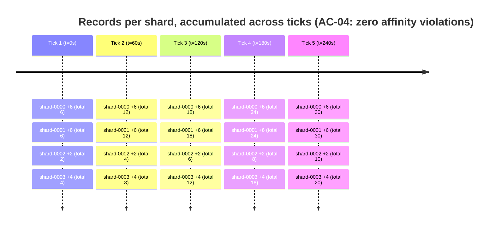

# Phase 3 — Market Ingestion (Kinesis)

Diagram for [`specs/phases/03-market-ingestion/spec.md`](../specs/phases/03-market-ingestion/spec.md) — implemented and verified live against a running LocalStack stack on 2026-07-25 (segment-hash partitioning per [ADR-0005](../docs/adr/ADR-0005-market-price-partition-key.md), log-normal price sampling per spec §5.2, bounded retry per spec §4). Verification covered both a direct `uv run` invocation and the actual `services/market-ingestor/Dockerfile` built and run via `infra/docker-compose.yml` — AC-02/03/04/06 all passed reading live records back from every shard, and the ADR-0005 hot-shard prediction was observed directly (a `30/30/10/20` record split across the 4 shards after several ticks). Scope is **`market-ingestor` + the `market-price-events` Kinesis stream only** — Phase 2's Kafka pipeline and Phase 4's Flink consumption are shown dashed, for orientation, not because this phase touches them.

## 1. Component / data-flow diagram

**Legend:** solid blue = to be built in this phase. Dashed gray = exists (LocalStack init from Phase 0) or is planned elsewhere (Phase 2, Phase 4) but not built/touched here.

## 2. Runtime sequence — one tick, including the retry path

## 3. Collaboration diagram — one tick's message exchange

Mermaid has no native UML collaboration/communication diagram type, so this is a flowchart used to
approximate one: a hub object (`main.py`) with numbered links to its collaborators, emphasizing *who talks
to whom* over strict time order (that's diagram 2's job).

## 4. How Kinesis's partition log actually works

Two mechanics this project's `PartitionKey` choice (ADR-0005) depends on: how a key maps to a shard, and
what a shard *is*.

**4.1 — `PartitionKey` → shard, via a 128-bit hash space**

Kinesis owns the hashing — the producer never computes it (spec §4, Failure handling / partition key
notes). The same string always hashes to the same 128-bit integer, which always falls in the same shard's
range — that's the entire mechanism behind ADR-0005's partition affinity (AC-04).

**4.2 — a shard is an ordered, append-only log — not a queue, not a table**

Sequence numbers are monotonically increasing **within a shard only** — there is no global ordering across
shards. Records from *different* partition keys freely interleave in the same shard if they hash to the
same range (exactly what happened here: 18 segments, 4 shards, several segments per shard by construction).
`GetShardIterator` (`ShardIteratorType`: `TRIM_HORIZON` / `LATEST` / `AT_SEQUENCE_NUMBER` /
`AT_TIMESTAMP`) returns an opaque cursor into one shard's log; `GetRecords` reads forward from that cursor
and returns a `NextShardIterator` to keep polling — this is exactly what the verification script in PR #5's
"How to test" section does, once per shard.

## 5. Timeline — log growth per shard, tick by tick

Reconstructed exactly from the live verification numbers (30/30/10/20 final split, §"What was verified" in
`docs/AUDIT_DIARY.md`) divided by the 5 ticks observed — affinity was 100% stable (AC-04, zero violations),
so the same 6/6/2/4 segments land on the same shards *every single tick*, not just on average.

The skew isn't random noise that might average out — it's a deterministic consequence of which 18 fixed
strings hash into which of the 4 ranges, so it repeats identically forever unless the key scheme or shard
count changes (ADR-0005's accepted trade-off).

## What this diagram does *not* include

- Phase 4 (Flink consuming `market-price-events`, joining against `payment-events.v1`, computing `price_decision.v1`).
- Phase 2's already-implemented Kafka/Debezium pipeline (shown only for orientation, dashed).
- The still-open Phase 4 dependency flagged in the spec's §8 (Follow-ups): nothing yet maps an `apartment_id` to a market segment — this diagram only covers producing the market side, not resolving that join.
