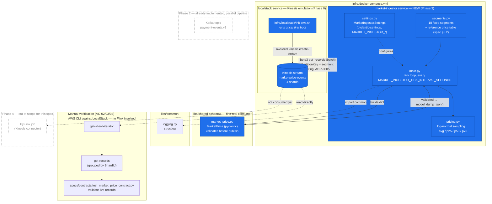
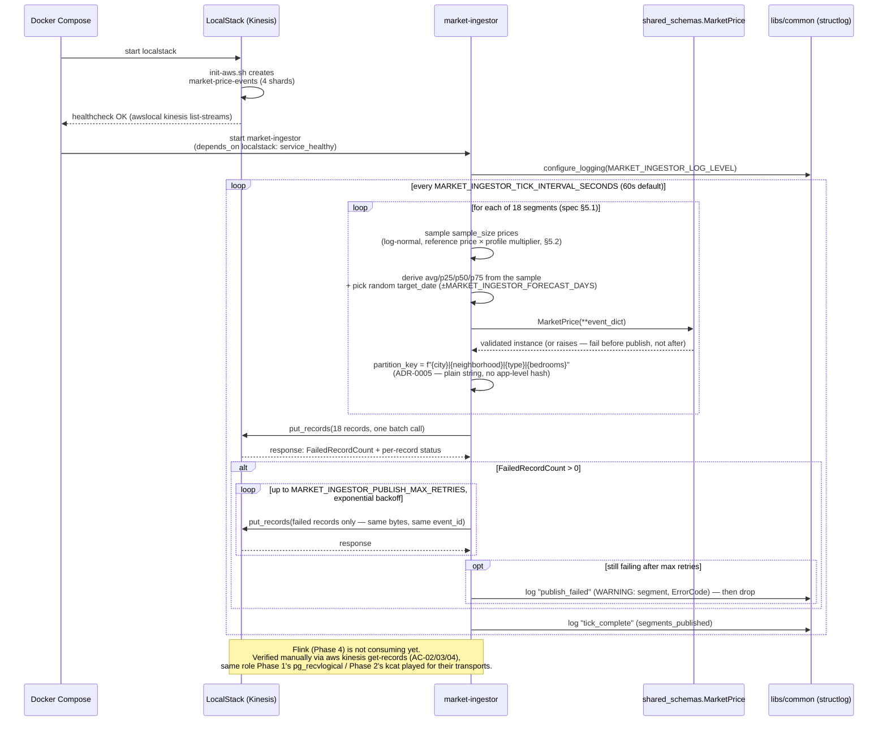

# Phase 3 — Market Ingestion (Kinesis)

Diagram for [`specs/phases/03-market-ingestion/spec.md`](../specs/phases/03-market-ingestion/spec.md) — implemented and verified live against a running LocalStack stack on 2026-07-25 (segment-hash partitioning per [ADR-0005](../docs/adr/ADR-0005-market-price-partition-key.md), log-normal price sampling per spec §5.2, bounded retry per spec §4). Verification covered both a direct `uv run` invocation and the actual `services/market-ingestor/Dockerfile` built and run via `infra/docker-compose.yml` — AC-02/03/04/06 all passed reading live records back from every shard, and the ADR-0005 hot-shard prediction was observed directly (a `30/30/10/20` record split across the 4 shards after several ticks). Scope is **`market-ingestor` + the `market-price-events` Kinesis stream only** — Phase 2's Kafka pipeline and Phase 4's Flink consumption are shown dashed, for orientation, not because this phase touches them.

## 1. Component / data-flow diagram

**Legend:** solid blue = to be built in this phase. Dashed gray = exists (LocalStack init from Phase 0) or is planned elsewhere (Phase 2, Phase 4) but not built/touched here.

## 2. Runtime sequence — one tick, including the retry path

## What this diagram does *not* include

- Phase 4 (Flink consuming `market-price-events`, joining against `payment-events.v1`, computing `price_decision.v1`).
- Phase 2's already-implemented Kafka/Debezium pipeline (shown only for orientation, dashed).
- The still-open Phase 4 dependency flagged in the spec's §8 (Follow-ups): nothing yet maps an `apartment_id` to a market segment — this diagram only covers producing the market side, not resolving that join.
