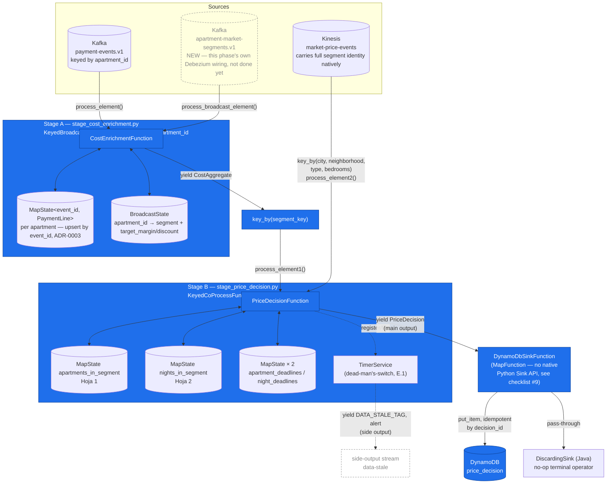
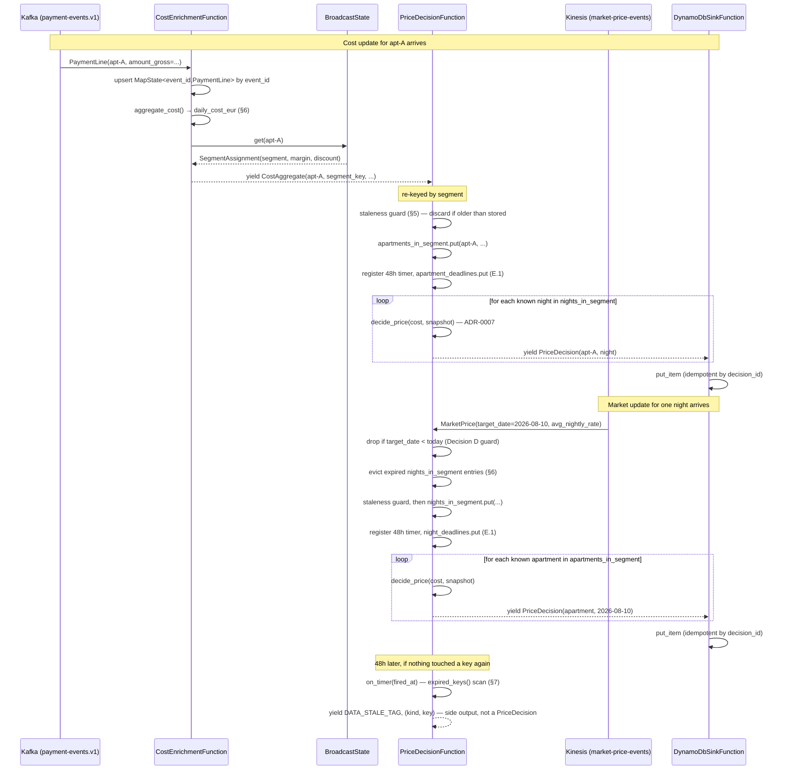

# Phase 4 — Flink Processing

Diagram for [`specs/phases/04-flink-processing/spec.md`](../specs/phases/04-flink-processing/spec.md) — implemented (`streaming/flink-jobs/`), not yet verified live against a running cluster (branch `phase-4-flink-processing`). Focus here is **how the Flink elements themselves talk to each other** inside `streaming/flink-jobs/` — the two-stage pipeline, its state, and the sink — not the surrounding infra (Kafka/Kinesis/DynamoDB are shown only as the boundary this job talks across).

## 1. Component diagram — state and control flow inside the job

**Legend:** solid blue = built and unit-tested (28 tests, no Flink runtime needed — `streaming/flink-jobs/tests/`). Dashed gray = depends on infrastructure this phase hasn't wired yet (`apartment-market-segments.v1` needs `infra/debezium/postgres-connector.json` updated, spec §4) or is a monitoring path (`data-stale`) with no consumer built yet.

## 2. Sequence diagram — a cost update and a market update, each triggering fan-out

Same numbers as the spec's worked example (§8): segment Barcelona/Eixample/studio, apartments `apt-A`/`apt-B`, nights `2026-08-10`/`2026-08-20`.

