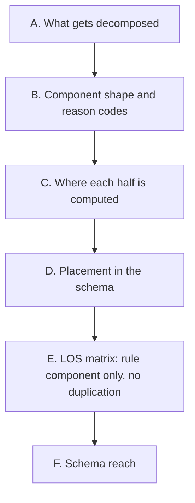

# Phase 10 — Decision Components design decisions (pre-spec)

Pre-spec for backlog item #4 (`docs/post-poc-roadmap.md`, ADR-0011) — structured reason codes for
pricing explainability. Not a formal spec — decisions confirmed with the user before writing
`specs/phases/10-decision-components/spec.md`.



---

## A. What gets decomposed

**Confirmed:** two independent sources, combined into one `decision_components` list — not a single
source alone:

1. **Property Bonus/Malus** (Phase 8) — `property_attribute_factor` is today one opaque scalar
   hiding four independent contributions (`quality_tier`, `rating`, `has_view`, `has_parking`).
   Phase 8's own spec flagged this exact gap as a named follow-up ("a future Decision Components
   phase can decompose this later using the same weights").
2. **Rule decision** (ADR-0009) — `rule_applied` is a closed 3-value enum with no attached reason;
   nothing today states *how much* headroom or overage decided `market_competitive` vs.
   `minimum_floor` vs. `cost_protected`. ADR-0011 named this as the actual motivating case for
   backlog #4: "#5/#7/#9 both need somewhere to record which rule fired."

**Rejected:** decomposing `minimum_price_eur` itself into its cost/margin/commission terms — those
terms are already individually visible as separate fields on `cost_inputs`/`calculation`
(`fixed_cost_eur`, `variable_cost_eur`, `one_time_cost_eur`, `target_margin`, `commission_pct`), so a
component list would just restate existing fields rather than reveal anything hidden.

## B. Component shape and reason codes

**Confirmed:** one shape for every component, regardless of source:

```
DecisionComponent:
  code: ReasonCode   # closed enum, stable across specific attribute values
  label: str         # human-readable, carries the specific value (e.g. "Rating 4.8 vs baseline 4.0")
  impact: float      # signed magnitude, unit depends on the code family (see below)
```

`code` stays a small closed set independent of *which* value was observed — mirroring how
`rule_applied` is already a stable 3-value enum regardless of the numbers that produced it — so the
specific value (which tier, which rating) lives in `label`, not in a proliferating enum:

```
ReasonCode =
  "property_quality_tier" | "property_rating" | "property_view" | "property_parking"
  | "rule_market_competitive" | "rule_minimum_floor" | "rule_cost_protected"
```

**`impact`'s unit is contextual to the code family**, the same way `below_market_by`'s sign is
already contextual to `rule_applied` today:
- `property_*` codes: the signed adjustment *fraction* that code contributed to
  `property_attribute_factor` before the `1 + Σadjustments` clamp (e.g. `luxury` → `+0.30`).
- `rule_*` codes: the signed price gap in EUR that decided the branch (e.g. `cost_protected` →
  `minimum_price_eur - property_reference_price_eur`, always `> 0` since that's what makes it fire).

**All four `property_*` components are always emitted, even at zero impact** (e.g. `quality_tier =
"standard"` → `impact = 0.00`, `has_view = false` → `impact = 0.00`). A deterministic, always-4-entry
property block is simpler to query in dbt/the dashboard than a variable-length list that silently
omits no-op attributes — "evaluated, no effect" is still informative.

**Exactly one `rule_*` component is emitted per decision** (whichever rule actually fired) — there
is only one `rule_applied` per `Calculation`/`LosFloorCandidate`, so there is only one rule component
to explain it, not three candidates with two discarded.

## C. Where each half is computed

**Confirmed:** same split of responsibility the codebase already uses for the plain
`property_attribute_factor` float and `rule_applied` enum — nothing new invented, just extended to
also emit a component:

- **Property components** — `property_attributes.py` gains `property_attribute_components(...) ->
  list[DecisionComponent]`, computed once in Stage A (`CostEnrichmentFunction`), same place
  `property_attribute_factor(...)` is already called. `property_attribute_factor()` itself is
  refactored to sum `property_attribute_components(...)`'s impacts (`1 + Σimpact`, then clamp) —
  the weights live in exactly one place, not two. `CostAggregate` gains
  `property_decision_components: tuple[DecisionComponent, ...] = ()`, mirroring how it already
  carries the resolved `property_attribute_factor` float rather than the four raw attributes.
- **Rule component** — a new pure helper in `pricing.py`, `rule_decision_component(rule_applied,
  minimum_price_eur, market_reference_price_eur, property_reference_price_eur) ->
  DecisionComponent`, called once inside `decide_price()` after `rule_applied` is decided. No new
  parameter needed to control this — it always fires, the same way `rule_applied` itself always gets
  set.

**A new tiny shared module**, `streaming/flink-jobs/src/flink_jobs/decision_components.py`, holds the
one `DecisionComponent` dataclass and the `ReasonCode`/`PropertyReasonCode`/`RuleReasonCode` Literal
aliases — imported by both `property_attributes.py` and `pricing.py`. Without this, the two modules
would each need their own near-identical `(code, label, impact)` dataclass, which is exactly the kind
of duplication the project's standing SOLID/DRY guidance rules out. This is the same shape as the
existing small single-concern modules (`cost_aggregation.py`, `staleness.py`, `eviction.py`,
`watchdog.py`, `property_attributes.py` itself) — one new module for one new shared concern.

`decide_price()` gains one new optional parameter, `property_decision_components:
Sequence[DecisionComponent] = ()` — decoupled from *where* they came from, the same way it's already
decoupled from the raw attributes behind `property_attribute_factor: float`. Its returned
`PriceCalculation.decision_components` is `[*property_decision_components, rule_component]`.

## D. Placement in the schema

**Confirmed:** inside `calculation`, as a sibling of `los_floor_matrix` — not a new top-level field on
`PriceDecision`. Phase 9 already established that a list field works fine directly on `Calculation`
(`extra="forbid"` blocks unlisted keys, not list-typed ones); ADR-0011's original note that
Decision Components "needs a new top-level model" predates that precedent and is superseded by it.
Keeping it inside `calculation` also keeps every calculation-derived fact (the floor, the rule, the
LOS matrix, and now the reasons behind them) in one place.

`calculation.decision_components: list[DecisionComponent]` — 5 entries in practice for this phase (4
property + 1 rule), applying to the `stay_length = 1` top-level decision.

## E. LOS matrix: rule component only, no duplication

**Confirmed:** each `LosFloorCandidate` gains its own `decision_components`, but containing **only**
that candidate's rule component (1 entry) — not the 4 property components repeated. Property
Bonus/Malus (`property_attribute_factor`, and now its component breakdown) does not vary with
`stay_length` (§A of the Phase 9 pre-spec: only `minimum_price_eur` and what depends on it varies) —
repeating 4 identical entries across all 5 LOS candidates would be the same redundant-data problem
Phase 9's own §D already rejected for `property_attribute_factor`/`market_reference_price_eur` at the
candidate level.

Mechanically, this falls out of `decide_price()`'s existing parameter rather than needing a second
code path: `decide_price_los_matrix()` calls `decide_price()` per candidate **without** forwarding
`property_decision_components`, so each candidate's internal `PriceCalculation.decision_components`
is naturally just `[rule_component]` — no separate helper call, no slicing, no risk of the two lists
drifting apart, since both paths go through the exact same `rule_decision_component()` call inside
`decide_price()` itself.

## F. Schema reach

**Confirmed:** `price_decision.v1`'s `calculation.decision_components` and
`calculation.los_floor_matrix[].decision_components` are both new array-of-object fields — additive,
no `schema_version` bump (same precedent as Phases 8/9). Unlike Phase 9, this is **not** a new shape
for any serialization layer: `los_floor_matrix` already proved `dynamodb_sink.py`'s list handling and
`iceberg_writer.py`'s `union_by_name` migration both work for list-of-struct fields — the
error-handling write-up for that incident named this exact field (`decision_components:
list[DecisionComponent]`) as the next thing that would exercise the same path, now already covered.
The only new wrinkle is a **list nested inside a list** (`los_floor_matrix[].decision_components`) —
worth one explicit test rather than assuming the existing coverage generalizes automatically.

`lakehouse-consumer/schema.py` gets new field IDs starting at 49 (last used: 48, Phase 9),
appended — never inserted before existing IDs, same rule the module docstring already states.

---

## Balance

**Confirmed:** A (both Bonus/Malus breakdown and rule-decision explanation, not cost-term breakdown —
combined into one list), B (`DecisionComponent{code, label, impact}`, 7-value closed `code` enum,
`impact`'s unit contextual to the code family, all 4 property components always emitted including
zero-impact ones, exactly 1 rule component), C (property components from `property_attributes.py` in
Stage A, rule component from a new `pricing.py` helper, both dataclasses sharing one new
`decision_components.py` module), D (lives inside `calculation`, sibling of `los_floor_matrix`, no new
top-level model), E (`LosFloorCandidate.decision_components` holds only its own rule component, not
the property block, achieved by simply not forwarding `property_decision_components` into the
per-candidate `decide_price()` calls), F (additive schema change; the list-of-struct mechanics are
already proven by Phase 9, the one new wrinkle is a list nested inside `los_floor_matrix`'s own list).
