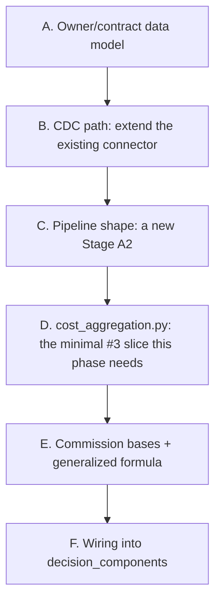

# Phase 11 — Owner Contract & Commission Base design decisions (pre-spec)

Pre-spec for backlog item #5 (`docs/post-poc-roadmap.md`, ADR-0011) — a configurable commission
calculation base, replacing the implicit "commission is charged on Total Revenue" assumption
`commission_pct` has carried since ADR-0009. Not a formal spec — decisions confirmed with the user
(owner grain, CDC path, phase scope) before writing `specs/phases/11-owner-contract/spec.md`; the
remaining technical calls below (pipeline shape, formula derivation, decision-components wiring) are
proposed here for review, same pattern Phase 9's pre-spec used for its own architectural call.



---

## A. Owner/contract data model

**Confirmed with the user:** a real 1-owner-to-N-apartments model, not a 1:1 "contract per
apartment" table wearing owner-shaped naming. Two new Postgres tables:

```sql
CREATE TABLE owners (
    owner_id    TEXT PRIMARY KEY,
    owner_name  TEXT NOT NULL,
    created_at  TIMESTAMPTZ NOT NULL DEFAULT now()
);

CREATE TABLE owner_contracts (
    apartment_id     TEXT PRIMARY KEY REFERENCES apartment_market_segments(apartment_id),
    owner_id         TEXT NOT NULL REFERENCES owners(owner_id),
    commission_base  TEXT NOT NULL DEFAULT 'total_revenue'
                          CHECK (commission_base IN ('total_revenue', 'revenue_minus_ota', 'revenue_minus_ota_minus_cleaning')),
    commission_pct   NUMERIC(5,4) NOT NULL DEFAULT 0.15
                          CHECK (commission_pct >= 0 AND commission_pct <= 1),
    created_at       TIMESTAMPTZ NOT NULL DEFAULT now(),
    updated_at       TIMESTAMPTZ
);
```

`owner_contracts.apartment_id` is both its PK and the join key back to `apartment_market_segments`
— one active contract per apartment at a time (matching this repo's existing "no history, current
state only" convention for every other config table), while `owner_id` lets several apartments share
the same owner, the actual point of modeling a real owner entity instead of a flat per-apartment
row. `mock-pm-app` synthesizes a small pool of owners (e.g. 5-8) and assigns each seeded apartment to
one, so the CDC stream this phase adds has genuine many-to-one structure to exercise, not just a
relabeled 1:1 table.

**A real removal, not another additive column — flagged explicitly.** `commission_pct` **moves out
of** `apartment_market_segments` into `owner_contracts`; it is not duplicated in both places. Every
prior phase (8, 9, 10) was purely additive — this is the first phase since ADR-0009 to actually
relocate an existing field. Keeping it in both tables would create two sources of truth for the same
number, exactly the kind of drift the project's standing SOLID/DRY guidance rules out. This is the
"acceptable, planned remodel" ADR-0011's own Consequences section already pre-authorized ("if a
future increment requires breaking an existing schema... that is treated as an acceptable, planned
remodel... since the project is a PoC with no production consumers yet") — the same reasoning
ADR-0007/ADR-0009 already used once each. Concretely: `ApartmentSegmentRow`/`SegmentAssignment`
(`streaming/flink-jobs/src/flink_jobs/models.py`) lose `commission_pct`; a new
`OwnerContractRow`/`OwnerContractAssignment` pair gains it (plus `commission_base`).

**Why not model `owners` as its own CDC-captured stream too:** nothing downstream (Flink, the
pricing formula, the dashboard) needs `owner_name` or any owner-level aggregation yet — only the
already-resolved `(commission_base, commission_pct)` pair per apartment matters to `decide_price()`.
`owners` stays a plain Postgres dimension table, seeded once, joined only by `owner_id` FK integrity
— not wired into Debezium. Only `owner_contracts` (already apartment-grain, already resolved) needs
to reach Flink, the same shape `apartment_market_segments` already provides for `target_margin`/
`competitiveness_discount`.

## B. CDC path: extend the existing connector, don't create a new one

**Confirmed with the user:** a real new CDC stream reaches Flink, not a Postgres-side resolution
that leaves Flink's existing pipeline shape untouched — this project's stated learning focus (README)
is CDC/streaming, and a second broadcast source is exactly the kind of pattern worth exercising for
real.

**Found while designing this phase:** this does **not** need a second Debezium connector.
`apartment_market_segments` itself already reuses the *same* connector and publication as
`payment_lines` — one connector, `table.include.list` naming multiple tables, each routed to its own
Kafka topic via its own `RegexRouter` transform
(`infra/debezium/postgres-connector.json:13,37-39`). Adding `owner_contracts` is the same pattern a
third time:

```json
"table.include.list": "public.payment_lines,public.apartment_market_segments,public.owner_contracts",
"transforms": "unwrap,routePayments,routeSegments,routeOwnerContracts",
"transforms.routeOwnerContracts.type": "org.apache.kafka.connect.transforms.RegexRouter",
"transforms.routeOwnerContracts.regex": "pms\\.public\\.owner_contracts",
"transforms.routeOwnerContracts.replacement": "owner-contracts.v1",
```

Plus the usual manual topic-creation step in `docs/manual/MANUAL.md` (`owner-contracts.v1`, same
`KAFKA_AUTO_CREATE_TOPICS_ENABLE=false` reason every other topic already needs this for). No new
connector registration, no new `slot.name`/`publication.name` — same publication, same slot, one
more captured table.

## C. Pipeline shape: a new Stage A2, chained after Stage A

**Found while designing this phase.** PyFlink's `KeyedStream.connect(BroadcastStream)` accepts
exactly one broadcast input per `process()` call — `CostEnrichmentFunction` (Stage A) already
occupies its one broadcast slot with `apartment_market_segments`. Two ways to add a second broadcast
source were considered:

- **Rejected — union both broadcast streams into one envelope type.** Wrapping
  `ApartmentSegmentRow`/`OwnerContractRow` in a discriminated-union type so both can travel over a
  single broadcast stream, with `CostEnrichmentFunction.process_broadcast_element` branching on
  which variant arrived. Technically possible, but invents an artificial sum type purely to work
  around a `.connect()` arity limit — the two config sources have nothing in common conceptually
  (segment/margin config vs. owner/commission config), so forcing them through one channel obscures
  the pipeline rather than clarifying it.
- **Confirmed — a second, chained `KeyedBroadcastProcessFunction`.** `CostAggregate` already flows
  out of Stage A as a plain stream; `.key_by(apartment_id)` it, `.connect()` it to a *second*
  broadcast stream (`owner_contracts`), and process with a new `OwnerContractEnrichmentFunction` that
  resolves `commission_base`/`commission_pct` onto the same `CostAggregate` before it continues to
  `.key_by(segment_key)` for Stage B, unchanged. This mirrors exactly how Stage A and Stage B are
  already two distinct `KeyedBroadcastProcessFunction`/`KeyedCoProcessFunction` stages chained
  together — one more stage of the same shape, not a new mechanism.

```
payment_stream ─┐
                 ├─(broadcast: apartment_market_segments)─▶ Stage A  (CostEnrichmentFunction)
                 │                                              │
                 │                                    CostAggregate (no commission info yet)
                 │                                              │
                 │            ┌─(broadcast: owner_contracts)────┤
                 │            ▼                                 │
                 │     Stage A2 (OwnerContractEnrichmentFunction)
                 │                                              │
                 │                              CostAggregate (commission_base/commission_pct resolved)
                 │                                              │
                 └──────────────────────────────▶ key_by(segment_key) ─▶ Stage B (unchanged)
```

`OwnerContractEnrichmentFunction` follows Stage A's own "skip, don't buffer" rule (spec 04 §6) for a
`CostAggregate` whose apartment has no owner-contract broadcast entry yet — same rationale
`CostEnrichmentFunction.process_element` already applies when segment config hasn't arrived.

## D. `cost_aggregation.py`: the minimal slice of backlog #3 this phase actually needs

**Confirmed with the user:** include only what #5 requires, not backlog #3's full 13-value
breakdown. `aggregate_cost()` (`streaming/flink-jobs/src/flink_jobs/cost_aggregation.py:44-67`)
today sums strictly by `cost_type` (`fixed`/`variable`/`one_time`), never by `concept` — confirmed
zero references to `concept` inside that function. Computing a netted commission base needs to know,
per apartment per night, how much of the existing `fixed_cost_eur`/`variable_cost_eur` came from
`concept`s that a narrower revenue base excludes:

| `concept` | `cost_type` (mock-pm-app) | Netted under |
|---|---|---|
| `ota_fee` | `variable` | `revenue_minus_ota`, `revenue_minus_ota_minus_cleaning` |
| `channel_manager` | `fixed` | `revenue_minus_ota`, `revenue_minus_ota_minus_cleaning` |
| `cleaning` | `variable` | `revenue_minus_ota_minus_cleaning` only |

`aggregate_cost()` gains two new per-night sub-totals, computed the same way (`sum / available_days`)
as the existing `fixed_cost_eur`/`variable_cost_eur`, alongside them, not replacing them:
- `ota_related_cost_eur` = (`ota_fee` + `channel_manager` lines) / `available_days`
- `cleaning_cost_eur` = (`cleaning` lines) / `available_days`

Both remain fully counted inside `fixed_cost_eur`/`variable_cost_eur` as before (no cost is removed
from the numerator) — these are additional, overlapping breakdowns for the *denominator*'s
commission-base netting (§E), not a new cost category. `CostAggregate` carries both alongside the
existing totals, the same "resolved once in Stage A, never re-derived downstream" pattern
`property_attribute_factor` (Phase 8) and `property_decision_components` (Phase 10) already
established.

## E. Commission bases + generalized formula

**Confirmed with the user:** three bases — `total_revenue` (default, today's implicit behavior,
zero netting), `revenue_minus_ota` (nets `ota_related_cost_eur`), `revenue_minus_ota_minus_cleaning`
(nets `ota_related_cost_eur` + `cleaning_cost_eur`).

**Derivation.** Let `N` be the per-night amount netted out of the commission base for a given
`commission_base` (`0` / `ota_related_cost_eur` / `ota_related_cost_eur + cleaning_cost_eur`). The
pre-Phase-11 formula (ADR-0009) solves `P = costs + margin·P + commission_pct·P` for `P`, implicitly
charging commission against the full suggested price (`Total Revenue`). Charging commission against
`P − N` instead:

```
P = costs + margin·P + commission_pct·(P − N)
P·(1 − margin − commission_pct) = costs − commission_pct·N
P = (costs − commission_pct·N) / (1 − margin − commission_pct)
```

This is a single, uniform adjustment — subtract `commission_pct·N` from the numerator — applied
identically to **all three** existing floor tiers (`structural_full_margin`, `structural_reduced_margin`
using the already-reduced margin, and `contribution` where `margin = 0` is already the case):

```
structural_full_margin    = (Cf + Cv + Cr/n − commission_pct·N) / (1 − target_margin − commission_pct)
structural_reduced_margin = (Cf + Cv + Cr/n − commission_pct·N) / (1 − target_margin×0.75 − commission_pct)
contribution               = (Cv + Cr/n − commission_pct·N) / (1 − commission_pct)
```

For `commission_base = "total_revenue"` (`N = 0`) this is algebraically identical to today's formula
— every existing ADR-0009/Phase 8/9 worked example and test stays valid unchanged, the same
regression-safety convention every prior phase's new parameter has used.

**Verified numerically** (structural_full_margin, `Cf=20` [incl. `channel_manager_eur=15`],
`Cv=100` [incl. `ota_fee_eur=30`, `cleaning_eur=25`], `Cr=0`, `target_margin=0.05`,
`commission_pct=0.15`, `n=1`):

| `commission_base` | `N` | `minimum_price_eur` |
|---|---|---|
| `total_revenue` | `0` | `(120 − 0) / 0.80 = 150.00` |
| `revenue_minus_ota` | `15+30=45` | `(120 − 6.75) / 0.80 = 141.56` |
| `revenue_minus_ota_minus_cleaning` | `45+25=70` | `(120 − 10.50) / 0.80 = 136.88` |

A narrower base (more netted) produces a **lower** floor, all else equal — this makes business
sense (the owner/PM isn't paying their own commission rate on money that passes straight through to
the OTA or the cleaning company) and is the sign-correctness check this derivation was verified
against before writing any code, the same discipline that caught ADR-0009's `n×Cf`/`n×Cv` bug during
Phase 9's own pre-spec.

`effective_margin` (still `suggested_price_eur / total_cost_eur − 1`, `total_cost_eur = Cf+Cv+Cr/n`)
is **unaffected** by `commission_base` — it measures profit against real costs incurred, which don't
change based on how commission is accounted for. `market_reference_price_eur`/
`property_reference_price_eur`/`rule_applied` are likewise entirely unaffected — `commission_base`
only changes `minimum_price_eur`'s own formula, the same contained blast radius Phase 8's
`property_attribute_factor` and Phase 9's `stay_length` each had on `decide_price()`.

## F. Wiring into `decision_components`

**Proposed, not yet confirmed — flagging explicitly for review.** ADR-0011 named backlog #4
(Decision Components) as a prerequisite specifically *because* #5 needs "somewhere to record which
rule fired." Now that the container exists (Phase 10), this phase's natural payoff is a new
component explaining the netting adjustment: when `commission_base != "total_revenue"` (i.e.
`N > 0`), `decide_price()` appends one more entry to `decision_components`:

```
code:  "commission_base_netting"
label: f"Commission base '{commission_base}' nets {N} EUR/night, reducing the floor by {commission_pct * N} EUR"
impact: -round(commission_pct * N, 2)   # negative: this is how much the floor was reduced
```

Not emitted at all when `N = 0` (`total_revenue`) — same "don't emit a component that explains
nothing" discipline Phase 10 already applied to omitting zero-impact `property_*` components... no,
correction: Phase 10 *always* emits all four `property_*` components even at zero impact, for a
deterministic list length. This case is different: `commission_base` isn't a fixed small set of
always-relevant dimensions the way the four Bonus/Malus attributes are — it's an optional adjustment
that either applies or doesn't. Emitting a `"commission_base_netting"` component with `impact: 0.0`
for the (default, majority) `total_revenue` case would add noise to every single decision for no
information gain. **This asymmetry with Phase 10's own convention is deliberate and should be stated
in the formal spec, not silently inconsistent.**

If confirmed, this adds one new `ReasonCode` value (`"commission_base_netting"`) to the closed
7-value enum from Phase 10, making it 8. If rejected, `commission_base`'s effect stays confined to
`minimum_price_eur`'s own value with no decision-component trace — still a complete, correct
implementation of backlog #5 either way, just without cashing in Decision Components' motivating use
case yet.

## G. Phase numbering

**Confirmed:** this becomes **Phase 11**, following the same "numbered by implementation order, not
backlog tier" convention `docs/phase-8-property-bonus-malus-design-decisions.md` §F already
established.

---

## Balance

**Confirmed with the user:** real 1-owner-to-N-apartments entity (§A, `owners` + `owner_contracts`
tables, `commission_pct` relocated off `apartment_market_segments` as a deliberate, ADR-0011-
pre-authorized remodel), a genuine second CDC stream reaching Flink (§B, extending the *existing*
Debezium connector/publication with one more table + topic, not a second connector), a real second
broadcast join in Flink (§C, chained Stage A2 rather than a union-type broadcast, since PyFlink's
`.connect()` takes exactly one broadcast input), one single phase covering data model through
formula (not split across two phases), and three commission bases (`total_revenue` /
`revenue_minus_ota` / `revenue_minus_ota_minus_cleaning`).

**Proposed for review, not yet confirmed:** the minimal `cost_aggregation.py` slice of backlog #3
this phase needs (§D — two new per-night sub-totals, not the full 13-concept breakdown), the
generalized formula derivation (§E — one uniform `− commission_pct·N` numerator adjustment across all
three floor tiers, verified numerically), and whether to wire a new `"commission_base_netting"`
component into `decision_components` (§F) — cashing in Decision Components' own stated motivation for
existing, at the cost of an asymmetry with Phase 10's "always emit all four" convention that the
formal spec needs to state plainly rather than gloss over.
