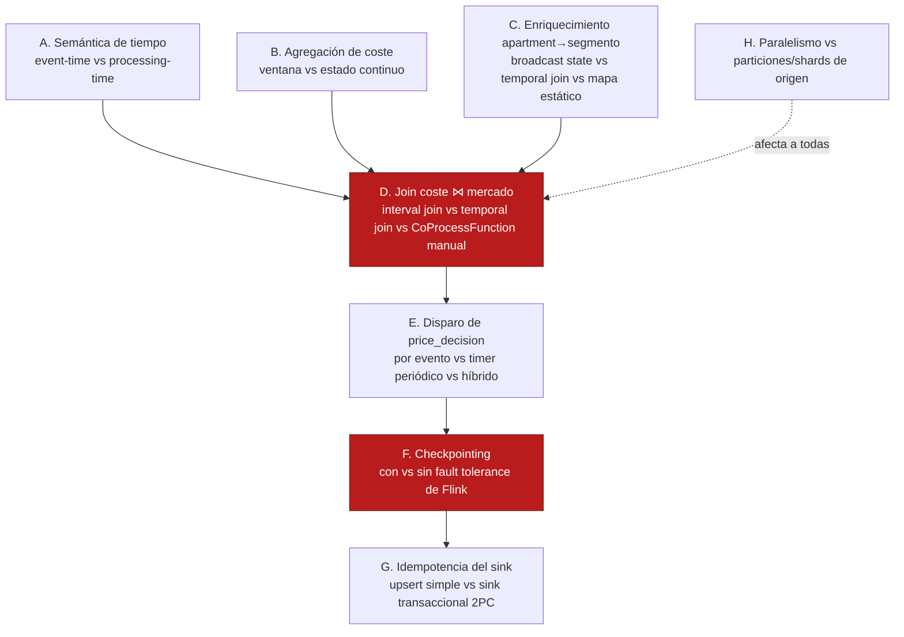
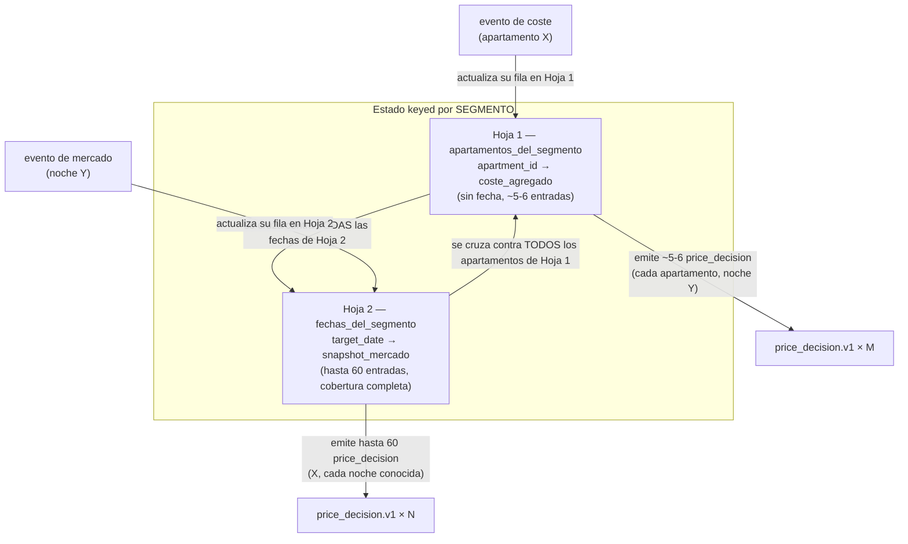

# Fase 4 — Decisiones de diseño de stream processing (pre-spec)

Este documento no es un ADR (nada está decidido todavía) ni el spec de la Fase 4. Es el mapa de **puntos de
decisión reales de Flink** — estado, tiempo, ventanas y joins — que hay que resolver antes de poder escribir
`specs/phases/04-flink-processing/spec.md` sin dejar huecos. Cada uno incluye qué pasa concretamente con cada
opción, no solo el nombre de la técnica. El objetivo declarado de este proyecto es aprender streaming
programming de verdad, así que aquí se documenta también la opción "más educativa pero más costosa" cuando
compite con la más pragmática — la elección es tuya, no la tomo por defecto hacia la más simple.

**Contexto que ata todo lo demás:** `payment-events.v1` (Kafka, 6 particiones, particionado por
`apartment_id`, ADR-0001) y `market-price-events` (Kinesis, 4 shards, particionado por segmento de mercado,
ADR-0005) no comparten clave de partición. Cualquier decisión de join depende de resolver primero cómo se
re-clave el lado de coste por segmento (Decisión C).

---

## Vista general de las decisiones



Las dos marcadas en rojo (**D** y **F**) son las que más cambian el diseño del resto del job — vale la pena
discutirlas primero.

---

## A. Semántica de tiempo — event-time vs processing-time

`payment_line.v1` trae `created_at`/`updated_at`; `market_price.v1` trae `collected_at`. Ninguno de los dos
es "el reloj de pared del TaskManager que ejecuta el job" — esa es la diferencia entre **event-time** y
**processing-time**.

| Opción | Qué pasa en la práctica |
|---|---|
| **Processing-time** | Flink usa el reloj del TaskManager para cualquier timer. No hace falta `WatermarkStrategy`. Un evento que llega tarde (p. ej. por reprocesar Kafka desde un offset antiguo) se trata igual que uno "a tiempo" — Flink no tiene forma de saberlo. Rerun del mismo stream en otro momento del día produce resultados distintos (no determinista), pero no bloquea nada. |
| **Event-time con watermarks** | Flink usa el timestamp del propio evento como "el reloj del stream", con watermarks marcando "no espero eventos más antiguos que esto". Determinista y correcto para reproceso. Pero: **si una de las dos fuentes deja de avanzar su watermark (p. ej. Kinesis sin tráfico para un segmento durante un rato), el watermark combinado de un join se estanca — y ni siquiera el lado Kafka, que sigue produciendo rápido, puede disparar lógica basada en event-time hasta que el lado lento se mueva.** Es la misma familia de incidente que el heartbeat-stall de Debezium (Fase 2) pero en Flink — un candidato real para `error-handling/` si lo encontramos en vivo. |

**Mi lectura:** dado que la agregación de coste (Decisión B) y el disparo de decisión (Decisión E) no van a
ser ventanas de tiempo fijo sino estado continuo + timers, event-time/watermarks añaden complejidad real sin
un beneficio claro *para este caso concreto*. Pero es exactamente el tipo de complejidad que "aprender
streaming" pide no evitar por comodidad — tu llamada.

---

## B. Agregación de coste por apartamento — ventana vs estado continuo

`total_monthly_cost_eur` = suma de `amount_gross` de todos los `payment_line` cuyo `billing_period` cubre el
mes en curso, **actualizado por `event_id`** (ADR-0003: nunca sumar mensajes, upsert por evento).

| Opción | Qué pasa en la práctica |
|---|---|
| **Window API de Flink** (tumbling/sliding) | Las ventanas de Flink agrupan por buckets de tiempo fijos sobre el timestamp del evento — no por rangos arbitrarios como `billing_period_start`/`billing_period_end`, que varían por fila. Forzar esto requeriría un `WindowAssigner` custom, inusual y complejo para lo que gana. |
| **`KeyedProcessFunction` + `MapState<event_id, PaymentLine>`** (sin ventana) | Estado keyed por `apartment_id`, upsert por `event_id` en cada evento entrante — literalmente la garantía de ADR-0003 expresada como código. En el momento de calcular una decisión, se filtra el `Map` por el periodo de facturación vigente y se suma `amount_gross`. Simple, sin pelear contra una API pensada para otra forma de partición temporal. |

**Mi lectura:** la Window API es la herramienta equivocada aquí — no porque sea "difícil", sino porque el
problema no tiene la forma que las ventanas de Flink resuelven (rangos por-fila, no buckets globales).
Recomiendo estado continuo sin ventana.

---

## C. Enriquecer el stream de coste con el segmento de mercado del apartamento

Bloqueo ya identificado en `specs/phases/03-market-ingestion/spec.md` §8 — confirmaste la opción de tabla de
referencia nueva. Falta decidir *cómo* Flink la consume:

| Opción | Qué pasa en la práctica |
|---|---|
| **Broadcast State Pattern** | La tabla `apartment_market_segments` (pequeña, ~100 filas) se transmite a todas las subtasks paralelas del operador; cada una guarda una copia completa en `BroadcastState`. Un `KeyedBroadcastProcessFunction` combina el stream de coste (keyed) con esa copia. Patrón estándar de DataStream API para "stream grande + dataset de referencia pequeño y cambia poco". |
| **Temporal Table Join (Table API/SQL)** | Trata la tabla de referencia como una tabla versionada que se consulta en el momento. Menos código manual, pero mezcla Table API/SQL con el DataStream API que necesitaremos para la Decisión D — dos paradigmas en el mismo job. |
| **Mapa estático cargado una vez (`open()`, JDBC)** | Más simple de escribir, pero cualquier cambio en la tabla de referencia exige reiniciar el job completo — no enseña el patrón real de "unir un stream con datos de referencia que sí pueden cambiar". |

**Mi lectura (ya alineada con tu elección anterior):** Broadcast State Pattern — es la construcción real de
DataStream API para este tamaño de dato de referencia, y no obliga a mezclar Table API en el job.

---

## D. Join coste ⋈ mercado — la decisión más crítica

**El problema real no es 1:1, es fan-out por fecha.** `price_decision.v1` necesita un precio **por noche
concreta** (`target_date`). El coste (por apartamento) **no tiene fecha** — es un agregado del periodo de
facturación. El mercado (por segmento) **sí tiene fecha** — una snapshot por `(segmento, target_date)`. Eso
significa que la clave de join correcta no es `apartment_id`, y tampoco `(segmento, fecha)` como clave
externa — es **`segmento`**, con dos tablas pequeñas colgando de esa clave:

- **Hoja 1 — apartamentos del segmento:** `apartment_id → coste actual` (sin fecha).
- **Hoja 2 — noches del segmento:** `target_date → precio de mercado ese día` (una entrada por noche cubierta).

Un `price_decision` correcto es el producto cruzado de esas dos hojas, **dentro del mismo segmento** — cada
apartamento del segmento, por cada noche con dato de mercado conocido.



Leído en palabras llanas: si te llega una factura nueva para un apartamento, actualizas su coste y recalculas
su precio para **todas** las noches que ya conoces de su segmento (tiene sentido: una factura nueva afecta a
todas las noches futuras del piso). Si te llega un precio de mercado nuevo para una noche concreta,
actualizas esa noche y recalculas el precio de **todos** los apartamentos de ese segmento para esa noche
(tiene sentido: el mercado se movió para esa noche, no para las demás).

**Recomendación final (2026-07-27): `KeyedProcessFunction` a mano, keyed por `segment`, DataStream API —
no Table API.** Se descartó Table API tras pesar el objetivo real del proyecto (aprender streaming
processing de verdad, no evitarlo por conveniencia) contra el ahorro de código. Con el panel de 5:

- **Contrarian:** "menos código" no es "menos aprendizaje" — B y C ya usan DataStream API a fondo
  (`KeyedProcessFunction`, `MapState`, `BroadcastState`); meter Table API en D no evita aprender, aprende
  algo *distinto* (SQL declarativo) a costa de mezclar dos paradigmas en el mismo job.
- **First Principles:** el objetivo es entender cómo Flink decide qué guardar y cuándo emitir — hacerlo a
  mano obliga a razonar explícitamente cada pieza, sin abstracción que lo oculte.
- **Expansionist:** construirlo a mano primero deja mejor preparado para entender de verdad qué hace un join
  de Table API por debajo, si algún día se compara con esa alternativa.
- **Outsider:** quien solo sabe Table API/SQL en Flink tiene techo bajo — en cuanto algo no encaja limpio en
  SQL (como el filtro `target_date >= CURRENT_DATE`, que es regla de negocio, no un TTL genérico) acaba
  cayendo a DataStream API de todas formas.
- **Executor:** como B y C ya van en DataStream API, D como un `KeyedProcessFunction` más es la extensión
  natural — mantiene **todo el job en un solo paradigma**, sin el puente `fromDataStream`/`toChangelogStream`
  que Table API exigiría. Menos complejidad total, no más, aun contando el aprendizaje.

Implementación — literalmente el dibujo de las dos hojas, escrito directamente:

```
KeyedProcessFunction (keyed por segment)
  state:
    apartamentos: MapState<apartment_id, CostAggregate>   # Hoja 1
    noches:       MapState<LocalDate, MarketSnapshot>      # Hoja 2

  processElement1(evento_coste):
      apartamentos.put(apartment_id, coste)
      for cada (fecha, snapshot) en noches:
          emit price_decision(apartment_id, fecha, coste, snapshot)

  processElement2(evento_mercado):
      if evento_mercado.target_date < hoy: return          # filtro explícito, no TTL genérico
      noches.put(target_date, snapshot)
      for cada (apartment_id, coste) en apartamentos:
          emit price_decision(apartment_id, target_date, coste, snapshot)
```

**Beneficio técnico extra, no solo pedagógico:** como el sink de DynamoDB ya es upsert-idempotente por
`decision_id` (Decisión G), aquí no hace falta lidiar con streams de retracción (`+I`/`-U`/`+U`/`-D`) que
Table API generaría automáticamente — se emite el mejor precio actual y el `put_item` sobrescribe el
anterior. Se evita una categoría entera de complejidad de Table API que, con este sink, no aporta nada.

Esto descarta también la Interval Join (diseñada para "eventos cercanos en el tiempo", no para esto) y la
Temporal Table Join propuesta antes (asimétrica: solo el coste disparaba, el mercado se quedaba mudo — aquí
ambos lados deben disparar, cada uno sobre su propia hoja, y el `KeyedProcessFunction` de arriba ya lo hace).

---

## D.1 — Para que esto funcione, la Fase 3 necesita cobertura completa del calendario

Hoy `market-ingestor` (Fase 3, spec §4) elige **una fecha al azar** dentro de la ventana de 60 días, por
segmento, cada tick — así que la Hoja 2 nunca se llena del todo: es un subconjunto parcial que crece a golpe
de azar, sin ningún patrón explicable ("¿por qué el 20 de agosto sí tiene precio y el 21 no?"). **Decisión
tomada: necesitamos cobertura completa**, no parcial.

**Cambio necesario en `services/market-ingestor` (follow-up sobre la Fase 3 ya mergeada, no implementado
todavía):** en vez de elegir la fecha al azar, recorrer la ventana de forma determinista y cíclica — un
offset distinto de la ventana en cada tick (`offset = tick_count % forecast_days`), calculando
`target_date = hoy + offset` en el momento de publicar (no cacheado, así la ventana se desliza sola cada día
sin lógica especial). Con la configuración por defecto (`tick_interval=60s`, `forecast_days=60`), un ciclo
completo tarda `60 × 60s = 1 hora` — cada segmento cubre las 60 noches una vez por hora, y cada noche
concreta queda refrescada al menos una vez por hora en régimen estable. Esto también le da sentido real al
campo `collected_at` de frescura del schema: bajo este esquema, ningún dato de mercado tiene más de ~1 hora
de antigüedad salvo incidente.

Esto es una edición sobre `specs/phases/03-market-ingestion/spec.md` §4 (comportamiento) y §5.2 (muestreo) —
la Fase 3 está mergeada, así que este es un follow-up de implementación pendiente, no un cambio ya hecho.

---

## E. Qué dispara el cálculo de un `price_decision`

**Esta decisión queda casi resuelta por D:** con el join regular de Table API, la emisión ya ocurre de forma
automática cada vez que cambia algo relevante en cualquiera de las dos hojas — no hace falta un timer manual
para decidir "cuándo recalcular". Lo único que sigue haciendo falta, aparte, es un **vigilante de frescura**
para el caso ">48h sin actualizar" que el propio schema ya prevé (`market_inputs.collected_at`) — y con
cobertura completa por hora (D.1), ese caso solo debería dispararse ante un incidente real (p. ej.
`market-ingestor` caído), no en operación normal.

| Opción | Qué pasa en la práctica |
|---|---|
| **El propio join de D dispara la emisión (recomendado)** | Cada cambio en Hoja 1 o Hoja 2 emite directamente — sin timer, sin código de disparo aparte. Requiere, aparte, un vigilante de frescura separado (una query periódica, no parte del pipeline de streaming) para detectar cuando una noche lleva >48h sin refrescarse. |
| ~~Timer periódico manual~~ | Superado por D — si el join ya emite en cada cambio relevante, un timer aparte para "cuándo recalcular" sería redundante. Se mantiene solo como vigilante de frescura, no como disparador de cálculo. |

---

## F. Checkpointing — la otra decisión crítica

Esta es distinta de la semántica de entrega de Kinesis/Kafka (eso ya se resolvió en la Fase 3, a nivel de
productor). Aquí hablamos de la **tolerancia a fallos del propio estado interno de Flink** — el `MapState` de
costes, el `BroadcastState` de segmentos, el `ValueState` de mercado de la Decisión D.

| Opción | Qué pasa en la práctica |
|---|---|
| **Sin checkpointing** | Si el job de Flink se cae y reinicia, **todo el estado en memoria se pierde**. Al reiniciar, Flink vuelve a consumir desde donde el conector/offset diga — depende de cómo se configure el consumo de Kafka y Kinesis. Con la retención de 24h de Kinesis (Fase 3 §7), un downtime largo puede perder snapshots de mercado para siempre, sin forma de recuperarlos. |
| **Con checkpointing** (state backend + almacenamiento durable, p. ej. un bucket S3 en LocalStack) | Flink toma snapshots consistentes y exactly-once del estado interno periódicamente. Al reiniciar, restaura los tres estados exactamente como estaban en el último checkpoint válido y reanuda el consumo desde los offsets guardados ahí — sin reprocesar todo ni perder progreso. Coste: hay que decidir un state backend (Heap vs RocksDB) y aprovisionar almacenamiento de checkpoints. |

**Mi lectura:** el README ya declara "stateful joins" como parte del stack de Flink — no habilitar
checkpointing dejaría fuera la razón principal por la que Flink existe frente a un script normal (tolerancia
a fallos de estado). Recomiendo habilitarlo, aceptando la pieza extra de infraestructura.

---

## G. Idempotencia del sink hacia DynamoDB

`price_decision.v1.decision_id` ya está descrito en el propio schema como "Idempotency key for Iceberg and
DynamoDB sinks" (`specs/events/price_decision.v1.json:25`). Un `put_item` simple (upsert por
`apartment_id`+`target_date`, o por `decision_id`) es seguro ante duplicados por construcción — **no hace
falta un sink transaccional de dos fases** para este caso, a diferencia de sistemas donde el sink no es
naturalmente idempotente. Vale la pena dejarlo explícito en el spec para no reabrir la misma discusión de
Kleppmann de la Fase 3 sin necesidad: aquí el propio diseño del evento ya resuelve el problema.

---

## H. Paralelismo del job vs particiones/shards de origen

Kafka (`payment-events.v1`) tiene 6 particiones; Kinesis (`market-price-events`) tiene 4 shards (Fase 3,
ADR-0005). El paralelismo de consumo real de cada fuente está acotado por su propio número de
particiones/shards — subir el paralelismo del job por encima de 6 (lado Kafka) o de 4 (lado Kinesis) deja
subtasks ociosas para esa fuente. El desbalance de shards ya observado en la Fase 3 (30/30/10/20) se hereda
tal cual en el lado Kinesis del job de Flink — no es algo que el paralelismo pueda corregir, ya lo asumió
ADR-0005 como trade-off aceptado.

---

## Próximo paso

Con este mapa delante, las decisiones que de verdad cambian el diseño del spec son **D** (Temporal Table Join
vs CoProcessFunction manual) y **F** (checkpointing sí/no). El resto (A, B, C, E, G, H) ya tiene una lectura
razonablemente clara. Cuando quieras, discutimos D y F con calma y retomamos también la pregunta pendiente
del sink de Iceberg (Fase 4 vs Fase 5) antes de escribir `specs/phases/04-flink-processing/spec.md`.
