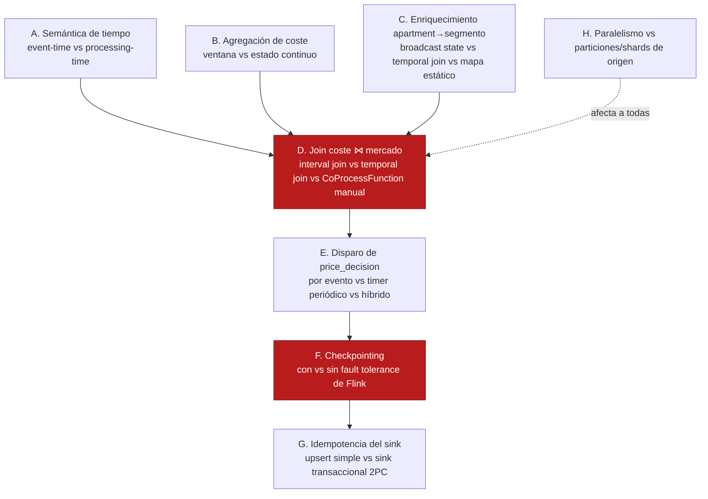
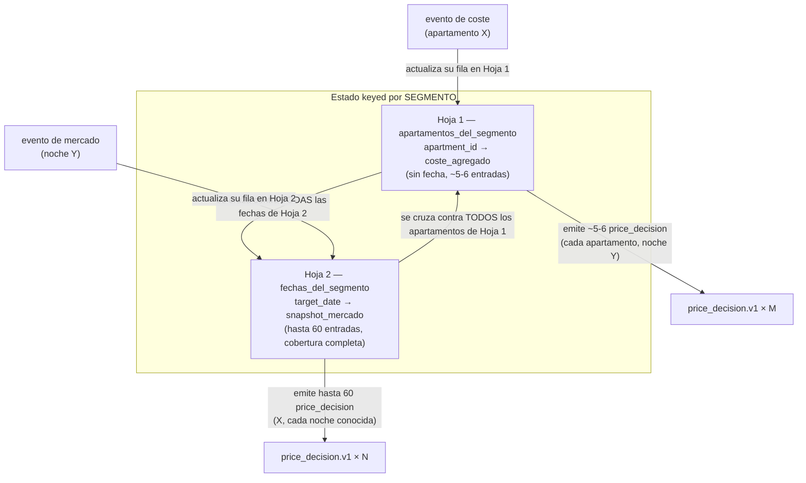

# Fase 4 — Decisiones de diseño de stream processing (pre-spec)

Este documento no es un ADR (nada está decidido todavía) ni el spec de la Fase 4. Es el mapa de **puntos de
decisión reales de Flink** — estado, tiempo, ventanas y joins — que hay que resolver antes de poder escribir
`specs/phases/04-flink-processing/spec.md` sin dejar huecos. Cada uno incluye qué pasa concretamente con cada
opción, no solo el nombre de la técnica. El objetivo declarado de este proyecto es aprender streaming
programming de verdad, así que aquí se documenta también la opción "más educativa pero más costosa" cuando
compite con la más pragmática — la elección es tuya, no la tomo por defecto hacia la más simple.

**Contexto que ata todo lo demás:** `payment-events.v1` (Kafka, 6 particiones, particionado por
`apartment_id`, ADR-0001) y `market-price-events` (Kinesis, 4 shards, particionado por segmento de mercado,
ADR-0005) no comparten clave de partición. Cualquier decisión de join depende de resolver primero cómo se
re-clave el lado de coste por segmento (Decisión C).

---

## Vista general de las decisiones



Las dos marcadas en rojo (**D** y **F**) son las que más cambian el diseño del resto del job — vale la pena
discutirlas primero.

---

## A. Semántica de tiempo — event-time vs processing-time

`payment_line.v1` trae `created_at`/`updated_at`; `market_price.v1` trae `collected_at`. Ninguno de los dos
es "el reloj de pared del TaskManager que ejecuta el job" — esa es la diferencia entre **event-time** y
**processing-time**.

| Opción | Qué pasa en la práctica |
|---|---|
| **Processing-time** | Flink usa el reloj del TaskManager para cualquier timer. No hace falta `WatermarkStrategy`. Un evento que llega tarde (p. ej. por reprocesar Kafka desde un offset antiguo) se trata igual que uno "a tiempo" — Flink no tiene forma de saberlo. Rerun del mismo stream en otro momento del día produce resultados distintos (no determinista), pero no bloquea nada. |
| **Event-time con watermarks** | Flink usa el timestamp del propio evento como "el reloj del stream", con watermarks marcando "no espero eventos más antiguos que esto". Determinista y correcto para reproceso. Pero: **si una de las dos fuentes deja de avanzar su watermark (p. ej. Kinesis sin tráfico para un segmento durante un rato), el watermark combinado de un join se estanca — y ni siquiera el lado Kafka, que sigue produciendo rápido, puede disparar lógica basada en event-time hasta que el lado lento se mueva.** Es la misma familia de incidente que el heartbeat-stall de Debezium (Fase 2) pero en Flink — un candidato real para `error-handling/` si lo encontramos en vivo. |

**Mi lectura:** dado que la agregación de coste (Decisión B) y el disparo de decisión (Decisión E) no van a
ser ventanas de tiempo fijo sino estado continuo + timers, event-time/watermarks añaden complejidad real sin
un beneficio claro *para este caso concreto*. Pero es exactamente el tipo de complejidad que "aprender
streaming" pide no evitar por comodidad — tu llamada.

**Confirmado (2026-07-27): processing-time.** Watermarks resuelven un problema que no tenemos — saber
"¿ya vi todo hasta este instante?" para poder cerrar una ventana. Aquí no hay ventanas, solo upsert reactivo
sobre `MapState`; no hay nada que cerrar.

El riesgo real que sí queda sobre la mesa: `MapState.put()` no compara nada, simplemente sobrescribe. En
operación normal esto no es un problema (Kafka preserva el orden por partición/clave, así que "orden de
llegada" = "orden real"). El único escenario donde falla es un **reproceso** — el job releyendo offsets
antiguos tras un fallo sin checkpoint, o un backfill manual — donde un evento viejo llega *ahora* y pisa un
dato bueno más reciente, porque el evento no lleva ninguna marca de "cuándo pasé de verdad" que se pueda
comparar. **Mitigación barata sin necesitar watermarks:** comparar el propio campo `updated_at`/`collected_at`
del evento contra el que ya está guardado antes de sobrescribir, y descartar si es más viejo — una
comparación de una línea, no una `WatermarkStrategy` completa. Y con checkpointing habilitado (Decisión F),
el escenario de "reprocesar desde el principio" deja de ser la vía normal de recuperación — el job resume
desde el último checkpoint, no desde el offset 0 — así que el caso que esta mitigación cubre pasa a ser
residual (solo backfill manual), no parte de la operación normal.

---

## B. Agregación de coste por apartamento — ventana vs estado continuo

`total_monthly_cost_eur` = suma de `amount_gross` de todos los `payment_line` cuyo `billing_period` cubre el
mes en curso, **actualizado por `event_id`** (ADR-0003: nunca sumar mensajes, upsert por evento).

| Opción | Qué pasa en la práctica |
|---|---|
| **Window API de Flink** (tumbling/sliding) | Las ventanas de Flink agrupan por buckets de tiempo fijos sobre el timestamp del evento — no por rangos arbitrarios como `billing_period_start`/`billing_period_end`, que varían por fila. Forzar esto requeriría un `WindowAssigner` custom, inusual y complejo para lo que gana. |
| **`KeyedProcessFunction` + `MapState<event_id, PaymentLine>`** (sin ventana) | Estado keyed por `apartment_id`, upsert por `event_id` en cada evento entrante — literalmente la garantía de ADR-0003 expresada como código. En el momento de calcular una decisión, se filtra el `Map` por el periodo de facturación vigente y se suma `amount_gross`. Simple, sin pelear contra una API pensada para otra forma de partición temporal. |

**Mi lectura:** la Window API es la herramienta equivocada aquí — no porque sea "difícil", sino porque el
problema no tiene la forma que las ventanas de Flink resuelven (rangos por-fila, no buckets globales).
Recomiendo estado continuo sin ventana.

---

## C. Enriquecer el stream de coste con el segmento de mercado del apartamento

Bloqueo ya identificado en `specs/phases/03-market-ingestion/spec.md` §8 — confirmaste la opción de tabla de
referencia nueva. Falta decidir *cómo* Flink la consume:

| Opción | Qué pasa en la práctica |
|---|---|
| **Broadcast State Pattern** | La tabla `apartment_market_segments` (pequeña, ~100 filas) se transmite a todas las subtasks paralelas del operador; cada una guarda una copia completa en `BroadcastState`. Un `KeyedBroadcastProcessFunction` combina el stream de coste (keyed) con esa copia. Patrón estándar de DataStream API para "stream grande + dataset de referencia pequeño y cambia poco". |
| **Temporal Table Join (Table API/SQL)** | Trata la tabla de referencia como una tabla versionada que se consulta en el momento. Menos código manual, pero mezcla Table API/SQL con el DataStream API que necesitaremos para la Decisión D — dos paradigmas en el mismo job. |
| **Mapa estático cargado una vez (`open()`, JDBC)** | Más simple de escribir, pero cualquier cambio en la tabla de referencia exige reiniciar el job completo — no enseña el patrón real de "unir un stream con datos de referencia que sí pueden cambiar". |

**Mi lectura (ya alineada con tu elección anterior):** Broadcast State Pattern — es la construcción real de
DataStream API para este tamaño de dato de referencia, y no obliga a mezclar Table API en el job.

### C.1 — Cómo se puebla `apartment_market_segments` (confirmado 2026-07-27: seed script)

Tres rutas posibles, en orden de madurez:

1. **Manual** — alguien inserta la asignación a mano. No escala, cero automatismo.
2. **Seed script (elegido)** — un script que corre una vez (o en cada deploy), lee los apartamentos ya
   existentes en `mock-pm-app` (datos semilla fijos, `seed_apartments`) y les asigna de forma determinista
   uno de los 18 segmentos fijos de `market-ingestor` según sus atributos (ciudad, tipo, habitaciones),
   insertando el resultado en `apartment_market_segments`. Estático después de correr — un apartamento nuevo
   exige re-correr el script.
3. **Dinámico/CDC** — la asignación se recalcula en vivo a partir de los atributos del apartamento, que
   también viajarían por CDC. Correcto a largo plazo, pero más pieza de la que este PoC necesita.

**Confirmado: opción 2.** Es el patrón real de una tabla de dimensión/maestro en un DW — se siembra una vez,
se consume como Broadcast State (arriba). **Confirmado (2026-07-28): "quién mantiene esto al día" queda
fuera de alcance de Fase 4**, punto final, no una pendiente abierta — si el catálogo de apartamentos de
`mock-pm-app` cambia de segmento, la ruta natural de evolución sería CDC sobre esos mismos atributos (la
opción 3 ya descartada arriba por sobre-ingeniería para este PoC), pero no se construye nada de eso ahora.

### C.2 — `target_margin` / `competitiveness_discount` por apartamento (confirmado 2026-07-27)

El propio enunciado del negocio ya lo exige: "el cliente puede establecer un porcentaje de rentabilidad" es
una decisión del dueño del apartamento, no un parámetro global del sistema. **Confirmado: se configura por
apartamento** (con posible valor por defecto a nivel de cliente/property manager si el dominio de
`mock-pm-app` agrupa apartamentos bajo un dueño — pendiente de confirmar ese modelo de dominio).

Mecanismo: vive como campo del apartamento en `mock-pm-app`, viaja por el mismo pipeline CDC ya existente
(Fases 1-2), y se añade al **mismo Broadcast State que ya transmite el segmento** (no hace falta un canal
nuevo) — el mismo `KeyedBroadcastProcessFunction` que enriquece con segmento enriquece también con
`target_margin`/`competitiveness_discount`.

**Confirmado (2026-07-28): modelo plano, sin jerarquía cliente→apartamento, fuera de alcance de Fase 4.**
`mock-pm-app` no modela hoy ningún concepto de "dueño"/"cliente" agrupando apartamentos — construir esa
jerarquía ahora sería diseñar sobre un dominio que no existe. `target_margin`/`competitiveness_discount` se
configuran **por apartamento**, sin default a otro nivel. Documentado explícitamente en el spec de Fase 4
como asunción, no como hueco — una jerarquía cliente→apartamento es una extensión futura sobre `mock-pm-app`
(Fase 1), no un bloqueo de esta fase.

**Valor por defecto para esta primera versión (confirmado 2026-07-28): `target_margin = 0.05` (5%)** para
todo apartamento sin override explícito en el seed de `mock-pm-app`. Es también, directamente, la garantía
de negocio detrás del nuevo estado `cost_protected` (ver G.2 / ADR-0007 más abajo): coste + este margen
mínimo es un suelo no negociable por el motor de pricing — bajarlo o prescindir del apartamento es siempre
decisión del cliente, nunca algo que el sistema decida automáticamente.

---

## D. Join coste ⋈ mercado — la decisión más crítica

**El problema real no es 1:1, es fan-out por fecha.** `price_decision.v1` necesita un precio **por noche
concreta** (`target_date`). El coste (por apartamento) **no tiene fecha** — es un agregado del periodo de
facturación. El mercado (por segmento) **sí tiene fecha** — una snapshot por `(segmento, target_date)`. Eso
significa que la clave de join correcta no es `apartment_id`, y tampoco `(segmento, fecha)` como clave
externa — es **`segmento`**, con dos tablas pequeñas colgando de esa clave:

- **Hoja 1 — apartamentos del segmento:** `apartment_id → coste actual` (sin fecha).
- **Hoja 2 — noches del segmento:** `target_date → precio de mercado ese día` (una entrada por noche cubierta).

Un `price_decision` correcto es el producto cruzado de esas dos hojas, **dentro del mismo segmento** — cada
apartamento del segmento, por cada noche con dato de mercado conocido.



Leído en palabras llanas: si te llega una factura nueva para un apartamento, actualizas su coste y recalculas
su precio para **todas** las noches que ya conoces de su segmento (tiene sentido: una factura nueva afecta a
todas las noches futuras del piso). Si te llega un precio de mercado nuevo para una noche concreta,
actualizas esa noche y recalculas el precio de **todos** los apartamentos de ese segmento para esa noche
(tiene sentido: el mercado se movió para esa noche, no para las demás).

**Recomendación final (2026-07-27): `KeyedProcessFunction` a mano, keyed por `segment`, DataStream API —
no Table API.** Se descartó Table API tras pesar el objetivo real del proyecto (aprender streaming
processing de verdad, no evitarlo por conveniencia) contra el ahorro de código. Con el panel de 5:

- **Contrarian:** "menos código" no es "menos aprendizaje" — B y C ya usan DataStream API a fondo
  (`KeyedProcessFunction`, `MapState`, `BroadcastState`); meter Table API en D no evita aprender, aprende
  algo *distinto* (SQL declarativo) a costa de mezclar dos paradigmas en el mismo job.
- **First Principles:** el objetivo es entender cómo Flink decide qué guardar y cuándo emitir — hacerlo a
  mano obliga a razonar explícitamente cada pieza, sin abstracción que lo oculte.
- **Expansionist:** construirlo a mano primero deja mejor preparado para entender de verdad qué hace un join
  de Table API por debajo, si algún día se compara con esa alternativa.
- **Outsider:** quien solo sabe Table API/SQL en Flink tiene techo bajo — en cuanto algo no encaja limpio en
  SQL (como el filtro `target_date >= CURRENT_DATE`, que es regla de negocio, no un TTL genérico) acaba
  cayendo a DataStream API de todas formas.
- **Executor:** como B y C ya van en DataStream API, D como un `KeyedProcessFunction` más es la extensión
  natural — mantiene **todo el job en un solo paradigma**, sin el puente `fromDataStream`/`toChangelogStream`
  que Table API exigiría. Menos complejidad total, no más, aun contando el aprendizaje.

Implementación — literalmente el dibujo de las dos hojas, escrito directamente:

```
KeyedProcessFunction (keyed por segment)
  state:
    apartamentos: MapState<apartment_id, CostAggregate>   # Hoja 1
    noches:       MapState<LocalDate, MarketSnapshot>      # Hoja 2

  processElement1(evento_coste):
      apartamentos.put(apartment_id, coste)
      for cada (fecha, snapshot) en noches:
          emit price_decision(apartment_id, fecha, coste, snapshot)

  processElement2(evento_mercado):
      if evento_mercado.target_date < hoy: return          # filtro explícito, no TTL genérico
      noches.put(target_date, snapshot)
      for cada (apartment_id, coste) en apartamentos:
          emit price_decision(apartment_id, target_date, coste, snapshot)
```

**Beneficio técnico extra, no solo pedagógico:** como el sink de DynamoDB ya es upsert-idempotente por
`decision_id` (Decisión G), aquí no hace falta lidiar con streams de retracción (`+I`/`-U`/`+U`/`-D`) que
Table API generaría automáticamente — se emite el mejor precio actual y el `put_item` sobrescribe el
anterior. Se evita una categoría entera de complejidad de Table API que, con este sink, no aporta nada.

Esto descarta también la Interval Join (diseñada para "eventos cercanos en el tiempo", no para esto) y la
Temporal Table Join propuesta antes (asimétrica: solo el coste disparaba, el mercado se quedaba mudo — aquí
ambos lados deben disparar, cada uno sobre su propia hoja, y el `KeyedProcessFunction` de arriba ya lo hace).

---

## D.1 — Para que esto funcione, la Fase 3 necesita cobertura completa del calendario

Hoy `market-ingestor` (Fase 3, spec §4) elige **una fecha al azar** dentro de la ventana de 60 días, por
segmento, cada tick — así que la Hoja 2 nunca se llena del todo: es un subconjunto parcial que crece a golpe
de azar, sin ningún patrón explicable ("¿por qué el 20 de agosto sí tiene precio y el 21 no?"). **Decisión
tomada: necesitamos cobertura completa**, no parcial.

**Cambio necesario en `services/market-ingestor` (follow-up sobre la Fase 3 ya mergeada, no implementado
todavía):** en vez de elegir la fecha al azar, recorrer la ventana de forma determinista y cíclica — un
offset distinto de la ventana en cada tick (`offset = tick_count % forecast_days`), calculando
`target_date = hoy + offset` en el momento de publicar (no cacheado, así la ventana se desliza sola cada día
sin lógica especial). Con la configuración por defecto (`tick_interval=60s`, `forecast_days=60`), un ciclo
completo tarda `60 × 60s = 1 hora` — cada segmento cubre las 60 noches una vez por hora, y cada noche
concreta queda refrescada al menos una vez por hora en régimen estable. Esto también le da sentido real al
campo `collected_at` de frescura del schema: bajo este esquema, ningún dato de mercado tiene más de ~1 hora
de antigüedad salvo incidente.

Esto es una edición sobre `specs/phases/03-market-ingestion/spec.md` §4 (comportamiento) y §5.2 (muestreo) —
la Fase 3 está mergeada, así que este es un follow-up de implementación pendiente, no un cambio ya hecho.

---

## D.2 — Estacionalidad real (confirmado 2026-07-27: vive en Fase 3, no en Fase 4)

Hueco identificado: el muestreo sintético de `market-ingestor` (spec §5.2) no varía por día de la semana,
festivo o temporada — un `avg_nightly_rate_eur` de un martes cualquiera de febrero es estadísticamente igual
al de un sábado de agosto, lo cual no es realista.

**Confirmado: la estacionalidad se implementa en la Fase 3, no en la Fase 4.** Motivo: `avg_nightly_rate_eur`
ya se genera por `target_date` en `market-ingestor` — es el sitio natural para inyectar la variación
calendario. Así, la fórmula de pricing de la Fase 4 se mantiene agnóstica del calendario: siempre lee
`avg_nightly_rate_eur(target_date)` tal cual, y ese valor ya viene "cocinado" con estacionalidad. Ningún
código de Fase 4 necesita saber qué día de la semana es.

Implementación concreta (nuevo `seasonality.py` en `services/market-ingestor`, aplicado antes del muestreo
log-normal en `pricing.py`):

1. Flag fin de semana/festivo por `target_date` (librería `holidays` o calendario fijo por ciudad).
2. Tabla de multiplicador por mes/temporada (ej. agosto en BCN ×1.3, temporada baja ×0.85).
3. Aplicar el multiplicador al precio de referencia antes de samplear.

Mismo lote de follow-up que D.1 (cobertura cíclica) sobre la Fase 3 ya mergeada — candidato a resolverse en
el mismo PR.

**Tabla de multiplicadores (confirmado 2026-07-28): tres franjas por mes, iguales para las tres ciudades
en esta primera versión** (no una tabla por segmento — 18 tablas sería sobre-ingeniería para un PoC), anclada
explícitamente a los extremos verano/invierno que motivaron esta decisión, no solo a un "alta/baja" genérico:

| Franja | Meses | Multiplicador | Motivo |
|---|---|---|---|
| Temporada alta (verano) | Julio, Agosto | `×1.30` | Pico turístico mediterráneo — el propio caso que motivó pedir esta confirmación. |
| Temporada media (hombro) | Mayo, Junio, Septiembre, Octubre | `×1.05` | Transición — ligeramente por encima de la referencia anual, no plano. |
| Temporada baja (invierno) | Noviembre–Abril | `×0.85` | Mínimo turístico — el otro extremo explícito pedido (no solo "resto del año" implícito). |

Aplicado como multiplicador único sobre `segment_median` (§5.2 de la Fase 3) antes del muestreo log-normal —
no varía todavía por ciudad (Barcelona/Madrid/Valencia comparten la misma tabla en esta primera versión); una
tabla diferenciada por ciudad queda como refinamiento futuro si los datos de las fuentes ya investigadas
(spec Fase 3 §5.2) muestran patrones estacionales visiblemente distintos entre ellas.

---

## E. Qué dispara el cálculo de un `price_decision`

**Esta decisión queda casi resuelta por D:** con el join regular de Table API, la emisión ya ocurre de forma
automática cada vez que cambia algo relevante en cualquiera de las dos hojas — no hace falta un timer manual
para decidir "cuándo recalcular". Lo único que sigue haciendo falta, aparte, es un **vigilante de frescura**
para el caso ">48h sin actualizar" que el propio schema ya prevé (`market_inputs.collected_at`) — y con
cobertura completa por hora (D.1), ese caso solo debería dispararse ante un incidente real (p. ej.
`market-ingestor` caído), no en operación normal.

| Opción | Qué pasa en la práctica |
|---|---|
| **El propio join de D dispara la emisión (recomendado)** | Cada cambio en Hoja 1 o Hoja 2 emite directamente — sin timer, sin código de disparo aparte. Requiere, aparte, un vigilante de frescura separado para detectar cuando una noche lleva >48h sin refrescarse (ver E.1). |
| ~~Timer periódico manual~~ | Superado por D — si el join ya emite en cada cambio relevante, un timer aparte para "cuándo recalcular" sería redundante. |

### E.1 — Vigilante de frescura (confirmado 2026-07-27: timer dentro del job, patrón "dead man's switch")

Cuatro opciones consideradas:

| Opción | Pro | Contra |
|---|---|---|
| **Timer dentro del job** (`onTimer`) | Patrón idiomático de Flink, reutiliza el keyed state que ya existe, es el tercer primitivo core (State, Time, Timers) que el proyecto aún no ha tocado | Mezcla responsabilidad de pricing con responsabilidad de observabilidad |
| Query batch aparte | Separación de responsabilidades limpia | Componente nuevo, no aprovecha lo ya construido |
| Alerta externa (Prometheus/Grafana) | Estándar en producción | No existe esa pieza en el stack — sobre-ingeniería para el PoC |
| Solo un flag en el evento | Gratis, cero infraestructura | No alerta si el job entero muere — solo informa cuando SÍ hay un `price_decision` que emitir |

**Confirmado: combinación de la primera y la última.** Cada vez que se actualiza una clave en Hoja 1 o Hoja 2,
se registra (o se resetea) un `processing-time timer` a +48h para esa clave — el patrón **dead man's
switch**: el silencio es la señal, no un evento explícito. Mientras sigan llegando actualizaciones, el timer
nunca llega a dispararse porque se cancela y se reprograma en cada evento. Si el timer sí se dispara, es la
prueba de que nadie ha tocado esa clave en 48h → se emite un evento `data_stale` a un side-output (stream
aparte, no un `price_decision`) — no es una query separada del sistema, vive dentro del mismo
`KeyedProcessFunction` de la Decisión D. Además, cada `price_decision` emitido lleva su propio
`data_age_seconds` calculado inline (gratis, sin infraestructura nueva) para que cualquier consumidor
downstream pueda ver la frescura sin depender del side-output.

Es también la pieza de aprendizaje que cierra el trío de primitivos de DataStream API que este proyecto se
propuso explorar: State (B, C, D), Time (Decisión A) y ahora Timers (E.1).

---

## F. Checkpointing — la otra decisión crítica

Esta es distinta de la semántica de entrega de Kinesis/Kafka (eso ya se resolvió en la Fase 3, a nivel de
productor). Aquí hablamos de la **tolerancia a fallos del propio estado interno de Flink** — el `MapState` de
costes, el `BroadcastState` de segmentos, el `ValueState` de mercado de la Decisión D.

| Opción | Qué pasa en la práctica |
|---|---|
| **Sin checkpointing** | Si el job de Flink se cae y reinicia, **todo el estado en memoria se pierde**. Al reiniciar, Flink vuelve a consumir desde donde el conector/offset diga — depende de cómo se configure el consumo de Kafka y Kinesis. Con la retención de 24h de Kinesis (Fase 3 §7), un downtime largo puede perder snapshots de mercado para siempre, sin forma de recuperarlos. |
| **Con checkpointing** (state backend + almacenamiento durable, p. ej. un bucket S3 en LocalStack) | Flink toma snapshots consistentes y exactly-once del estado interno periódicamente. Al reiniciar, restaura los tres estados exactamente como estaban en el último checkpoint válido y reanuda el consumo desde los offsets guardados ahí — sin reprocesar todo ni perder progreso. Coste: hay que decidir un state backend (Heap vs RocksDB) y aprovisionar almacenamiento de checkpoints. |

**Mi lectura:** el README ya declara "stateful joins" como parte del stack de Flink — no habilitar
checkpointing dejaría fuera la razón principal por la que Flink existe frente a un script normal (tolerancia
a fallos de estado). Recomiendo habilitarlo, aceptando la pieza extra de infraestructura.

**Confirmado (2026-07-27): checkpointing habilitado, con `EmbeddedRocksDBStateBackend` + almacenamiento en
S3 (LocalStack).** Aclarando algo que puede sonar como "elige uno u otro" pero no lo es — son dos ejes
distintos:

- **State backend** (dónde vive el `MapState`/`BroadcastState` mientras el job corre): Heap (memoria) vs
  RocksDB (disco, serializado). Con nuestro volumen (100 apartamentos, 18 segmentos × 60 noches ≈ 1080
  entradas) cabría de sobra en memoria — RocksDB no hace falta por tamaño.
- **Checkpoint storage** (dónde se persiste la foto periódica para recuperación): filesystem local vs S3.

Se eligen los dos juntos: **RocksDB como state backend** (no por necesidad de tamaño, sino porque es el
patrón real de producción — checkpoints incrementales, solo el delta — y aprenderlo aquí con datos pequeños
es barato) + **S3 vía LocalStack como almacenamiento de checkpoints**, modo `EXACTLY_ONCE`, intervalo
alineado a la cadencia de mercado (60s, el mismo tick de `market-ingestor`).

---

## G. Idempotencia del sink hacia DynamoDB

`price_decision.v1.decision_id` ya está descrito en el propio schema como "Idempotency key for Iceberg and
DynamoDB sinks" (`specs/events/price_decision.v1.json:25`). Un `put_item` simple (upsert por
`apartment_id`+`target_date`, o por `decision_id`) es seguro ante duplicados por construcción — **no hace
falta un sink transaccional de dos fases** para este caso, a diferencia de sistemas donde el sink no es
naturalmente idempotente. Vale la pena dejarlo explícito en el spec para no reabrir la misma discusión de
Kleppmann de la Fase 3 sin necesidad: aquí el propio diseño del evento ya resuelve el problema.

---

## G.1 — Persistencia en Iceberg: CDC vía DynamoDB Streams, no dual-write (confirmado 2026-07-28)

Pregunta abierta desde el balance anterior: ¿Fase 4 escribe directo a S3+Iceberg además de DynamoDB, o solo
DynamoDB y Fase 5 se encarga del resto? Rechazada explícitamente la opción de dual-write (el mismo job de
Flink escribiendo a los dos sinks) citando el problema que Kleppmann nombra en DDIA (cap. 11): escribir el
mismo hecho a dos sistemas independientes desde el mismo código de aplicación no tiene atomicidad entre
ellos — un fallo entre las dos escrituras los deja divergentes sin forma de detectarlo ni repararlo.

**Confirmado: Flink escribe solo a DynamoDB** (un único `put_item` por decisión, idempotente por
`decision_id`, Decisión G). **Iceberg se puebla vía un consumidor CDC nuevo que lee DynamoDB Streams** —
exactamente el mismo patrón que ya usa este proyecto desde la Fase 2 (no escribir el mismo hecho a Postgres
y Kafka desde la app; leer el WAL de Postgres y derivar Kafka de ahí), aplicado ahora a DynamoDB Streams como
el "WAL" y un consumidor nuevo (Python, `boto3` `dynamodbstreams` + PyIceberg) como el equivalente de
Kafka Connect. Detalle completo, alternativas descartadas (2PC, export batch, KCL/Lambda) y consecuencias:
**[ADR-0006](adr/ADR-0006-dynamodb-single-writer-iceberg-cdc.md)**.

**Esto es trabajo de Fase 5, no de Fase 4** — Fase 4 solo necesita declarar en su spec que su sink es único
(DynamoDB) y que la población de Iceberg está fuera de su alcance, propiedad de Fase 5. Coincide con cómo
Fase 5 ya estaba descrita en `docs/AUDIT_DIARY.md` ("consumirá la salida de la Fase 4 hacia S3 + Iceberg") —
este ADR aclara el *cómo* (CDC vía DynamoDB Streams), no inventa alcance nuevo.

---

## G.2 — Tercer estado de `rule_applied`: `cost_protected` (confirmado 2026-07-28)

Pregunta abierta desde el balance anterior: nombre del tercer estado de `rule_applied` para "precio por encima
de mercado por proteger el coste". Resuelta junto con la reafirmación explícita del principio de negocio: el
suelo (coste + `target_margin`) **manda siempre** — nunca lo pisa el propio motor de pricing; bajar el margen
o prescindir del apartamento es siempre decisión del cliente, nunca automática.

Eso separa el "suelo gana" existente (`minimum_floor`) en dos situaciones con significado operativo distinto,
según si el suelo queda por debajo o por encima de `avg_nightly_rate_eur` (el precio medio de mercado *sin*
descuento, no `market_reference_price_eur`, que ya lleva aplicado `competitiveness_discount`):

- Suelo gana pero **sigue por debajo** de la media de mercado → `minimum_floor` (se mantiene, sin cambios).
  Informativo, no alarmante — el apartamento sigue siendo competitivo, solo sin el descuento habitual.
- Suelo gana y **queda por encima** de la media de mercado → **`cost_protected`** (nuevo). Señal accionable:
  los costes están sacando al apartamento de su propio mercado — exactamente el momento en que el cliente
  debe decidir entre bajar `target_margin` o prescindir del apartamento.

Detalle completo (fórmulas, `below_market_by` deja de anularse, nuevo campo `data_age_seconds`):
**[ADR-0007](adr/ADR-0007-price-decision-cost-protected-rule.md)**. Ya aplicado a
`specs/events/price_decision.v1.json`.

---

## H. Paralelismo del job vs particiones/shards de origen

Kafka (`payment-events.v1`) tiene 6 particiones; Kinesis (`market-price-events`) tiene 4 shards (Fase 3,
ADR-0005). El paralelismo de consumo real de cada fuente está acotado por su propio número de
particiones/shards — subir el paralelismo del job por encima de 6 (lado Kafka) o de 4 (lado Kinesis) deja
subtasks ociosas para esa fuente. El desbalance de shards ya observado en la Fase 3 (30/30/10/20) se hereda
tal cual en el lado Kinesis del job de Flink — no es algo que el paralelismo pueda corregir, ya lo asumió
ADR-0005 como trade-off aceptado.

---

## Balance a fecha de 2026-07-28

### Qué tenemos hecho

- **Fases 1–3: completas, verificadas en vivo, mergeadas en `main`** (PR #3, #4, #5). Nada de esto cambia por
  la Fase 4, salvo el follow-up de D.1.
- **Mapeo apartamento→segmento (Decisión C):** decidido — tabla de referencia nueva, consumida vía Broadcast
  State Pattern. No implementado todavía.
- **Fórmula de pricing:** decidida — Modelo 1 (`suggested_price = max(minimum_price, market_reference_price)`),
  suelo = coste+margen, techo = mercado (estrictamente por debajo, vía `competitiveness_discount`). Caso
  límite resuelto: si el suelo supera el techo, **el coste manda siempre** — el cliente nunca pierde
  rentabilidad por diseño.
- **Join coste ⋈ mercado (Decisión D):** decidido — `KeyedProcessFunction` a mano, keyed por `segment`,
  DataStream API, con dos `MapState` (apartamentos del segmento / noches del segmento) y fan-out cruzado.
  Table API descartado explícitamente.
- **Cobertura de fechas (D.1):** decidido — `market-ingestor` debe pasar de fecha aleatoria por tick a
  recorrido cíclico determinista de la ventana de 60 días.
- **Semántica de tiempo (Decisión A):** confirmado — processing-time, con mitigación de una línea
  (comparar `updated_at`/`collected_at` antes de sobrescribir) para el caso residual de reproceso manual.
- **Checkpointing (Decisión F):** confirmado — habilitado, `EmbeddedRocksDBStateBackend` + almacenamiento en
  S3 (LocalStack), `EXACTLY_ONCE`, intervalo 60s.
- **Vigilante de frescura (E.1):** confirmado — timer `onTimer` dentro del mismo `KeyedProcessFunction`
  (patrón dead man's switch) + side-output `data_stale` + campo `data_age_seconds` en cada `price_decision`.
- **Población de `apartment_market_segments` (C.1):** confirmado — seed script determinista, no manual ni
  dinámico.
- **`target_margin`/`competitiveness_discount` por apartamento (C.2):** confirmado — por apartamento, viaja
  por el mismo Broadcast State que el segmento.
- **Estacionalidad (D.2):** confirmado — vive en la Fase 3 (`market-ingestor`), no en la Fase 4; Fase 4 se
  mantiene agnóstica del calendario. Tabla de multiplicadores por mes (verano ×1.30, hombro ×1.05, invierno
  ×0.85) confirmada 2026-07-28, igual para las tres ciudades en esta primera versión.
- **Persistencia en Iceberg (G.1):** confirmado 2026-07-28 — sin dual-write; Flink escribe solo a DynamoDB,
  Iceberg se puebla vía CDC sobre DynamoDB Streams, trabajo de Fase 5. [ADR-0006](adr/ADR-0006-dynamodb-single-writer-iceberg-cdc.md).
- **Tercer estado de `rule_applied` (G.2):** confirmado 2026-07-28 — `cost_protected`, ya aplicado a
  `specs/events/price_decision.v1.json` junto con `below_market_by` siempre calculado y el nuevo campo
  `data_age_seconds`. [ADR-0007](adr/ADR-0007-price-decision-cost-protected-rule.md).
- **Modelo de dueño del apartamento (C.2):** confirmado 2026-07-28 — sin jerarquía cliente→apartamento
  (fuera de alcance de Fase 4), `target_margin` con **valor por defecto 0.05 (5%)** por apartamento para esta
  primera versión.
- **Mantenimiento de `apartment_market_segments` (C.1):** confirmado 2026-07-28 — fuera de alcance de Fase 4,
  cerrado, no una pendiente abierta.
- Todo lo anterior está documentado en este archivo, en sus ADRs, y en el artefacto publicado, en la rama
  `phase-4-flink-processing` (pusheada a origin, sin PR abierta todavía).

### Qué tenemos que hacer

1. Crear la tabla de referencia `apartment_market_segments` (schema + seed script, C.1) — territorio de la
   Fase 1, no existe hoy en ningún sitio.
2. Parchear `services/market-ingestor` (Fase 3, ya mergeada) para el recorrido cíclico determinista (D.1) y
   la estacionalidad con la tabla verano/hombro/invierno confirmada (D.2) — edición sobre
   `specs/phases/03-market-ingestion/spec.md` §4/§5.2 + código, idealmente en el mismo PR.
3. ~~Editar `specs/events/price_decision.v1.json`~~ — **hecho** (ADR-0007): `cost_protected`,
   `below_market_by` siempre calculado, `data_age_seconds` añadido.
4. Escribir `specs/phases/04-flink-processing/spec.md` formal — todavía no existe, solo este documento
   pre-spec. Ya no tiene decisiones de dominio pendientes que lo bloqueen (ver sección siguiente).
5. Implementar `streaming/flink-jobs/` — hoy solo tiene `pyproject.toml` y un `__init__.py` vacío. Incluye el
   `KeyedProcessFunction` de D (con las tres ramas de `rule_applied`), el timer de E.1, RocksDB+S3 de F.
6. Añadir el campo `target_margin` (default `0.05`) / `competitiveness_discount` al Broadcast State de C.2
   (junto al segmento).
7. Diseñar el sink DynamoDB (**único sink**, per ADR-0006 — sin Iceberg desde Flink): claves primarias, y si
   hace falta un índice secundario para que la Fase 6 pueda leer "todas las decisiones de un apartamento".
8. Decidir y documentar la estrategia de test de un job PyFlink (notoriamente difícil de testear en unitario).
9. Actualizar `docs/AUDIT_DIARY.md` — sigue diciendo "Fase 4: Not started, spec not yet written"; añadir
   también una nota en la sección de Fase 5 sobre el consumidor CDC de DynamoDB Streams (ADR-0006).
10. Abrir la PR de `phase-4-flink-processing` una vez el spec formal esté escrito.

### Decisiones de dominio — todas resueltas 2026-07-28

Las 5 decisiones que bloqueaban escribir el spec formal (Iceberg, nombre del tercer `rule_applied`, modelo de
dueño, tabla de estacionalidad, mantenimiento de `apartment_market_segments`) están todas cerradas — ver G.1,
G.2, C.2 y C.1 arriba, y ADR-0006/ADR-0007. **No queda ninguna decisión de dominio pendiente que bloquee
escribir `specs/phases/04-flink-processing/spec.md`** — lo que queda es convertir decisiones en artefactos
(ítems 1, 2, 4–10 de la lista de arriba).

### Qué debe asegurar el spec de Flink, sin excepción

Razonando como un data engineer sénior que tiene que firmar este spec antes de que nadie escriba código:

- **Límites explícitos de tamaño de estado** para cada `MapState` (apartamentos por segmento, noches por
  segmento) y su regla de expulsión — por escrito, como restricción dura, no implícita en la descripción.
  Incluye los timers de E.1: cuántos timers activos por clave, y qué pasa con el timer si la clave desaparece
  (apartamento dado de baja) — un timer huérfano es una fuga de estado tan real como un `MapState` sin límite.
- **Semántica de reinicio/replay explícita:** qué pasa al reiniciar el job con y sin checkpoint; nunca debe
  duplicar coste (protegido hoy por upsert-por-`event_id`, pero debe ser un criterio de aceptación explícito,
  no solo una propiedad asumida).
- **Manejo de fallos del sink DynamoDB** (throttling, reintentos) — con el mismo rigor de framing Kleppmann
  que ya se usó para `put_records` en la Fase 3, no un "ya veremos".
- **Criterios de aceptación numerados (AC-01...)** con el mismo rigor que las Fases 2 y 3 — no prosa
  descriptiva sin verificación live.
- **El ejemplo numérico trabajado** (90/100/110/120€) debe quedar escrito **dentro del spec mismo**, no solo
  en el historial de esta conversación — quien lo lea en seis meses no tiene por qué reconstruirlo.
- **Declaraciones explícitas de "fuera de alcance, propiedad de X"** para Iceberg, estacionalidad y el
  vigilante de frescura — cero huecos implícitos, seguir el precedente de las Fases 2 y 3.
- **Una estrategia de test concreta para el job de PyFlink** — la instrucción permanente de este proyecto es
  "aplica tests en todo momento"; un spec que no diga cómo se testea un job de PyFlink (notoriamente difícil
  de testear en unitario) está incompleto.
- **Requisitos mínimos de observabilidad** — volumen de fan-out por segmento, tamaño de estado, lag frente a
  Kafka/Kinesis. Un job de streaming sin esto es inoperable en producción, y "aprender streaming" incluye
  aprender a operarlo, no solo a escribirlo.
- **Una ADR propia para el cambio de contrato** — modificar `price_decision.v1.json` es el primer cambio de
  este proyecto sobre un contrato de evento que otra fase ya trataba como "cerrado" — merece su propia ADR
  (precedente: ADR-0005), no solo un párrafo dentro del spec de la Fase 4.
