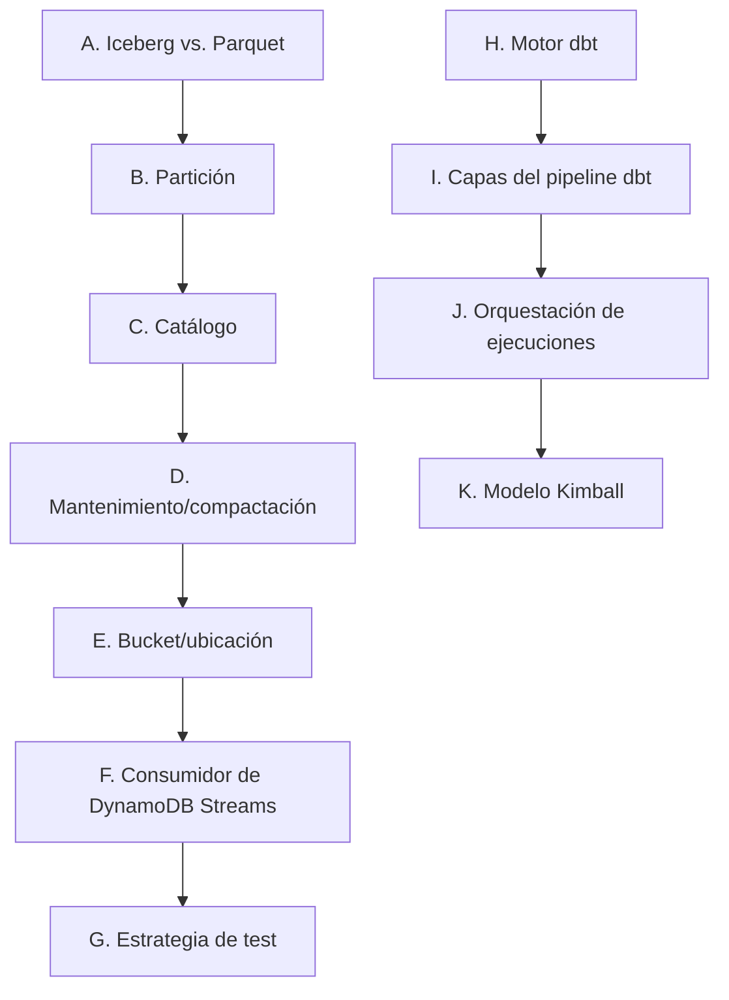

# Fase 5 — Decisiones de diseño de persistencia (pre-spec)

Este documento no es un ADR (nada está fijado en piedra hasta que se escriba uno) ni el spec de
la Fase 5. Es el mapa de decisiones reales — formato de tabla, partición, catálogo, mantenimiento,
motor de dbt, orquestación y modelo de datos — que hay que resolver antes de escribir
`specs/phases/05-persistence/spec.md` sin dejar huecos. Sigue el mismo formato que
`docs/phase-4-streaming-design-decisions.md`: opciones reales con qué pasa en la práctica, no solo
el nombre de la técnica.

**Contexto que ata todo lo demás:** ADR-0006 ya cerró que Flink solo escribe a DynamoDB — este
documento resuelve cómo un consumidor de DynamoDB Streams (Python, `boto3`) vuelca eso a un
lakehouse Iceberg, y cómo dbt transforma ese histórico en algo consultable.



Todo lo marcado **Confirmado** abajo ya está decidido en conversación con el cliente/dueño del
proyecto. El punto **F** quedaba abierto hasta verificar en vivo el soporte de DynamoDB Streams en
LocalStack, mismo principio que este proyecto ya aplicó a D.1 en la Fase 4 (no asumir, verificar) —
ya verificado, ver su sección para el resultado y sus consecuencias de diseño.

---

## A. Iceberg vs. Parquet

| Opción | Qué pasa en la práctica |
|---|---|
| **Parquet plano en carpetas particionadas** | Un lector no tiene forma de saber qué conjunto de ficheros es una lectura consistente mientras otro proceso escribe. Cada cambio de schema (`price_decision.v1` ya ha cambiado dos veces — ADR-0007, ADR-0009) obliga a reescribir histórico o mantener versiones a mano. |
| **Iceberg (elegido)** | Capa de metadatos (snapshots, manifests) sobre ficheros Parquet. Da schema evolution sin reescritura, partition evolution (cambiar la partición sin tocar datos ya escritos), y snapshots consistentes para lectores concurrentes. |

**Confirmado: Iceberg**, vía `PyIceberg` (sin Spark). Ya decidido en ADR-0006 y el README; este documento solo cierra el *cómo*.

---

## B. Partición

| Opción | Qué pasa en la práctica |
|---|---|
| **`apartment_id`** | Instinto de índice OLTP, no de partición analítica — cardinalidad alta (~30-100+ apartamentos), beneficio bajo para las consultas que dbt hará (evolución temporal, no "dame un apartamento"). Descartado. |
| **`decided_at` truncado a día (elegido)** | Baja cardinalidad, crece de forma acotada y predecible, encaja con el eje real de consulta (evolución de precio en el tiempo, alertas de margen). |
| **`decided_at` día + `city`** | Cardinalidad baja (×3 ciudades) — barato de añadir, ayuda a comparativas por ciudad. Pero con el volumen actual de esta PoC, particionar ya por ciudad puede crear particiones con pocas filas cada una (el problema clásico de sobre-particionar). |
| **Segmento completo (ciudad+barrio+tipo+habitaciones, 18 combinaciones)** | Demasiado fino para el volumen actual — muchas particiones diminutas, sobrecarga de metadatos sin beneficio real de poda. |

**Confirmado: particionar solo por `days(decided_at)` para empezar.** `city` se guarda como columna normal (consultable/ordenable), no como partición — y esto no es una limitación permanente: partition evolution de Iceberg permite añadir `identity(city)` más adelante, sobre datos ya escritos, sin reescribir nada. Es, de hecho, la demostración más clara de por qué elegimos Iceberg en el punto A — mejor guardarla para cuando el volumen real la justifique que añadirla ya "por si acaso". Segmento completo, descartado como partición (sí como columna).

---

## C. Catálogo

| Opción | Qué pasa en la práctica |
|---|---|
| **Catálogo SQLite local (vía PyIceberg)** | Cero infraestructura, pero no promueve limpio a AWS real — habría que migrar de catálogo en la Fase 7. |
| **AWS Glue Data Catalog (elegido)** | Mismo servicio de metadatos que se usaría en AWS real — la promoción a la Fase 7 es solo cambiar endpoint/credenciales, no de tecnología. |

**Confirmado: AWS Glue Data Catalog**, vía LocalStack en local. **Asunción a verificar en vivo antes de construir sobre ella** (mismo principio que D.1 en Fase 4): LocalStack Community soporta las operaciones de catálogo de Glue (`CreateDatabase`/`CreateTable`/`GetTable`) — lo que **no** soporta en Community son los *Glue Jobs* (cómputo Spark), que es Pro. Esta distinción importa directamente para la decisión D.

---

## D. Mantenimiento / compactación

Preguntado explícitamente: ¿Glue Job o que el propio consumidor/PyIceberg autocompacte?

| Opción | Qué pasa en la práctica |
|---|---|
| **AWS Glue Job (Spark) ejecutando `rewrite_data_files`/`expire_snapshots`** | El patrón real de producción — usa procedimientos Iceberg vía Spark SQL. Pero: (1) Glue Jobs no está soportado en LocalStack Community (ver C), bloquea probarlo en local sin Pro; (2) reintroduce Spark/JVM en un stack que este proyecto ha mantenido deliberadamente Python-only (mismo razonamiento que ya rechazó mezclar Table API en Flink — Decisión D de la Fase 4: no mezclar paradigmas/tooling pesado sin necesidad real). |
| **PyIceberg nativo (elegido)** | Versiones recientes de PyIceberg (0.7+) traen `rewrite_data_files` y `expire_snapshots` sin necesitar Spark — mismo lenguaje que todo lo demás en este proyecto. Se ejecuta como un job programado más (mismo patrón "tick" que `market-ingestor`), no dentro del propio consumidor de streams (separar "escribir" de "mantener" — responsabilidades distintas). |

**Confirmado: compactación vía PyIceberg nativo**, en un job programado aparte del consumidor (no en cada escritura). **Glue Job (Spark) queda anotado como la vía de promoción a producción real** si algún día se necesita a la escala en la que PyIceberg nativo se quede corto — no descartado para siempre, descartado *para esta PoC*.

---

## E. Bucket / ubicación

**Confirmado:** bucket separado del que usa Flink para checkpoints (`pms-iceberg`, ya existente) — un bucket propio (p. ej. `pms-lakehouse`) o, como mínimo, un prefijo claramente distinto (`warehouse/` vs `flink-checkpoints/`). Ciclos de vida distintos: un checkpoint es operativo y desechable, el histórico de Iceberg es el dato permanente — no deben poder limpiarse por el mismo camino. Estructura de rutas (`s3://<bucket>/warehouse/<db>/<table>/`) pensada ya para promover a Glue Catalog + S3 real en la Fase 7 sin rediseñar nada.

---

## F. Consumidor de DynamoDB Streams — verificado en vivo (2026-08-03)

Los shards de DynamoDB Streams **no son estáticos** como las particiones de Kafka: en AWS real expiran (~24h) y se re-parentan — un consumidor tiene que descubrir shards de forma continua, no asumir que uno vive para siempre. Además, no existe un KCL de Python maduro para esto (a diferencia de Kinesis, donde sí se consideró en la Fase 3): el checkpoint de qué `sequence_number` se ha procesado por shard hay que llevarlo a mano (probablemente otra tabla DynamoDB pequeña, mismo patrón que un `__consumer_offsets` casero).

**Verificado en vivo contra LocalStack — dos hallazgos concretos:**

1. **El ARN del stream no sobrevive un reinicio del contenedor de forma fiable.** `describe-table` seguía reportando `StreamEnabled: true` con un `LatestStreamArn` de una sesión anterior, pero `dynamodbstreams list-streams` devolvía `[]` para ese ARN — `describe-stream` fallaba con `ResourceNotFoundException`. Solo tras desactivar y reactivar el stream (`update-table --stream-specification StreamEnabled=false` → `true`) apareció un stream nuevo, correctamente registrado. **Consecuencia de diseño:** el consumidor nunca debe fijar el ARN del stream como configuración estática — debe resolverlo dinámicamente vía `describe-table` en cada arranque.
2. **LocalStack da exactamente un shard, siempre abierto, y no lo particiona bajo carga.** Tras 50 escrituras rápidas seguidas, `describe-stream` seguía mostrando un único `Shards[]` sin `ParentShardId` ni `EndingSequenceNumber` — nunca se cierra, nunca se divide. El camino feliz (`get-shard-iterator` con `TRIM_HORIZON` + `get-records`) funciona correctamente y devuelve los registros `INSERT` con la forma real de AWS (`NewImage`, `SequenceNumber`, etc.) — la escritura/lectura básica es fiable para probar contra ella.

**Decisión de diseño resultante:** el consumidor se construye para el caso general (múltiples shards, `ParentShardId`, shards cerrados) porque eso es lo correcto para AWS real — pero esa lógica de multi-shard **solo se puede probar con árboles de shards sintéticos en tests unitarios**, nunca en vivo contra LocalStack, que solo da un shard fijo. Documentado explícitamente como limitación conocida (mismo patrón que `available_days` en la Fase 4, spec §14): la verificación en vivo contra LocalStack cubre el camino feliz de un solo shard; la división/expiración real de shards solo se verá de verdad en la Fase 7 (AWS real).

---

## G. Estrategia de test

Mismo criterio piramidal que Fase 4 (spec §13):

- **Unitarios, sin infraestructura:** parseo de registros del stream, lógica de checkpoint (qué shard/secuencia toca leer a continuación) — funciones puras.
- **Componente, con catálogo Iceberg local/temporal:** el merge por `decision_id` no duplica filas — mismo invariante de idempotencia que ya se probó en Fase 2-4, aplicado aquí.
- **Uno que demuestre schema evolution de verdad:** añadir una columna a una tabla con datos ya escritos, confirmar que se sigue leyendo sin reescritura — es la característica que justifica elegir Iceberg (punto A), merece un test que lo pruebe, no solo que se documente.
- **Smoke manual/vivo contra LocalStack S3 + Glue Data Catalog**, mismo precedente que el MiniCluster smoke test de Flink — no automatizado, verificado a mano como el resto de infraestructura pesada de este proyecto.

---

## H. Motor de dbt

**Confirmado: `dbt-duckdb`.** DuckDB es un motor OLAP embebido (sin servidor, sin infraestructura que levantar) con soporte nativo para leer catálogos Iceberg — encaja con el estilo de este proyecto (LocalStack/Docker Compose primero, nada de clústeres pesados salvo Flink, que ya se justificó aparte). Vale la pena decirlo explícitamente ya que es tu primera vez con dbt: los conceptos (modelos, `source()`, tests, materializaciones) transfieren a cualquier motor (Snowflake, Athena, Trino); el motor concreto es la pieza que cambiaría en un entorno real, no la forma de pensar en dbt.

---

## I. Capas del pipeline dbt

**Confirmado**, forma estándar de dbt:

```
Iceberg raw (fct_price_decision_raw — 1 fila por decisión, tal cual la escribe el consumidor)
   → staging (limpieza/renombrado, 1:1 con la fuente, sin lógica de negocio)
   → intermediate (lógica: "última decisión conocida por apartamento/noche/día")
   → marts (dim_apartment, dim_date, los 3 facts — lo que lee el dashboard de la Fase 6)
```

`dbt source freshness` sobre la tabla raw — mismo concepto que el watchdog `data_stale` de Flink, repetido en la capa de transformación.

---

## J. Orquestación de las ejecuciones de dbt

Preguntado explícitamente, delegado: "te dejo a ti que decidas."

| Opción | Qué pasa en la práctica |
|---|---|
| **AWS CodeBuild + EventBridge Scheduler** (tu instinto inicial) | CodeBuild es una herramienta de CI/build — su disparador nativo es cambio de código, no cron; EventBridge lo puede forzar a horario, pero es pedirle a una herramienta de CI que haga de orquestador. Es, además, un servicio real de AWS: no se prueba de verdad en local contra LocalStack Community. |
| **Contenedor propio en `docker-compose.yml` con un bucle** (elegido, para local) | Mismo patrón "tick" que ya usa `market-ingestor` — un contenedor Python con un bucle que llama `dbt run` cada N minutos. Cero infraestructura nueva, se prueba de verdad en local, coherente con el resto del proyecto. |

**Confirmado (mi decisión, como pediste): contenedor con tick local para desarrollo/PoC; CodeBuild + EventBridge Scheduler queda anotado como la vía de promoción real para la Fase 7**, no descartado — es exactamente el mismo patrón que ya se aplicó a Glue Job en el punto D y al propio despliegue AWS real de la Fase 7: local vía Docker Compose/LocalStack, producción vía el servicio AWS real, nunca mezclado a medias.

---

## K. Modelo de datos (Kimball)

**Confirmado:** 2 dimensiones + 3 facts, alcance deliberadamente acotado — no se construyen `dim_market_segment` ni una *junk dimension* de `rule_applied`/`floor_type` en esta primera versión (se pliegan como columnas dentro de `dim_apartment` y de los facts respectivamente); quedan anotadas como extensión futura, no como hueco silencioso.

| Tabla | Grano | Tipo Kimball | Nota |
|---|---|---|---|
| `dim_apartment` | 1 fila por apartamento | Dimensión (SCD1 para empezar) | Incluye `city`/`neighborhood`/`property_type`/`bedrooms` directamente (sin dimensión de segmento aparte) |
| `dim_date` | 1 fila por día | Dimensión conformada | Reutiliza las franjas de temporada (verano ×1.30/hombro ×1.05/invierno ×0.85) que `market-ingestor` ya calcula — no reinventar la estacionalidad en dbt |
| `fct_price_decision` | 1 fila por decisión emitida | Transaction fact | Es, literalmente, el propio audit trail que `price_decision.v1` ya promete — grano igual al dato fuente |
| `fct_daily_price` | 1 fila por (apartamento, noche, día) — última decisión conocida ese día | Periodic snapshot fact | Lo que realmente alimenta un dashboard de evolución de precio, sin el ruido de cada recálculo |
| `fct_margin_alert` | 1 fila solo cuando `rule_applied = cost_protected` | Factless/accumulating fact | Es la propia "alerta de margen" que ya nombra el README — no una tabla inventada |

**Por qué ambos facts (transaction + snapshot) y no solo uno:** el dato fuente ya es a grano de transacción (una fila por emisión) — construir directamente el snapshot sin guardar el histórico completo tiraría el propósito de auditoría que `price_decision.v1` declara desde su propio schema ("para que el gestor pueda reconstruir exactamente por qué se fijó un precio, meses después"). El snapshot es una derivada de dbt sobre el raw, no un reemplazo.

---

## Balance

**Confirmado:** A (Iceberg), B (partición por día, ciudad como columna no partición), C (Glue Data Catalog), D (compactación vía PyIceberg nativo, no Glue Job), E (bucket separado de checkpoints), F (consumidor construido para el caso general de multi-shard, verificado en vivo que LocalStack solo cubre el camino feliz de un shard fijo), G (estrategia de test), H (dbt-duckdb), I (capas staging→intermediate→marts), J (tick local + CodeBuild/EventBridge como vía de promoción a Fase 7), K (2 dimensiones + 3 facts, alcance acotado).

**No quedan decisiones de dominio pendientes que bloqueen escribir `specs/phases/05-persistence/spec.md`.** Lo que queda es convertir estas decisiones en el spec formal y luego en código — mismo punto en el que estaba la Fase 4 tras cerrar sus propias decisiones de dominio.
