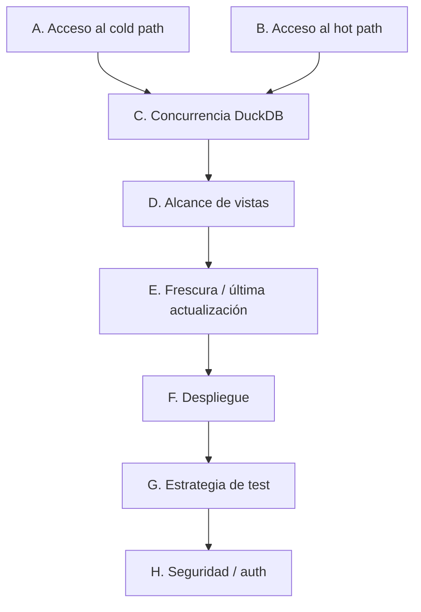

# Fase 6 — Decisiones de diseño del dashboard (pre-spec)

Este documento no es un ADR ni el spec de la Fase 6. Es el mapa de decisiones reales — cómo lee el
dashboard el hot path y el cold path, concurrencia, alcance de vistas, despliegue y test — que hay
que resolver antes de escribir `specs/phases/06-dashboard/spec.md`. Mismo formato que
`docs/phase-5-persistence-design-decisions.md`, con panel de 5 asesores en los puntos realmente
abiertos (no en los que ya se resuelven solos).

**Contexto que ata todo lo demás:** Fase 5 ya dejó listas las piezas — `price_decision` en DynamoDB
(hot path, Fase 4/ADR-0006) y `dim_apartment`/`fct_daily_price`/`fct_margin_alert`/`fct_price_decision`
en DuckDB vía dbt (cold path, Fase 5). El dashboard (`dashboard/`, ya existe como esqueleto vacío en
el workspace — `streamlit`+`boto3`+`pandas` ya pineados desde ADR-0004) no construye datos nuevos,
solo los consume.

**Panel de 5 asesores** (aplicado en A, B y C — los puntos con una decisión real por tomar):
El Contrario, Pensador de Primeros Principios, Expansionista, Outsider, Ejecutor.

---

## A. Acceso al cold path (marts de dbt)

| Opción | Qué pasa en la práctica |
|---|---|
| **Leer directamente el fichero `pms_lakehouse.duckdb`** (elegido) | `dbt-runner` ya lo materializa cada 15 min en el volumen Docker `dbt_warehouse`. El dashboard monta el mismo volumen (solo lectura) y abre el fichero con el cliente `duckdb` de Python — cero infraestructura nueva. |
| **Re-implementar `iceberg_scan()` propio** | Duplicaría el wiring de catálogo que ya vive en `transform/profiles.yml` (SqlCatalog, `unsafe_enable_version_guessing`). Dos sitios manteniendo la misma lógica de catálogo — mismo error de diseño que `lakehouse-shared` ya se creó para evitar en Fase 5. |
| **Athena / motor con servidor** | No existe en local (LocalStack Community no da Athena); es la vía real de Fase 7, no de esta fase. |

**5 asesores:**
- **Contrario:** leer el fichero interno de otro servicio acopla el dashboard a un detalle de implementación de dbt. Si Fase 7 cambia el motor (Athena/Trino), el dashboard se rompe si no hay una capa intermedia.
- **Primeros principios:** el problema real es "leer 3-5 tablas pequeñas cada pocos minutos" — dbt ya las materializó, usar eso literalmente en vez de re-derivar el mismo dato por otro camino.
- **Expansionista:** si en el futuro hay más consumidores (BI externo, Metabase), conviene exponer las marts vía Glue/Athena real en vez de un fichero DuckDB en un volumen — anotado como vía de promoción de Fase 7, no bloquea ahora.
- **Outsider:** alguien nuevo esperaría "conectar a una base de datos", no leer un fichero binario compartido por volumen Docker — merece un comentario explicando el por qué (coherente con "cero servidores extra" que ya rige el resto del proyecto).
- **Ejecutor:** usarlo ya, pero envuelto en una función propia (`read_marts()` en un nuevo módulo, no en `dashboard/main.py` directamente) para que el día que cambie el motor sea un solo punto de cambio.

**Confirmado:** lectura directa del fichero DuckDB compartido, encapsulada en `dashboard/src/dashboard/marts.py` (una función por tabla, no SQL disperso en la UI).

---

## B. Acceso al hot path (DynamoDB `price_decision`)

La tabla tiene `apartment_id` (HASH) + `target_date` (RANGE) — no hay índice para "todos los
apartamentos en la fecha X" sin recorrer la tabla entera.

| Opción | Qué pasa en la práctica |
|---|---|
| **`Scan` completo + filtro en cliente** | Funciona a cualquier volumen de datos porque es fuerza bruta, pero es el antipatrón número uno de coste/latencia en DynamoDB — exactamente el hábito a no normalizar antes de la Fase 7 (AWS real, coste real). |
| **N `Query` (uno por apartamento, `Limit=1`, orden descendente)** (elegido) | Usa la lista de `apartment_id` que ya da `dim_apartment` (cold path) para saber qué consultar, y hace una `Query` — la primitiva correcta en DynamoDB — por cada uno. Escala lineal con el nº de apartamentos (~10-30 en esta PoC), no con el tamaño de la tabla. |
| **Añadir un GSI por `target_date`** | Una sola `Query` traería todos los apartamentos de una noche de golpe. Trivial de añadir sin tocar el escritor (Flink solo hace `put_item`, un GSI no le afecta). Más eficiente a escala real. |

**5 asesores:**
- **Contrario:** N queries es mejor que un Scan, pero sigue siendo N llamadas por refresco de página — a 30 apartamentos es barato, a 300 empieza a doler.
- **Primeros principios:** `Query` es la primitiva de acceso correcta en DynamoDB (acceso por partition key conocida); `Scan` es "no sé qué busco, lee todo" — el dashboard sí sabe qué busca (la lista de apartamentos de `dim_apartment`).
- **Expansionista:** el GSI por `target_date` es la mejora obvia si el nº de apartamentos crece — anotarlo ahora como follow-up de Fase 7, no construirlo ya sin necesidad real (mismo criterio que Fase 4 ya aplicó a `available_days`).
- **Outsider:** resulta raro que el hot path dependa del cold path (dbt) para saber qué claves consultar — pero es exactamente para eso que existe `dim_apartment`: el catálogo de entidades conocidas.
- **Ejecutor:** implementar N `Query` ya; GSI queda en `specs/phases/06-dashboard/spec.md §13` como limitación conocida, no como bloqueante.

**Confirmado:** N `Query` por apartamento (no `Scan`), lista de apartamentos desde `dim_apartment`. GSI por `target_date` anotado como mejora de Fase 7 si el volumen lo justifica.

---

## C. Concurrencia: leer el fichero DuckDB mientras `dbt-runner` escribe

DuckDB permite un único escritor por fichero, pero varios lectores concurrentes solo si abren la
conexión explícitamente en modo `read_only=True`. **No asumido — a verificar en vivo** (misma
disciplina que Fase 4/5 ya aplicaron a Glue/PyIceberg antes de construir encima): abrir el dashboard
mientras `dbt-runner` ejecuta un `dbt run` real contra el mismo fichero, y confirmar si hay conflicto
de lock o no.

**5 asesores:**
- **Contrario:** "no asumas que `read_only=True` basta sin probarlo contra el `dbt-runner` corriendo de verdad" — el proyecto ya se equivocó dos veces asumiendo comportamiento de una librería (Glue Ultimate-tier, PyIceberg 0.7+ compaction) y le costó tiempo cada vez.
- **Primeros principios:** el patrón real es "un escritor, varios lectores" — DuckDB lo soporta en teoría vía su modelo de fichero, pero hay que confirmar la versión concreta que usamos, no la documentación genérica.
- **Expansionista:** si la verificación en vivo falla, el plan B limpio es que `dbt-runner` escriba a un fichero temporal y haga un `mv` atómico al terminar cada corrida — el dashboard nunca ve un fichero a medio escribir. Anotarlo ya como plan B, no implementarlo salvo que falle.
- **Outsider:** compartir un fichero DuckDB entre dos contenedores vía volumen suena frágil comparado con una base de datos con servidor — pero es coherente con "cero servidores extra" que ya rige Postgres/LocalStack/DuckDB en este proyecto.
- **Ejecutor:** verificar en vivo primero, con un AC dedicado (ver spec futura), y decidir el plan B solo si la verificación falla — no construir la mitigación antes de saber si hace falta.

**Confirmado:** verificar en vivo antes de construir sobre ello. Si falla, plan B = escritura atómica por fichero temporal en `dbt-runner`. Se documenta como AC explícito de la Fase 6, no como supuesto.

---

## D. Alcance de vistas (mínimo viable)

Kimball (Fase 5) ya construyó las piezas — el dashboard solo las consume, sin lógica de negocio
nueva:

| Vista | Fuente | Camino |
|---|---|---|
| Precio actual por apartamento | `price_decision` (DynamoDB, `Query` por apartamento) | Hot path |
| Evolución de precio por apartamento | `fct_daily_price` | Cold path |
| Alertas de margen (`cost_protected`) | `fct_margin_alert` | Cold path |
| Detalle "por qué este precio" (drill-down, opcional si da tiempo) | `fct_price_decision` (todos los campos de cálculo) | Cold path |

**Confirmado:** las 3 primeras vistas son el alcance mínimo de la Fase 6; el drill-down queda como
extensión, no como bloqueante. Sin filtros avanzados, sin auth (ver H), sin edición — solo lectura.

---

## E. Frescura / "última actualización"

El hot path es en tiempo real (lectura directa a DynamoDB); el cold path tiene hasta 15 minutos de
retraso (intervalo de `dbt-runner`, Fase 5 §10). El dashboard debe mostrar explícitamente un
`última actualización: <max(ingested_at)>` en las vistas de historial/alertas — mismo concepto que
`dbt source freshness` (Fase 5 §7), llevado a la propia UI para no dar sensación falsa de tiempo real
donde no la hay.

**Confirmado:** timestamp visible en cada vista de cold path, calculado como `max(ingested_at)` de la
tabla leída, no un reloj de pared.

---

## F. Despliegue

**Confirmado:** nuevo servicio `dashboard` en `infra/docker-compose.yml` (Streamlit, puerto `8501`,
ya reservado en el README desde Fase 0). Monta `dbt_warehouse` en modo solo-lectura; variables de
entorno AWS/LocalStack iguales al resto de servicios para el acceso a DynamoDB. Sin infraestructura
nueva más allá de esto.

---

## G. Estrategia de test

Mismo criterio piramidal que Fases 4-5:

- **Funciones puras, sin infraestructura:** formateo/agregación de filas leídas de las marts,
  construcción de las `Query` de DynamoDB (parámetros correctos, no el resultado real).
- **Componente:** lectura contra un fichero DuckDB de fixture y una tabla DynamoDB local (LocalStack)
  con datos sintéticos — confirma que las vistas leen las columnas correctas.
- **Smoke manual/vivo:** Streamlit levantado contra el stack real, click-through de las 3 vistas,
  igual que el resto de infraestructura pesada de este proyecto. No hay Selenium/Playwright
  automatizado — fuera de alcance para esta PoC.

---

## H. Seguridad / auth

LocalStack Community no impone IAM y Streamlit no tiene auth propia por defecto. **Confirmado para
esta fase:** sin autenticación, solo accesible en `localhost` (PoC, red local). Anotado como
limitación conocida — una promoción real (Fase 7, fuera de `localhost`) necesitaría auth (p. ej.
Cognito o un proxy con login) antes de exponerse, mismo criterio que la sección IAM que Fase 5 ya
dejó escrita para Fase 7 sin implementarla en LocalStack.

---

## Balance

**Confirmado:** A (fichero DuckDB compartido, encapsulado), B (N `Query` por apartamento, no `Scan`;
GSI anotado para Fase 7), C (verificar en vivo la concurrencia de lectura/escritura del fichero
DuckDB antes de construir sobre ella; plan B = escritura atómica si falla), D (3 vistas mínimas:
precio actual, evolución, alertas), E (timestamp de frescura visible en cold path), F (nuevo
servicio `dashboard` en compose, volumen read-only), G (pirámide de test habitual), H (sin auth en
local, anotado para Fase 7).

**No quedan decisiones de dominio pendientes que bloqueen escribir `specs/phases/06-dashboard/spec.md`.**
El único punto con verificación en vivo pendiente antes de construir es C (concurrencia DuckDB) —
mismo principio que Fases 4-5 ya aplicaron repetidamente: no asumir, comprobar contra el stack real
antes de comprometerse en el spec formal.
