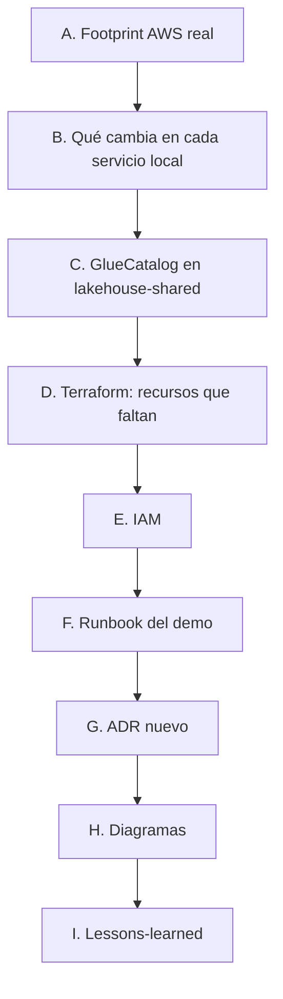

# Fase 7 — Decisiones de diseño del demo y cierre (pre-spec)

Pre-spec de la última fase: demo real en AWS + documentación de cierre. No es un ADR ni el spec
formal. Confirmado con el usuario antes de escribir código: **trabajo de documentación primero
(coste cero)**, despliegue AWS real después, con footprint mínimo y Budget alerts ($5/$10) ya
configuradas en la cuenta real.

---

## A. Footprint AWS real

**Confirmado con el usuario:** solo la capa de almacenamiento/estado va a AWS real — **S3, Kinesis,
DynamoDB, Glue Data Catalog**. Kafka, Kafka Connect (Debezium), Flink y Postgres **siguen en Docker
Compose local**, reconfigurados para apuntar a los endpoints reales de AWS en vez de LocalStack.

**Por qué:** el propio README ya limitaba Terraform a "S3, Kinesis, DynamoDB" — nunca a Kafka/Flink.
Un MSK o Flink gestionado (KDA/EMR) en AWS real cuesta por hora de bróker/nodo incluso en el tier más
pequeño y se comería el budget de $5-10 en minutos, no en el tiempo que dura un demo. Todo lo que ya
corre gratis en Docker Compose (cómputo) se queda ahí; solo lo que necesita ser "de verdad AWS" para
que el demo tenga sentido (almacenamiento durable, streaming gestionado, catálogo) se despliega.

---

## B. Qué cambia en cada servicio local para apuntar a AWS real

Para la mayoría de servicios, es un cambio de **configuración, no de código** — mismo patrón que
`lakehouse-shared`'s `build_catalog()` ya documentaba desde la Fase 5 ("promoción a Fase 7 es un
endpoint swap"):

| Servicio | Cambio |
|---|---|
| `market-ingestor` | `MARKET_INGESTOR_KINESIS_ENDPOINT_URL` sin definir (boto3 usa el endpoint real de AWS por región) + credenciales reales (no `test`/`test`) |
| `lakehouse-consumer` / `lakehouse-maintenance` | `LAKEHOUSE_CONSUMER_DYNAMODB_ENDPOINT_URL`/`S3_ENDPOINT_URL` sin definir + credenciales reales + **ver punto C** (esto sí es código) |
| `dbt-runner` | `DBT_S3_ENDPOINT` → el endpoint real de S3 (`s3.<region>.amazonaws.com`), credenciales reales. `unsafe_enable_version_guessing` se mantiene (ver nota) |
| `dashboard` | `DASHBOARD_DYNAMODB_ENDPOINT_URL` sin definir + credenciales reales |
| Flink (`flink-jobmanager`) | `FLINK_JOB_DYNAMODB_ENDPOINT_URL`/`S3_ENDPOINT_URL` sin definir + credenciales reales; `s3.endpoint` de `FLINK_PROPERTIES` apunta al S3 real |

**Nota sobre dbt-duckdb y Glue:** DuckDB's `iceberg_scan()` lee directamente de S3 por ruta — no
habla con la API de Glue en ningún momento, tanto si el catálogo que gestiona la tabla es `SqlCatalog`
como `GlueCatalog`. Es decir: cambiar el catálogo de escritura (punto C) no obliga a cambiar cómo dbt
lee. `unsafe_enable_version_guessing` sigue siendo necesario salvo que se implemente el mecanismo de
`external_location` con la ruta exacta que Glue reporta — fuera de alcance de esta fase, anotado como
posible mejora futura, no bloqueante.

---

## C. `GlueCatalog` en `lakehouse-shared` — esto sí es código, no solo config

**Confirmado 2026-08-04 (spec 05 §10):** la promoción de Fase 7 "requiere un cambio de código real
(`GlueCatalog`), no solo un endpoint/credential swap" — ya anotado en su momento, ahora toca
implementarlo.

`libs/lakehouse-shared/src/lakehouse_shared/catalog.py`'s `build_catalog()` necesita una segunda rama:
`GlueCatalog` (vía `pyiceberg.catalog.glue`) cuando `IcebergCatalogSettings` indique modo AWS real, en
vez de `SqlCatalog` (SQLite) que usa hoy para LocalStack/PoC. Mismo patrón que cualquier otro
"local vs. real" switch de este proyecto (LocalStack vs AWS real vía endpoint), pero aquí el cambio
está en qué **clase de PyIceberg catalog** se instancia, no solo en qué endpoint se le pasa — de ahí
que sea código, no solo variables de entorno.

---

## D. Terraform — recursos que faltan (el stub de Fase 0 está obsoleto)

El `infra/terraform/` actual (`main.tf`/`variables.tf`/`outputs.tf`) es del Phase 0, anterior a que
existiera ningún spec real. No coincide con lo construido:

| Recurso del stub | Problema |
|---|---|
| `aws_dynamodb_table.apartment_prices` | Nombre y esquema incorrectos — la tabla real es `price_decision` (`apartment_id` HASH + `target_date` RANGE, Streams `NEW_AND_OLD_IMAGES`) |
| `aws_s3_bucket.iceberg` (uno solo) | Faltan **dos** buckets con ciclos de vida distintos (Fase 5, pre-spec Decisión E): `pms-iceberg` (checkpoints Flink, desechable) y `pms-lakehouse` (histórico Iceberg, permanente, versionado) |
| — | Falta `stream_checkpoints` (DynamoDB, PK `shard_id`) — Fase 5 |
| — | Falta el Glue Data Catalog (`aws_glue_catalog_database`) — Fase 5 lo dejó pendiente explícitamente para esta fase |
| — | Faltan los roles IAM (ver punto E) — nunca se habían escrito como Terraform, solo como tabla de diseño en los specs |

**A actualizar antes de cualquier `terraform apply`:** reescribir `main.tf`/`variables.tf`/`outputs.tf`
para que coincidan exactamente con lo que `infra/localstack/init-aws.sh` ya provisiona en local — mismo
esquema, mismos nombres (o un prefijo/sufijo de demo si hace falta evitar colisión de nombres
globalmente únicos en S3).

---

## E. IAM — de tabla de diseño a Terraform real

Fase 5 (§10.1) y Fase 6 (§8.1) ya escribieron, por servicio, el permiso mínimo necesario — "diseño no
exigible en LocalStack Community, escrito para que Fase 7 tenga algo que implementar". Ahora toca
convertir esas tablas en `aws_iam_role`/`aws_iam_role_policy` reales, uno por servicio
(`lakehouse-consumer`, `lakehouse-maintenance`, `dbt-runner`, `dashboard`, más el rol que ya use
`market-ingestor`/Flink si no existía antes) — sin wildcards de recurso, exactamente como esas tablas
ya especifican.

**Pregunta abierta de Fase 5, aún sin resolver:** las acciones de DynamoDB Streams no siempre soportan
ARNs de recurso tan finos como la tabla base — confirmar contra el policy simulator de IAM real al
escribir esto, no asumir que la política de LocalStack (permisivo por defecto) generaliza.

---

## F. Runbook del demo — orden de operaciones

1. `terraform apply` (con los recursos corregidos del punto D) — anotar los outputs (ARNs, nombres).
2. Reconfigurar env vars de los servicios locales (punto B) y relanzar solo esos contenedores vía
   Docker Compose (Kafka/Flink/Postgres siguen igual, no tocan AWS).
3. Registrar el conector Debezium, someter el job de Flink (igual que en local) — pero ahora
   `price_decision` vive en DynamoDB real y `market-price-events` en Kinesis real.
4. Dejar correr unos minutos para generar historial real (mismo patrón ya probado en local: sembrar
   unos `payment_lines`/decisiones si hace falta acelerar el demo).
5. Abrir el dashboard, mostrar el flujo end-to-end contra AWS real.
6. **`terraform destroy` inmediatamente después** — no negociable, coste real corriendo.

---

## G. ADR nuevo

**Un solo ADR nuevo para esta fase:** "footprint del demo AWS — almacenamiento/estado real, cómputo
local" (punto A). Cumple el criterio que este proyecto ya usa para decidir qué merece ADR (Fase 4/5):
rompe un límite de fase / decide cómo se despliega el sistema completo, no un detalle interno de una
fase. El cambio de catálogo (punto C) no necesita su propio ADR — ya estaba anotado como decisión
tomada desde la Fase 5, esto es solo implementarlo.

---

## H. Diagramas

- **Nuevo, con más valor que rellenar huecos:** un diagrama de arquitectura final mostrando la
  frontera local/AWS real — qué corre en Docker Compose, qué corre en AWS, y por dónde cruza cada
  flujo. Es el diagrama que le falta a este proyecto y que no tenía sentido dibujar antes de que esta
  frontera existiera de verdad.
- **Opcional, no bloqueante:** completar los diagramas que faltan de Fases 2/5/6 (`diagrams/` solo
  tiene 1, 3 y 4 hoy) — se puede hacer si queda tiempo, no es parte del "hecho cuando" de esta fase.

---

## I. Lessons-learned — estructura propuesta

No repetir el diario ni el error-handling — destilarlos. Estructura:

1. **Resumen ejecutivo** — qué se construyó, qué tecnologías, qué se demuestra.
2. **Por tecnología** (Debezium/CDC, Flink/streaming state, Iceberg/dbt, LocalStack) — 3-5 lecciones
   reales por tecnología, enlazando al `error-handling/` correspondiente en vez de duplicar el detalle.
3. **Qué sorprendió** — hallazgos que invalidaron una asunción inicial (Glue Ultimate-tier, PyIceberg
   0.8.1 sin compaction nativa, DuckDB bloqueando lecturas concurrentes).
4. **Qué se haría distinto** — con la perspectiva completa del proyecto, no solo por fase.
5. **Qué queda fuera del PoC** — enlace a `docs/post-poc-roadmap.md`, sin repetirlo.

---

## Balance

**Confirmado:** A (footprint mínimo: S3+Kinesis+DynamoDB+Glue reales, cómputo local), B (cambios de
config por servicio, tabla arriba), C (`GlueCatalog` en `lakehouse-shared`, código real), D (Terraform
del Phase 0 obsoleto, reescribir para que coincida con `init-aws.sh`), E (IAM real por servicio, sin
wildcards), F (runbook de 6 pasos, `terraform destroy` no negociable), G (1 ADR nuevo, footprint del
demo), H (1 diagrama nuevo, frontera local/AWS), I (lessons-learned por tecnología, enlazando en vez
de duplicar).

**Orden de ejecución confirmado con el usuario:** documentación y preparación (B–E como código/config,
sin `apply`; G, H, I) primero, coste cero. El despliegue real (F) se ejecuta al final, cuando todo lo
anterior esté listo y revisado.
