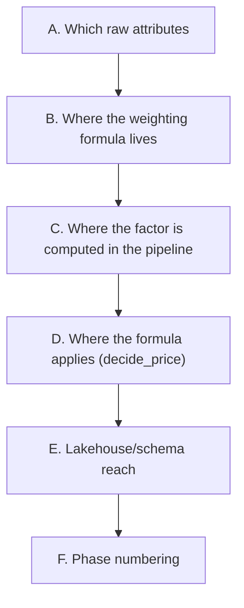

# Phase 8 — Property Bonus/Malus design decisions (pre-spec)

Pre-spec for the first backlog item picked up from `docs/post-poc-roadmap.md` (ADR-0011): Property
Bonus/Malus + Property Reference Price. Not a formal spec — decisions confirmed with the user before
writing `specs/phases/08-property-bonus-malus/spec.md`.



---

## A. Which raw attributes

**Confirmed:** full attribute-plus-weights route, not a single flat owner-set factor (the alternative
considered: one `property_attribute_factor` column, same pattern as `target_margin` — rejected as not
faithful enough to the source spec's Bonus/Malus model, which explicitly wants individual attributes
combined via configurable weights, not a single opaque number).

Four raw attributes on `apartment_market_segments` (new columns), chosen to cover both a strong
overall-quality signal and two differential amenities, without trying to cover BiLemon's entire
endogenous/exogenous list in one pass:

- `quality_tier` — enum (`basic` / `standard` / `premium` / `luxury`), the single biggest driver.
- `rating` — numeric (1.0–5.0), an independent "perceived quality" signal alongside `quality_tier`.
- `has_view` — boolean.
- `has_parking` — boolean.

**Why these four, not more:** each is cheap to synthesize plausibly in `mock-pm-app`, each maps
cleanly to a bounded bonus/malus adjustment, and together they already prove the point (apartments in
the same segment stop receiving an identical market price) without the scope of modeling BiLemon's
full attribute list (surface, bathrooms, terrace, pool, elevator, AC, workspace, distance to POIs,
neighborhood attractiveness...) in one phase.

## B. Where the weighting formula lives

**Confirmed:** a new pure function module, `streaming/flink-jobs/src/flink_jobs/property_attributes.py`
— same shape as `cost_aggregation.py`/`staleness.py`/`eviction.py`/`watchdog.py` (one focused pure
function per concern, independently unit-testable). Weights are named module-level constants (same
pattern as `REDUCED_MARGIN_FACTOR` in `pricing.py`), not inline arithmetic — "configurable, not
embedded irreversibly in code" is the source spec's own stated principle (§6.3).

**Combination method:** additive percentage adjustments summed into a single multiplier, not a chain
of independent multiplications — closer to the source spec's own wording ("la suma... transforma el
Market Reference Price") and easier to later decompose into named reason codes (backlog #4, Decision
Components) than a multiplicative chain would be:

```
factor = 1 + quality_tier_adjustment + rating_adjustment + view_adjustment + parking_adjustment
factor = clamp(factor, MIN_FACTOR, MAX_FACTOR)
```

Illustrative starting weights (tunable, not load-bearing on the design itself):

| Attribute | Adjustment |
|---|---|
| `quality_tier` | basic `-0.15` / standard `0.00` / premium `+0.15` / luxury `+0.30` |
| `rating` | `(rating - 4.0) × 0.10` (linear, centered on a "typical" 4.0) |
| `has_view` | `+0.05` if true |
| `has_parking` | `+0.04` if true |

Clamp range `[0.5, 2.0]` — a guardrail against an absurd combined factor, matching the source spec's
own emphasis on caps (§14.2, Guardrails layer), even though the full layered RM engine (backlog #7)
isn't built yet.

## C. Where the factor is computed in the pipeline

**Confirmed:** Stage A (`CostEnrichmentFunction`), not Stage B. The four raw attributes travel through
CDC → `ApartmentSegmentRow` → `SegmentAssignment` (broadcast state) exactly like `city`/`neighborhood`/
`property_type`/`bedrooms` already do — but Stage A resolves them into a single
`property_attribute_factor: float` field on `CostAggregate`, the same way it already resolves
`target_margin`/`competitiveness_discount`/`commission_pct` from broadcast state into ready-to-use
values. Stage B and `decide_price()` never see the four raw attributes — only the resolved factor.

**Why not resolve it in Stage B or in `decide_price()` itself:** `CostAggregate` already is "config
resolved for this apartment" — keeping the weighting logic in one place (Stage A) means it runs once
per cost update, not once per fan-out pair in Stage B's cross-join, and keeps `decide_price()` a pure
function of scalars, consistent with its current shape.

## D. Where the formula applies

**Confirmed:** `decide_price()` gains a new parameter, `property_attribute_factor: float = 1.0`
(default preserves every one of ADR-0009's existing worked examples exactly — regression safety, same
convention as the LOS outline's `stay_length` default). Internally:

```
property_reference_price_eur = avg_nightly_rate_eur × property_attribute_factor
market_reference_price_eur   = property_reference_price_eur × (1 - competitiveness_discount)
```

`rule_applied`'s comparisons and `below_market_by` move from the raw `avg_nightly_rate_eur` to
`property_reference_price_eur` — this is the actual point of the phase: two apartments in the same
segment, same cost structure, now get genuinely different competitive thresholds if their attributes
differ. `avg_nightly_rate_eur` itself keeps flowing through unchanged, as the raw market observation.

## E. Lakehouse / schema reach

**Confirmed:** the four raw attributes stay Postgres-only — the same limitation this project already
accepted for `property_type`/`bedrooms` (`specs/phases/05-persistence/spec.md` §13: `price_decision.v1`
only carries a collapsed `city/neighborhood` string, so `dim_apartment` can't see finer attributes
without either forwarding them into the event contract or adding a second dbt source, neither in scope
before). Forwarding all four raw attributes into `price_decision.v1`/`dim_apartment` is explicitly
**out of scope for this phase** — it would fix a pre-existing gap this phase didn't create, and doing
it now would double this phase's surface area for no requirement this phase actually has.

What **does** reach the schema: the two **derived** fields, `property_attribute_factor` and
`property_reference_price_eur`, added to `price_decision.v1`'s `calculation` block — pure additive
columns (no `schema_version` bump, same precedent as ADR-0007/ADR-0009), flowing through
`price_decision_raw` (Iceberg) into `fct_price_decision` via ordinary dbt schema evolution (Phase 5's
own documented story: "just new columns, no redesign").

## F. Phase numbering

**Confirmed:** this becomes **Phase 8**. `docs/post-poc-roadmap.md`'s existing "a future Phase 8:
LOS-aware floor" outline is renumbered to **Phase 9** — this repo numbers phases by actual
implementation order, not by the theoretical priority tier a backlog item was first assigned (LOS was
tier "Now" in the backlog; Property Bonus/Malus was tier "Later" — the user chose to pick this one up
first regardless, and the phase numbering reflects that choice, not the original priority ranking).

---

## Balance

**Confirmed:** A (4 raw attributes: quality_tier, rating, has_view, has_parking), B (weights as named
constants in a new `property_attributes.py`, additive-percentage combination, clamped), C (factor
computed once in Stage A, attached to `CostAggregate`), D (`decide_price()` gains
`property_attribute_factor`, default `1.0`; `market_reference_price_eur`/`rule_applied`/
`below_market_by` move to `property_reference_price_eur`), E (raw attributes Postgres-only; only the
two derived fields reach `price_decision.v1`/Iceberg/dbt), F (this is Phase 8; LOS becomes Phase 9).
