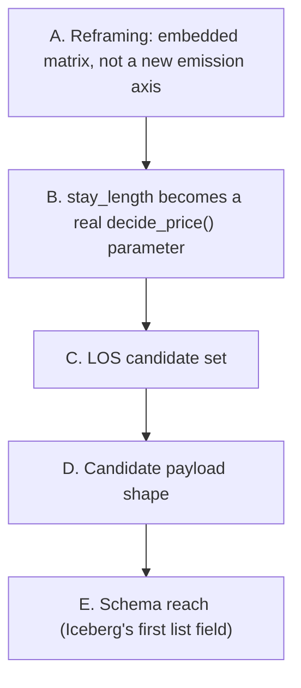

# Phase 9 — LOS floor matrix design decisions (pre-spec)

Pre-spec for backlog item #1 (`docs/post-poc-roadmap.md`) — the LOS-aware floor. Supersedes that
roadmap's original A/B design fork with a third option found while designing this phase; confirmed
with the user before writing `specs/phases/09-los-floor-matrix/spec.md`.



---

## A. Reframing: embedded matrix, not a new emission axis

The roadmap's original fork (A: one `price_decision` row per LOS candidate, requiring a DynamoDB PK
change to `(apartment_id, target_date, stay_length)`; B: compute the matrix at read time, outside
Flink) both assumed evaluating multiple LOS candidates necessarily multiplies Stage B's fan-out or
duplicates the pricing formula outside Flink.

**Confirmed:** neither is true, because `market_reference_price_eur`/`property_reference_price_eur`
(everything market-side) depend only on `avg_nightly_rate_eur`, `property_attribute_factor`, and
`competitiveness_discount` — none of which vary with `stay_length` or `days_to_arrival`. Only
`minimum_price_eur` (the floor) varies with `n`. That means every LOS candidate's full
`decide_price()` result can be computed **inside the same `_build_price_decision()` call Stage B
already makes for one (apartment, night) pair** — no new fan-out, no new DynamoDB key, no logic
duplicated outside Flink. `price_decision.v1` gains one new field,
`calculation.los_floor_matrix`, holding the array of per-candidate results.

**Why this is the better fit, not just an alternative:** it satisfies the standing project
guideline (SOLID/DRY, easily-modifiable code) directly — `decide_price()` stays the single source
of truth for the floor formula, called N times with different `stay_length` rather than
reimplemented anywhere; it avoids Risk 4/5's fan-out concern entirely rather than mitigating it;
and it doesn't touch the DynamoDB PK, so Phase 5's Iceberg mirror and Phase 6's dashboard queries
are unaffected by anything except an additive schema change. It also matches the source spec's own
described shape more closely than either original option — BiLemon's §10.1 LOS floor matrix is a
table keyed by `(arrival, LOS)` attached to one arrival date's evaluation, and its §28 non-functional
requirements ask for exactly this as a side calculation, not a firehose of new decisions.

## B. `stay_length` becomes a real `decide_price()` parameter — and ADR-0009's formula needs correcting for `n > 1`

**Confirmed:** replace the hardcoded module constant `STAY_LENGTH_NIGHTS = 1` in `pricing.py` with a
real parameter, `stay_length: int = 1` (default preserves every existing ADR-0009 worked example
unchanged — the same regression-safety convention Phase 8's `property_attribute_factor` default
established).

**Found while designing this phase — ADR-0009's symbolic formula, taken literally, is wrong for
`n > 1`.** ADR-0009 wrote `structural_floor = ((n×Cf) + (n×Cv) + Cr) / (1 - M - Cp)` with `n` as a
placeholder, but D5 fixed `n = 1` immediately after, so that formula was never actually exercised
for `n ≠ 1`. Verified numerically: with `Cf = Cv = 0`, `Cr = 110`, that literal formula returns
`110 / (1 - M - Cp)` for **every** `n` — it never dilutes anything, because `Cr` (a lump sum per
booking) is never divided by `n`, and `Cf`/`Cv` are already per-night rates (`cost_aggregation.py`
computes them as `sum / available_days`), so multiplying them by `n` produces a total-stay figure,
not a per-night one — incompatible with comparing `minimum_price_eur` against `avg_nightly_rate_eur`
(always per-night).

**Corrected formula, per night:**
```
minimum_price_eur (structural) = (fixed_cost_eur + variable_cost_eur + one_time_cost_eur / n) / (1 - margin - commission)
minimum_price_eur (contribution) = (variable_cost_eur + one_time_cost_eur / n) / (1 - commission)
```
No more `n × Cf` / `n × Cv` — they're already nightly. Only `one_time_cost_eur` gets divided by `n`,
which is exactly the dilution `docs/post-poc-roadmap.md` §1's own worked example describes
(cleaning+laundry €110/booking → €110/night at LOS 1, €11/night at LOS 10). For `n = 1` this is
algebraically identical to today's formula (`one_time_cost_eur / 1 = one_time_cost_eur`) — every
existing test stays valid unchanged. `effective_margin`'s `total_cost_eur` is amortized the same
way (`fixed_cost_eur + variable_cost_eur + one_time_cost_eur / n`), so it stays comparable to a
per-night `suggested_price_eur` at any `stay_length`.

## C. LOS candidate set

**Confirmed:** `{1, 2, 3, 7, 14}` nights, as a named constant (`LOS_CANDIDATES` in `pricing.py`) —
the exact set already sketched in the roadmap. Kept as a code constant for this phase (same stance
Phase 8 took on Bonus/Malus weights): configurable-in-principle, not runtime-editable yet — that's
backlog #7 (layered RM engine) territory, which needs a general rule-versioning story this phase
doesn't.

## D. Candidate payload shape

**Confirmed:** each `los_floor_matrix` entry carries `stay_length`, `minimum_price_eur`,
`floor_type`, `rule_applied`, `suggested_price_eur`, `effective_margin` — the fields that actually
vary per candidate. `property_attribute_factor`, `property_reference_price_eur`,
`market_reference_price_eur`, and `below_market_by` are **not** repeated per candidate — they're
identical across every candidate for a given decision (§A), so repeating them five times per
decision would be redundant data, not more information. `stay_length=1`'s candidate entry
intentionally duplicates the top-level `calculation` block's own values (by construction, since the
top-level calculation *is* the `stay_length=1` case) — kept in the matrix anyway for a uniform
display grid, matching BiLemon's own worked table (§10.1) which lists LOS=1 alongside longer stays.

## E. Schema reach — Iceberg's first list field

**Confirmed:** `los_floor_matrix` is the first array/list-typed field anywhere in `price_decision.v1`
— every other field to date has been a flat scalar or a nested struct. This is a small, scoped
precedent for backlog #4 (Decision Components), which needs the exact same kind of list container
but for structured reason codes instead of LOS candidates; ADR-0011 already flagged
`extra="forbid"` + "no existing array to extend" as the reason #4 is tier "Next" rather than a cheap
column add. This phase doesn't unblock #4 by itself (a `los_floor_matrix: list[LosFloorCandidate]`
is a different shape than a generic `decision_components: list[DecisionComponent]`), but it proves
the Pydantic/JSON-Schema/Iceberg/dbt list-field mechanics work end to end in this codebase, which #4
will need to repeat.

Concretely: `LosFloorCandidate` (new Pydantic sub-model, `extra="forbid"` like every other
sub-model), `specs/events/price_decision.v1.json`'s `calculation.los_floor_matrix` as a JSON Schema
array of objects, and a `pyiceberg.types.ListType` wrapping a `StructType` in
`lakehouse-consumer/schema.py` with fresh field IDs (continuing from 40).

---

## Balance

**Confirmed:** A (embedded matrix inside the existing per-night decision, no new fan-out or PK
change — supersedes the roadmap's original A/B fork), B (`stay_length` real parameter on
`decide_price()`, default `1` — and ADR-0009's literal `n×Cf`/`n×Cv` notation corrected to amortize
`Cr` instead, verified numerically to be the difference between diluting and not diluting at all),
C (candidate set `{1,2,3,7,14}`, code constant), D (trimmed per-candidate payload — only the fields
that actually vary by LOS), E (first list field in `price_decision.v1`; a scoped precedent for
backlog #4, not a substitute for it).
