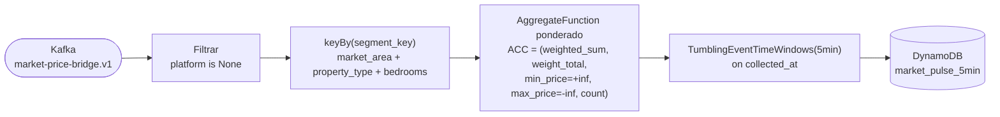
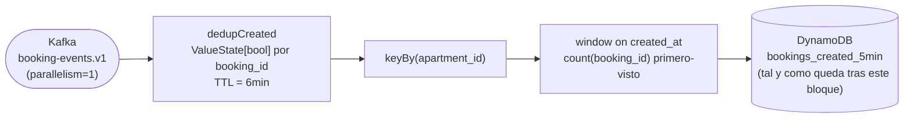
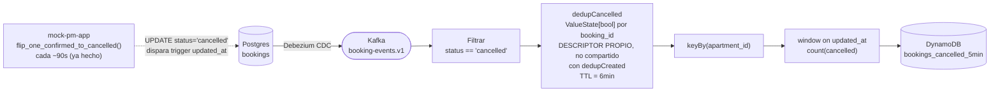

# Fase 26 — Plan de implementación (Market Pulse Job)

**Qué es esto, y qué no es:** este documento responde "en qué orden lo construyo y qué compruebo en
cada paso". El diseño completo (qué se construye, por qué, las 4 decisiones cerradas, los criterios
de aceptación AC-01 a AC-12) vive en
[`spec.md`](./spec.md) y no se repite aquí. Escrito y validado con el propio autor de la fase,
paso a paso — cada bloque queda cerrado solo cuando la línea de verificación está clara antes de
programarlo, no después.

**Criterio general de orden, decidido explícitamente (no por defecto):**
1. Esqueleto mínimo primero (sin métricas, sin sinks) — demuestra que las piezas base conectan
   antes de meter complejidad.
2. Infraestructura (las 3 tablas DynamoDB nuevas) de una sola vez, no incremental — coherente con
   cómo este propio repo ya provisiona cada fase (`infra/localstack/init-aws.sh` es un único script
   por fase).
3. Las métricas, una a una, de menor a mayor complejidad/dependencias: market pulse (más simple,
   sin dedup, sin I/O externo) → bookings created (dedup) → bookings cancelled (dedup + arreglo de
   `mock-pm-app`) → profit/Async I/O (la pieza más delicada, dependencia externa de datos ya
   existentes en `price_decision`, se deja para el final).
4. Dentro de cada bloque, lo que es calco de código ya existente en `flink_jobs/` va separado de lo
   genuinamente nuevo/arriesgado (ver Bloque 0, tareas 2 vs. 3) — si algo falla al probar, se sabe
   de inmediato en cuál de las dos partes está el problema.

---

## Bloque 0 — Esqueleto mínimo

Sin ninguna de las 3 métricas, sin ventanas, sin sinks. Solo demuestra que el job arranca, lee, y
deserializa correctamente.

- [ ] **Tarea 1 — `streaming/market-pulse-job/src/market_pulse_job/settings.py`**
      Declarar como configuración (nada hardcodeado): nombres de los 3 topics de entrada
      (`market-price-bridge.v1`, `booking-events.v1`, más lo que haga falta), nombres de las 3
      tablas DynamoDB nuevas (`market_pulse_5min`, `bookings_created_5min`,
      `bookings_cancelled_5min`), el paralelismo global del job, el paralelismo especial de
      `booking-events.v1` (= 1, spec §3.1), y los umbrales de watermark/idleness
      (`booking_idleness_seconds=60`, `market_pulse_idleness_seconds=120`, spec §3.1).
- [ ] **Tarea 2 — `streaming/market-pulse-job/src/market_pulse_job/job.py`**
      Inicializar `env`: `set_parallelism()` (global) + `_configure_checkpointing()`. Calco directo
      del job existente (`flink_jobs/job.py`), poco riesgo, nada nuevo que aprender aquí.
- [ ] **Tarea 3 — mismo `job.py`, tarea separada a propósito (spec §1: el motivo pedagógico central
      de esta fase, y la parte donde más costó cerrar el diseño — Decisión 3)**
      `KafkaSource.builder()` para las 2 fuentes + `env.from_source(source, watermark_strategy,
      name)` con su watermark strategy propia por fuente
      (`for_bounded_out_of_orderness(30s).with_idleness(...)`, umbral distinto por fuente) +
      `.set_parallelism(1)` sobre el `DataStream` de `booking-events.v1` específicamente (no sobre
      `env`). Un `.map(logger.info(...))` trivial al final de cada stream, sin ventana ni sink.

**Verificación de este bloque:** con el job desplegado y corriendo contra LocalStack, en los logs
del contenedor `flink-taskmanager` aparece una línea por cada evento de `market-price-bridge.v1` y
de `booking-events.v1` que llega, mostrando `event.market_area.city` para el primero y
`event.booking_id` para el segundo — confirma que ambos streams deserializan correctamente, no solo
que "algo" llega.

---

## Bloque 1 — Infraestructura: las 3 tablas DynamoDB

- [ ] `infra/localstack/init-aws.sh` — crear `market_pulse_5min` (PK `segment_key`, SK
      `window_start`), `bookings_created_5min` (PK `apartment_id`, SK `window_start`),
      `bookings_cancelled_5min` (PK `apartment_id`, SK `window_start`) — esquema exacto en spec
      `§5.2`.
- [ ] `infra/terraform/` — las mismas 3 tablas, Terraform (solo se usa en el demo real de AWS,
      ADR-0010 — no bloquea el desarrollo local).
- [ ] Añadir el nuevo servicio `market-pulse-job` a `infra/docker-compose.yml`, mirando cómo está
      montado el job de pricing existente como referencia de forma, no de contenido.

**Verificación de este bloque:** `aws dynamodb list-tables` (contra el endpoint de LocalStack)
muestra las 3 tablas nuevas junto a las ya existentes; `aws dynamodb describe-table` sobre cada una
confirma la clave primaria (PK+SK) esperada.

---

## Bloque 2 — Métrica 1: Market pulse (spec §4.1)

- [ ] `AggregateFunction` ponderado: `ACC = (weighted_sum, weight_total, min_price, max_price,
      snapshot_count)`, con `min_price` inicializado en `+inf` y `max_price` en `-inf` (spec §4.1,
      nunca `0`).
- [ ] Filtro `platform is None` antes de la ventana (solo snapshots blended).
- [ ] `keyBy` sobre la clave de segmento completa (`market_area` + `property_type` + `bedrooms`),
      **sin** `target_date` en la clave (decisión explícita, spec §4.1).
- [ ] `TumblingEventTimeWindows.of(Time.minutes(5))` + sink a `market_pulse_5min` (`put_item`).
- [ ] Tests unitarios del `AggregateFunction` en aislamiento (sin Docker/Flink real) — casos: 1
      evento, 0 eventos, el ejemplo ponderado del diseño (`[100,50]`, `[100,50]`, `[300,2]` →
      `≈103.9`, no `166.7`).
- [ ] Verificación en vivo: AC-02 (snapshot con `platform != null` excluido), AC-11 (una partición
      inactiva no bloquea el resto).

**Verificación de este bloque:** publicar snapshots reales vía `market-ingestor` durante >5 min,
confirmar en DynamoDB que `market_pulse_5min` recibe filas con `avg_price_eur` coherente con el
cálculo manual ponderado, una fila por segmento y ventana, nunca por `market_area` sola.

---

## Bloque 3 — Métrica 2: Bookings created + deduplicación (spec §4.2, §4.4)

**Tal como está dibujado aquí, esta ventana no incluye ningún dato de `price_decision`.** Compáralo
con el diagrama de arquitectura de `§2` de la spec (la flecha `dedupCreated --> asyncEnrich -->
createdWin`) antes de dar este bloque por completo — ¿falta algo en este dibujo respecto a ese?

- [ ] `KeyedProcessFunction` de deduplicación (`dedupCreated`): `ValueState[bool]` por
      `booking_id`, TTL = `windowSize + allowedLateness` (6 min).
- [ ] Ventana sobre `created_at`, conteo de `booking_id`s únicos (primero-visto) por `apartment_id`.
- [ ] Sink a `bookings_created_5min` (sin `avg_profit_eur` todavía — eso es el Bloque 5).
- [ ] Tests unitarios: dedup con TTL, ventana básica.
- [ ] Verificación en vivo: AC-01 (N bookings, 1 fila con `booking_count==N`), AC-08 (redelivery no
      duplica), AC-10 (paralelismo=1 no dejó subtasks vacíos).

**Verificación de este bloque:** con `mock-pm-app` generando bookings en vivo, `bookings_created_5min`
en DynamoDB muestra un conteo que coincide con las reservas realmente creadas en cada ventana de 5
min, verificado contra un `SELECT COUNT(*)` manual en Postgres para la misma franja.

---

## Bloque 4 — Métrica 3: Bookings cancelled + deduplicación propia (spec §4.2, §4.4b)

- [ ] `flip_one_confirmed_to_cancelled()` en `mock-pm-app` — **ya hecho** (2026-09-26,
      `services/mock-pm-app/src/mock_pm_app/generator.py` + `settings.py`).
- [ ] Segundo `KeyedProcessFunction` de deduplicación (`dedupCancelled`), descriptor propio,
      **no compartido** con `dedupCreated` (spec §4.4b — motivo: compartirlo protegería la
      cancelación de una reserva con el "ya visto" de su propia creación).
- [ ] Filtro `status == "cancelled"` + ventana sobre `updated_at` + sink a
      `bookings_cancelled_5min`.
- [ ] Tests unitarios: mismo patrón de dedup que el Bloque 3, TTL igual (6 min).
- [ ] Verificación en vivo: AC-09 (cancelación no modifica la ventana de creación original), AC-12
      (redelivery de una cancelación no duplica `cancelled_count`).

**Verificación de este bloque:** dejar correr el stack con el nuevo timer de cancelación (~90s);
confirmar que `bookings_cancelled_5min` recibe filas reales sin necesidad de forzar un `UPDATE` a
mano — si no aparece ninguna en varios minutos, revisar `cancellation_check_interval_seconds` antes
de asumir que el código de Flink está mal.

---

## Bloque 5 — Métrica 4: Profit / Async I/O (spec §4.5) — la pieza más delicada, al final

> ⚠️ **Dependencia explícita con el Bloque 3, detectada en revisión (2026-09-27):** este bloque
> **no es una extensión aditiva** de `bookings_created_5min` — según el diagrama de arquitectura
> (`§2` de la spec: `dedupCreated --> asyncEnrich --> createdWin`), el enriquecimiento Async I/O
> ocurre **antes** de la ventana, y `createdWin` emite **una sola fila** combinando conteo y profit
> (`§5.2`). Esto significa que este bloque **modifica la misma función de ventana** que construyó
> el Bloque 3 — cambia su tipo de entrada (de `Booking` a un `Booking` enriquecido con un profit
> opcional) y su acumulador (que pasa a necesitar una caja incondicional para `booking_count` y una
> condicional, separada, para `avg_profit_eur` — ver `docs/tech-concepts/windowing-design-checklist.md`
> §3, el mismo patrón de "varias cajas en el mismo `ACC`"). **No se puede completar este bloque sin
> reabrir y reescribir el código del Bloque 3.**

- [ ] `AsyncFunction` (`async_invoke`) con `GetItem(price_decision, apartment_id+check_in)`, que
      **siempre** emite un registro por booking — con el profit resuelto, o con un marcador de "no
      resuelto" — nunca lo descarta, para que `createdWin` lo pueda seguir contando en
      `booking_count` aunque falte el profit.
- [ ] `AsyncDataStream.unordered_wait(...)` con timeout/retry, y el fallback definido (booking
      contado en `booking_count` pero excluido de `avg_profit_eur`, logueado en `WARNING`, spec
      §4.5).
- [ ] **Reescribir** la función de ventana del Bloque 3 (`createdWin`): nuevo tipo de entrada
      (booking + profit opcional) y `ACC` con las dos cajas separadas (conteo incondicional, profit
      condicional) — no es un campo nuevo añadido a la tabla de salida, es la propia función.
- [ ] Tests unitarios: fórmula del profit contra un `price_decision` conocido, y el caso sin
      `price_decision` (fallback) — además de repetir los tests del Bloque 3 (conteo, dedup) contra
      la función ya reescrita, para confirmar que no se rompió nada de lo ya construido.
- [ ] Verificación en vivo: AC-03 (booking sin `price_decision` excluido del promedio, no tratado
      como 0), AC-07 (profit calculado a mano coincide al céntimo).

**Verificación de este bloque:** con el job de pricing existente ya corriendo y `price_decision`
poblado, confirmar que una reserva conocida (`apartment_id`+`check_in` con decisión real) produce un
`avg_profit_eur` que coincide, a mano, con la fórmula de §4.5 aplicada a esos mismos números.

---

## Bloque 6 — Cierre

- [ ] Pasada completa de AC-01 a AC-12 contra el stack real, una sola sesión, sin atajos.
- [ ] Entrada en `docs/AUDIT_DIARY.md` con lo verificado y cualquier hallazgo nuevo (mismo formato
      que el resto de fases).
- [ ] `spec.md`: actualizar `**Status:** Draft` a `Implemented` una vez todo lo de arriba esté
      verificado en vivo, no antes.
