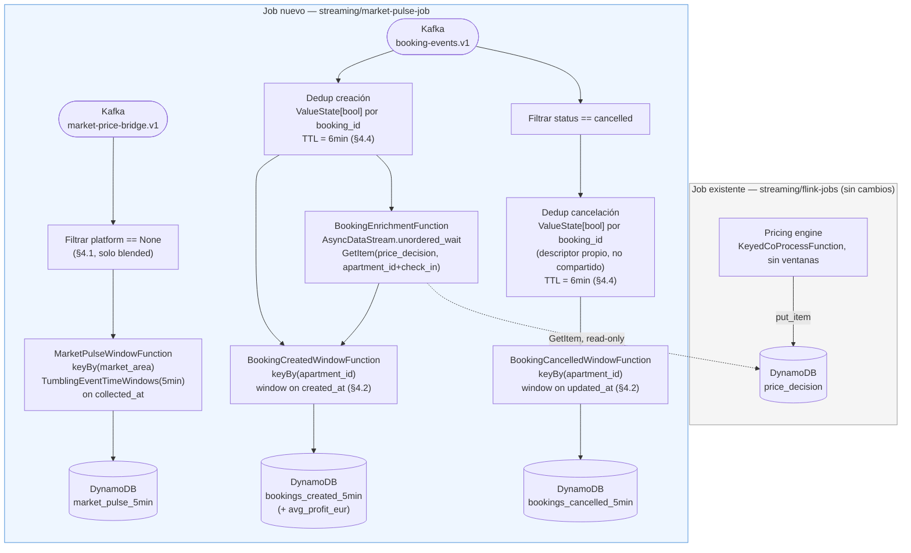
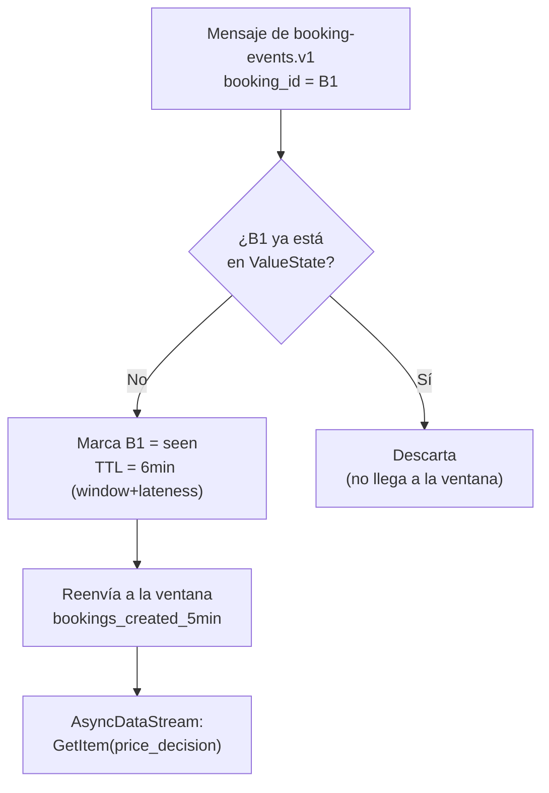
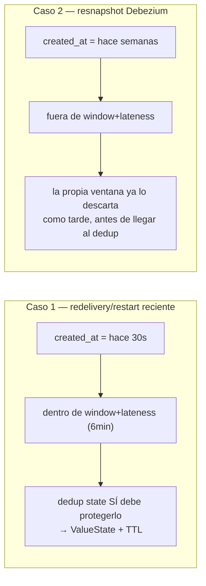

# Phase 26 — Market Pulse Job (windowed streaming metrics)

**Status:** Draft
**Depends on:** Phase 3 (market ingestion — `market-price-bridge.v1`), Phase 4 (Flink processing —
`booking-events.v1`, the `price_decision` DynamoDB table and its key shape), Phase 18 (owner
contract / cost fields on `PriceDecision`)
**Blocks:** nothing — this is a read-only, additive analytics job. No other phase depends on it.
**Does not touch:** `streaming/flink-jobs/` (the existing pricing engine job) — this phase adds a
**second, independent** Flink job, deployed and run separately, per an explicit decision made
before this spec was written.
**Related:** [ADR-0008](../../../docs/adr/ADR-0008-kinesis-kafka-bridge.md) (precedent for a
"bridge is the wrong tool, look for a native connector or a lookup instead" decision),
[`docs/technical-definitions.md`](../../../docs/technical-definitions.md),
[`docs/profitable-pricing-glossary.md`](../../../docs/profitable-pricing-glossary.md)

---

## 0. Cómo leer esta spec — cronología de decisiones

Esta spec no se escribió de una sentada: cada sección técnica de más abajo es la conclusión de una
discusión, no un punto de partida. Esta sección resume esa discusión en orden, en español, para que
antes de leer un `§N` técnico entiendas **qué pregunta respondía** y **qué otras respuestas se
descartaron y por qué**. Los `§N` de abajo son el detalle formal; esta sección es el mapa.

1. **¿Por qué un job nuevo y no ampliar el de pricing?** (→ §2) El job de pricing es puro
   `KeyedCoProcessFunction` sin ventanas — nunca ha necesitado tiempo de evento. Esta fase existe
   para aprender ventanas y Async I/O, dos capacidades que el job de pricing no usa. Meterlo en el
   mismo grafo mezclaría el dominio de "decisión de precio" (crítico, exactly-once) con el de
   "métricas agregadas" (observabilidad, puede fallar sin romper nada). Se decidió: **segundo job
   independiente**, mismo clúster de Flink, cero cambios al job existente.

2. **¿Por qué Async I/O y no un tercer bridge CDC?** (→ §2.1) Ya hay un patrón repetido tres veces
   en el job de pricing (Stage A/A2/A4) para resolver datos de referencia vía CDC + broadcast state.
   Repetirlo aquí sería la opción "segura" pero no enseña nada nuevo. Como la búsqueda es un lookup
   puntual por clave conocida (`apartment_id` + `target_date`) sobre una tabla que ya existe, un
   `GetItem` asíncrono es la herramienta correcta — y es la primera vez que este proyecto usa
   `AsyncDataStream`. Coste aceptado: latencia y disponibilidad de DynamoDB en el camino crítico del
   enriquecimiento (mitigado con timeout/retry, nunca con un circuit breaker propio, §8).

3. **¿Qué significa "un evento" en `booking-events.v1`?** (→ §4.2) Este fue el primer error real de
   la spec original: trataba el topic como si cada mensaje fuera un evento de negocio nuevo
   ("se creó una reserva"). Pero es un changelog de Debezium — cualquier `UPDATE` a la fila
   (cambiar `guests`, no solo cancelar) reemite la fila entera. Contar "reservas confirmadas por
   ventana" tal cual duplica reservas que solo se editaron. Se decidió separar en dos contadores
   independientes e inmutables (`bookings_created_5min`, `bookings_cancelled_5min`), cada uno sobre
   su propio campo de tiempo de evento, y dejar el neto ("reservas activas") para tiempo de consulta
   — no se puede calcular dentro de Flink sin un `interval join` con un límite superior que no
   existe (una reserva puede tardar meses en cancelarse). El detalle y las 4 alternativas
   descartadas están en §4.2.

4. **¿Cómo evitar contar dos veces la misma reserva?** (→ §4.4) Una vez que "creado" se mide por
   primera-aparición de `booking_id`, hace falta recordar qué `booking_id` ya se vio. La primera
   idea razonable — `updated_at IS NULL` — se descartó: ese campo lo rellena un trigger de **otra**
   aplicación (`mock-pm-app`), y un resnapshot de Debezium reemite el valor `NULL` original de una
   fila nunca editada, indistinguible de una fila nueva. La solución final usa estado propio de
   Flink (`ValueState[bool]` por `booking_id`) con un TTL corto (6 min = ventana + lateness), porque
   un resnapshot real siempre trae un `created_at` de hace semanas, que la propia ventana ya descarta
   como tarde antes de llegar a la deduplicación. Alternativas descartadas: TTL "para siempre"
   (estado sin límite pagando por un caso que la ventana ya resuelve gratis) e idempotencia del sink
   de DynamoDB (protege el resultado final, no evita sumar dos veces el evento de entrada).

5. **¿Qué mide realmente el "market pulse"?** (→ §4.1 — **cerrado**) La versión original mezclaba
   fechas y tipos de propiedad distintos bajo una sola clave (`market_area`), y promediaba
   `avg_nightly_rate` sin ponderar por `sample_size`. Cerrado en dos partes: (a) la clave pasa a ser
   el segmento completo (`market_area` + `property_type` + `bedrooms`), no solo el barrio — es la
   unidad de comparación real que ya usa `market-ingestor`; (b) el agregado es una media ponderada
   por `sample_size` vía un `AggregateFunction` propio (`ACC` de 5 campos: suma ponderada, peso
   total, min, max, conteo de snapshots — con `min`/`max` inicializados en `+inf`/`-inf`, no en `0`,
   para que el patrón sea correcto también si se reutiliza en un campo que admita negativos).
   `target_date` queda **fuera** de la clave a propósito — el pulso responde a "qué nivel de precio
   se pide ahora mismo para este segmento" (un termómetro en tiempo real), no al precio de una noche
   concreta, que ya da el propio snapshot sin necesidad de ventana. Detalle completo y alternativas
   descartadas en §4.1.

6. **Watermarks e idle partitions** (→ §3.1 — **cerrado**) Dos causas distintas, verificadas contra
   datos reales antes de decidir: `booking-events.v1` tiene 1 sola partición, así que con el
   paralelismo por defecto (4) del job existente, 3 de 4 subtasks nunca reciben ninguna partición
   asignada — un fallo **estructural y permanente**, no de tráfico. Se corrige fijando el paralelismo
   de esa fuente a 1 (no con `with_idleness`, que solo taparía el síntoma). Aparte de eso, sí hace
   falta `with_idleness(60s)` para el caso genuino de tráfico intermitente (60s = 2× el intervalo
   máximo real del generador de bookings). `market-price-bridge.v1` (4 particiones, sin problema
   estructural) usa `with_idleness(120s)`, derivado del tick determinista de 60s de
   `market-ingestor`. Ambos umbrales son configuración (`FlinkJobSettings`), no constantes
   hardcodeadas. Detalle completo y alternativas descartadas en §3.1.

**Regla para leer lo que sigue:** si una sección dice "Alternativas consideradas y rechazadas", es
una decisión ya cerrada — el porqué está ahí mismo. Si una sección no tiene ese bloque, es que
todavía no se ha revisado con este nivel de detalle o sigue abierta (marcado explícitamente).

---

## 1. Executive summary (plain language)

Every metric this project has computed so far is triggered by a single event, and answers "what is
true right now." This phase asks a different kind of question: "how many bookings came in over the
last 5 minutes, what is the market doing right now, and how profitable were those bookings, on
average, after every booking and owner cost?" That is a **windowed** question — it needs to
observe a slice of time, not a single event — and this project has no windowed computation
anywhere yet.

This phase is explicitly **pedagogical**: its purpose is to introduce Flink's event-time windowing
API (`TumblingEventTimeWindows`, watermarks, allowed lateness) and Asynchronous I/O
(`AsyncDataStream`), two capabilities the existing pricing job never needed because it is pure
per-event `KeyedCoProcessFunction` state, with zero time windows (confirmed by grep across
`streaming/flink-jobs/src/flink_jobs/`, Phase 4 onward: not one `Window` call anywhere). It is
explicitly **not** a replacement or an extension of the pricing engine, and produces a different
kind of output: rolled-up, time-boxed observability metrics for a property manager's dashboard, not
a pricing decision.

---

## 2. Architecture



**Puntos que el diagrama deja explícitos y que la versión ASCII anterior no mostraba:**
- El único punto de contacto entre los dos jobs es la flecha punteada (`GetItem` de solo lectura) —
  nunca hay una flecha de escritura hacia `price_decision`.
- `bookings_created_5min` y `bookings_cancelled_5min` son dos ramas independientes desde el mismo
  topic, sin unión entre ellas (§4.2, decisión 3 de §0) — no existe una caja "net bookings" en este
  job a propósito.
- La deduplicación (§4.4) ocurre **antes** de cada ventana, no dentro de ella — y son **dos estados
  independientes** (`dedupCreated`, `dedupCancelled`), uno por rama, no uno compartido. Corregido
  tras revisión (2026-09-26): la versión anterior de este diagrama solo tenía deduplicación en la
  rama de creación; la rama de cancelaciones salía directa del topic sin protección contra
  redelivery. Detalle en §4.4 (Decisión 4).

Deployed as a new, independent package, `streaming/market-pulse-job/`, mirroring
`streaming/flink-jobs/`'s own shape (own `pyproject.toml`, own `main.py`, its own Flink job
submission). It is a second job running on the same Flink cluster, not a new operator added to the
existing pricing job's graph. This means:

- The existing job's checkpointing, parallelism, and failure domain are completely unaffected by
  this one crashing, backpressuring, or being redeployed.
- It reads `booking-events.v1` and `market-price-bridge.v1` as an **independent consumer group** —
  never affects the existing job's consumer offsets or throughput.
- It talks to DynamoDB only via `GetItem` (read) and `PutItem` (write to its own two new tables,
  §5) — it never writes to the `price_decision` table the pricing job owns.

### 2.1 Why Async I/O instead of a second CDC bridge

The obvious analogue to how the pricing job resolves owner contracts/costs would be a third
`KeyedCoProcessFunction` input fed by a DynamoDB-Streams-to-Kafka bridge (the same shape as
[ADR-0008](../../../docs/adr/ADR-0008-kinesis-kafka-bridge.md)'s Kinesis-to-Kafka bridge for
`price_decision` change events). That was considered and rejected here:

- It would require standing up a **third bridge service** and a **third topic**, purely to look up
  a value that already has a stable, well-known key (`apartment_id` + `target_date`) in an
  already-queryable store.
- The pricing job's own DynamoDB table is already the system of record for "the latest decision
  for this apartment/date" — a direct point lookup is the natural fit, not a second streaming join.
- It is a genuinely different, and currently unused, Flink capability
  (`AsyncDataStream.unordered_wait`) worth exercising for its own pedagogical sake, per this
  phase's stated purpose (§1) — a second `KeyedCoProcessFunction` would only repeat a pattern the
  project already has three of (Phase 4's Stage A/A2/A4).

Trade-off accepted: an async DynamoDB `GetItem` per booking event adds real per-record I/O latency
and a dependency on DynamoDB's availability for this job's enrichment step (mitigated by
`AsyncDataStream`'s built-in timeout/retry and a defined fallback, §4.5) — a CDC-fed keyed-state
join would have zero per-event I/O once state is warm, at the cost of the extra bridge/topic. For a
5-minute-windowed analytics metric (not the priced-decision floor itself), the operational
simplicity of one fewer service was judged to matter more than shaving lookup latency.

---

## 3. Windowing design

**Event time, not processing time**, on all three windows — deliberately, since this is the
pedagogical point of the phase (§1):

- Market pulse: watermark and window key on `MarketPrice.collected_at`.
- Booking count / profit: watermark and window key on `Booking.created_at`.
- Watermark strategy: `WatermarkStrategy.for_bounded_out_of_orderness(Duration.of_seconds(30))` on
  both streams — a fixed, explicit out-of-orderness bound rather than a monotonic watermark,
  because Kafka delivery order across partitions gives no actual ordering guarantee across
  different apartments/segments.
- Window: `TumblingEventTimeWindows.of(Time.minutes(5))`, non-overlapping, one output row per
  key per window.
- **Allowed lateness:** `allowedLateness(Time.minutes(1))`. A record arriving after its window has
  closed, but within this grace period, updates and re-emits that window's result (Flink's
  standard late-firing behavior). A record arriving later than that is sent to a
  `late-data` side output — logged, never silently dropped, matching the project's existing
  "explicit, not silent" convention for exceptional cases (`errors.tolerance: none` in Debezium,
  `manual_overrides`' auditability, etc.).

```mermaid
sequenceDiagram
    participant E as Eventos (event-time)
    participant W as Watermark (maxTs - 30s)
    participant Win as Ventana [10:00, 10:05)

    E->>Win: evento @10:04:50
    E->>W: avanza maxTs
    Note over W: watermark = 10:04:20
    E->>Win: evento @10:04:58 (algo desordenado)
    E->>W: avanza maxTs
    Note over W: watermark = 10:04:28
    W-->>Win: watermark supera 10:05 → CIERRA y emite
    Note over Win: fired at watermark ≥ 10:05:00

    rect rgb(255, 245, 200)
    E->>Win: evento tardío @10:04:40 llega a las 10:05:40
    Note over Win: dentro de allowedLateness (1 min)<br/>→ recalcula y reemite la misma ventana
    end

    rect rgb(255, 220, 220)
    E->>Win: evento @10:04:10 llega a las 10:07:00
    Note over Win: fuera de allowedLateness<br/>→ side output "late-data", ventana ya cerrada del todo
    end
```



**Lo que este diagrama no resolvía — cerrado abajo (§3.1):** asume que todas las particiones siguen
produciendo eventos con regularidad, así que el watermark siempre puede avanzar. Cuando eso no pasa
— por dos causas distintas, según la fuente — el watermark se congela y bloquea el cierre de la
ventana de **todas** las claves, no solo la suya.

### 3.1 Idle sources — dos causas distintas, dos fixes distintos (cerrado 2026-09-24)

**El error que se estuvo a punto de cometer:** aplicar `with_idleness` "a las dos fuentes por
igual, para curarse en salud" sin distinguir *por qué* cada una lo necesita. Verificado contra datos
reales (`docs/manual/MANUAL.md`, número de particiones al crear cada topic;
`services/market-ingestor/src/market_ingestor/main.py`, cadencia de publicación;
`services/mock-pm-app/src/mock_pm_app/settings.py`, cadencia de bookings) antes de decidir, no
asumido — las dos fuentes tienen problemas de naturaleza distinta:

**`booking-events.v1` — 1 sola partición de Kafka (`MANUAL.md`).** Con el paralelismo por defecto
del job existente (`parallelism=4`, `flink_jobs/settings.py`), solo 1 de los 4 subtasks del
`KafkaSource` recibiría esa única partición asignada — los otros 3 subtasks **nunca reciben ni un
solo evento, desde el instante en que arranca el job**, sin relación alguna con si hay o no
reservas reales. Como el watermark del operador es el mínimo entre **todos** los subtasks (no solo
los que tienen partición asignada), esos 3 subtasks vacíos congelarían el watermark global para
siempre — un fallo **estructural y permanente**, no intermitente, causado por tener más paralelismo
que particiones.

- **Fix 1 — paralelismo de esta fuente fijado a 1** (`.set_parallelism(1)` sobre el operador
  `KafkaSource` de `booking-events.v1` específicamente — PyFlink permite paralelismo por operador,
  no hace falta que todo el job comparta un único valor). Con 1 subtask y 1 partición, no puede
  haber subtasks sin partición asignada — el problema estructural desaparece por completo, no se
  mitiga.
- **Fix 2 — `with_idleness` sigue haciendo falta, para una causa distinta y real:** incluso con
  paralelismo=1, si no llegan reservas nuevas durante un rato (tráfico genuinamente intermitente,
  no un fallo de asignación), el watermark de esa única partición no avanza por sí solo.
  `WatermarkStrategy.for_bounded_out_of_orderness(...).with_idleness(Duration.of_seconds(60))` —
  60s = 2× el intervalo máximo real entre bookings del generador actual
  (`insert_interval_max_seconds=30`, `mock_pm_app/settings.py`) — excluye esa partición del cálculo
  del mínimo mientras esté callada, dejando que el resto del job siga avanzando. **Documentado
  explícitamente como derivado del generador de este PoC, no de un patrón de tráfico real de
  producción** — a diferencia del generador de mercado (determinista, un tick fijo cada 60s), este
  es aleatorio (`rng.uniform(10, 30)`) y no representativo de una tasa real de reservas.

**`market-price-bridge.v1` — 4 particiones (`MANUAL.md`), sin problema estructural.** Con
paralelismo ≤4 para esta fuente, cada subtask tiene garantizada al menos una partición asignada — no
hay subtasks estructuralmente vacíos como en el caso anterior. El único riesgo real es de tráfico
desigual entre particiones. Dato real que descarta ese riesgo en operación normal:
`market-ingestor` publica un evento por cada uno de los 18 segmentos en **cada tick de 60s,
determinista** (`main.py`, no aleatorio), repartidos entre las 4 particiones por
`partition_key(segment)` — bajo funcionamiento normal, ninguna partición pasa más de ~60s sin
recibir al menos un evento.

- **`with_idleness(Duration.of_seconds(120))`** — mismo criterio de "2× la cadencia máxima normal"
  que en `booking-events.v1`, aplicado aquí al tick determinista de 60s. Sin cambio de paralelismo
  (no hace falta — no hay causa estructural que corregir).

**Ambos umbrales expuestos como configuración, no hardcodeados** — nuevos campos en el
`FlinkJobSettings` de `streaming/market-pulse-job/`: `booking_idleness_seconds: int = 60`,
`market_pulse_idleness_seconds: int = 120`. Necesario porque, a diferencia del PoC, una fuente de
reservas real de producción no tendría la cadencia predecible del mock actual — el valor tiene que
poder ajustarse sin tocar código el día que cambie la fuente real.

**Monitorización:** `with_idleness` no emite por sí solo ningún evento de negocio observable — la
señal indirecta de que algo va mal con una fuente son (a) las métricas propias de Flink
(`currentInputWatermark` por operador, expuestas en la UI/Prometheus) quedándose estancadas más
tiempo del esperado, y (b) una acumulación sostenida en el side output de datos tardíos (§3) — si
empiezan a llegar muchos eventos "tarde" de golpe tras un hueco de tráfico, es la reanudación de una
fuente que estuvo marcada como idle. Ninguna de las dos se implementa como alerta activa en esta
fase (fuera de alcance, §6) — se documentan como los sitios correctos donde mirar si el job parece
no producir resultados.

**Alternativas consideradas y rechazadas:**

1. **`with_idleness` idéntico en las dos fuentes, sin distinguir la causa.** Rechazado — habría
   tapado el síntoma de `booking-events.v1` sin arreglar la causa estructural (subtasks vacíos por
   paralelismo mal dimensionado), que ningún umbral de idleness corrige por sí solo.
2. **Dejar `parallelism=4` en `booking-events.v1` y confiar solo en `with_idleness`.** Rechazado —
   funcionaría (el watermark avanzaría igual, excluyendo los subtasks vacíos), pero desperdicia 3
   subtasks que nunca van a procesar nada, y esconde con un parche un problema de dimensionamiento
   que se puede eliminar de raíz con `.set_parallelism(1)` en esa fuente.
3. **Umbral de idleness igual para las dos fuentes (p. ej. 60s para ambas).** Rechazado — cada
   fuente tiene su propia cadencia real medida en código (30s máx. para bookings, 60s fijos para
   market); usar el mismo número para las dos habría sido adivinar en vez de derivar.
4. **Chosen: causa estructural (paralelismo) y causa de tráfico intermitente (`with_idleness`)
   resueltas por separado, con umbrales derivados de la cadencia real medida de cada fuente, no de
   un valor único adivinado para todo el job.**

---

## 4. Metric definitions

### 4.1 Market pulse (weighted average market price per segment, per 5 min)

**Corrected during design review (2026-09-23/24):** the original draft keyed only on `market_area`
and used a plain, unweighted `avg()`. Both were wrong for reasons only visible once the real data
shape was checked (`services/market-ingestor/src/market_ingestor/segments.py`,
`market_ingestor/main.py`) instead of assumed:

- **Key.** `MarketPrice` carries `property_profile` (type, bedrooms) alongside `market_area` — the
  real unit of comparison in this project's own data model is the full 18-way segment
  (`(city, neighborhood, property_type, bedrooms)`), not the neighborhood alone. Keying by
  `market_area` only mixes a studio and a 3-bedroom apartment in the same average, which answers no
  real question a property manager could act on.
- **Aggregate.** A plain `avg()` of `avg_nightly_rate` across snapshots gives every snapshot equal
  weight regardless of how many real comps it was computed from (`market_context.sample_size`).
  Worked example: snapshots `(100, sample_size=50)`, `(100, 50)`, `(300, 2)` — unweighted average is
  `166.7`, dominated by the low-confidence outlier; the weighted average
  (`Σ(rate·sample_size) / Σ(sample_size) = 10600/102 ≈ 103.9`) reflects the real market level far
  better.

**Decided:**

- **Input:** `market-price-bridge.v1`, filtered to blended snapshots only (`platform` field is
  `None` — channel-specific snapshots from Phase 16 are excluded, matching how the existing
  pricing job's top-level calculation only ever reads the blended rate too).
- **Key:** the full segment — `market_area` (`"{city}/{neighborhood}"`, same string the pricing job
  builds in `stage_price_decision.py`) **+** `property_profile.type` **+** `property_profile.bedrooms`.
- **Window vs. `target_date` — deliberately not part of the key.** `market-ingestor` emits one
  `target_date` per 60s tick, shared by all 18 segments (`main.py`, Decision D.1 comment) — a 5-min
  window therefore sees up to ~5 different `target_date`s per segment. Keying on segment +
  `target_date` too would make each window receive ~1 sample (nothing to aggregate) and multiply
  output rows by the 60-day forecast horizon per segment per window — the same kind of fan-out
  `error-handling/anticipated-risks-flink-processing.md` already measured and flagged for the
  pricing job's LOS case. **Accepted approximation:** this metric answers "what price level is
  currently being asked for this segment, across its near-term horizon" (a real-time thermometer a
  PM can act on immediately) — not "the market price for one specific night," which the underlying
  `MarketPrice` snapshot already answers on its own, per-event, with no windowing needed. Mixing
  several `target_date`s inside one window is the accepted cost of that choice, documented here
  rather than discovered later as a surprise.
- **Aggregate — weighted `AggregateFunction`,** `ACC = (weighted_sum, weight_total, min_price,
  max_price, snapshot_count)`:
  - `add`: `weighted_sum += rate·sample_size`; `weight_total += sample_size`;
    `min_price = min(min_price, rate)`; `max_price = max(max_price, rate)`; `snapshot_count += 1`.
  - `create_accumulator` init: `weighted_sum=0`, `weight_total=0`, `min_price=+inf`,
    `max_price=-inf`, `snapshot_count=0`. **`max_price` starts at `-inf`, not `0`** — `0` happens to
    never break *this* field only because `Pricing.avg_nightly_rate` is schema-constrained to
    `ge=0`; `-inf` is the general identity for `max` regardless of the field's own constraints, and
    is what protects a future reuse of this same accumulator shape for a field that can go negative
    (e.g. a profit figure) from silently reporting `0` as a "maximum" that never actually occurred.
  - `get_result`: `avg_price_eur = weighted_sum / weight_total`; `min_price_eur = min_price`;
    `max_price_eur = max_price`; `sample_count = snapshot_count` (number of **snapshots** aggregated,
    distinct from `weight_total`, which sums `sample_size` across those snapshots).

**Alternatives considered and rejected:**

1. **Key = `market_area` only (original draft).** Rejected — mixes incomparable property types
   within one average (§ above).
2. **Key = `market_area` + `property_profile`, unweighted `avg()`.** Rejected — still lets a
   low-`sample_size` snapshot outweigh a high-confidence one (worked example above).
3. **Key = full segment + `target_date`.** Rejected — near-zero aggregation per window given the
   ingestor's one-`target_date`-per-tick cadence, plus a 60× row-count multiplier per segment per
   window; the resulting "average" of ~1 sample isn't meaningfully different from reading the raw
   `MarketPrice` snapshot directly, so the window buys nothing here.
4. **Chosen: full segment as key, `target_date` intentionally excluded, weighted `AggregateFunction`
   over `sample_size`, `-inf`/`+inf` accumulator identities for min/max.**

### 4.2 Booking count — created and cancelled, as two independent windowed metrics

**Corrected during design review (2026-09-23):** the original draft conflated two different
questions under one `booking_count`. `booking-events.v1` is a CDC changelog (Debezium
`ExtractNewRecordState`, no `__op` field) — every `UPDATE` to a `bookings` row (not just a status
change) republishes the full row, so a single confirmed booking that later gets, say, its `guests`
field edited produces a second message that looks identical in shape to a fresh confirmation.
Counting "confirmed bookings in the window" naively double-counts that case, and cannot represent
a cancellation at all without retracting an already-emitted, already-closed window — which
`TumblingEventTimeWindows` cannot do past `allowedLateness` (§3).

The fix: two independent, immutable windowed counters, each keyed by its own event-time field, with
**no cross-window retraction**:

- **`bookings_created_5min`**
  - **Input:** `booking-events.v1`, a row counts as "created" the first time this job sees its
    `booking_id` (deduplication mechanism: §4.4).
  - **Key:** `apartment_id`.
  - **Window:** event time = `Booking.created_at`.
  - **Aggregate:** count of distinct `booking_id`s first-seen in the window.
- **`bookings_cancelled_5min`**
  - **Input:** `booking-events.v1`, filtered to `status == "cancelled"`.
  - **Key:** `apartment_id`.
  - **Window:** event time = `Booking.updated_at` (the instant the cancellation itself happened —
    `updated_at` is set by a `BEFORE UPDATE` trigger in `mock-pm-app`'s schema, never on `INSERT`).
  - **Aggregate:** count of cancellations whose `updated_at` falls in the window.

**Net "active bookings" is explicitly out of scope for this job** (§6) — a cancellation's
`updated_at` window can be arbitrarily far in the future relative to its booking's own
`created_at` window (there is no upper bound on how long a booking stays live before cancellation),
so there is no valid `interval join` bound to join the two series inside Flink. Computing a net
figure is a **compute-at-read** concern: subtract `bookings_cancelled_5min` from
`bookings_created_5min` per `apartment_id` over a date range, at query time (dashboard/API) — the
same precompute-vs-read-time trade-off already made explicitly for the LOS floor matrix
(`docs/post-poc-roadmap.md` §5). Portfolio-wide totals are the same kind of read-time `SUM`, for
the same reason (finer granularity is always aggregable upward; the reverse is not).

**Alternatives considered and rejected, in the order they came up during design:**

1. **A single `booking_count` per window, incrementing on any `status == "confirmed"` message,
   decrementing on `"cancelled"`.** Rejected first: a cancellation arriving after its creation
   window already closed (and past `allowedLateness`) would need to mutate an already-emitted,
   already-final window result — `TumblingEventTimeWindows` has no such retraction mechanism past
   that point (§3). This is what surfaced the retraction problem in the first place.
2. **A running total via `KeyedProcessFunction` + `ValueState[int]` per `apartment_id`** (increment
   on creation, decrement on cancellation, no window at all — see
   [`docs/tech-concepts/keyed-state-and-checkpointing.md`](../../../docs/tech-concepts/keyed-state-and-checkpointing.md)
   §4 for the general trade-off). This does solve the retraction problem — state has no window
   boundary to be "too late" for — but it answers a different question ("how many bookings are
   active right now") than what a 5-minute observability pulse is for, and would need its own
   design pass on emission cadence (a running total has no natural "fire now" instant the way a
   window does). Kept as the right tool if a genuine real-time "active bookings" gauge is ever
   requested — not what this phase needs.
3. **A Flink `interval join` between the created-events stream and the cancelled-events stream**,
   to emit a joined "this booking was created in window N and cancelled in window M" record.
   Rejected: an `interval join` requires a bounded time offset between the two sides
   (`.between(lowerBound, upperBound)`); there is no such bound here — a booking can stay
   uncancelled indefinitely, so no upper bound can be chosen without either being wrong (too
   short, silently drops real cancellations from the join) or defeating the point of a bound at
   all (set to "infinity").
4. **Chosen:** two independent, single-purpose tumbling windows (this section), with the net figure
   left to query time — no retraction, no unbounded join, and each metric stays independently
   correct and auditable on its own.

### 4.4 Deduplication of `booking_id` (applies to §4.2's `bookings_created_5min`)





`booking-events.v1` can redeliver a `booking_id` this job already processed, in two different ways
with two different blast radii:

1. **Kafka redelivery / same-day job restart** — a consumer commits its offset just before crashing,
   or the job restarts from a checkpoint. The redelivered record's `created_at` is recent — still
   within `windowSize + allowedLateness` (6 minutes here) — genuinely at risk of being double-counted
   *inside a window Flink hasn't closed yet*.
2. **Full Debezium resnapshot** (connector offset reset, or — per
   `error-handling/dynamodb-streams-orphaned-after-localstack-restart-needs-full-table-recreation.md`
   and its sibling write-ups — a LocalStack volume reset after the stack sat stopped for weeks).
   The resnapshotted row's `created_at` is **weeks old** — far outside `windowSize + allowedLateness`
   — so it is caught and discarded by the window's own late-data mechanism (§3) before deduplication
   state is ever consulted. This class does **not** need a defensive TTL to be correct.

Given (2) is already handled by windowing itself, deduplication only needs to cover (1) — a much
narrower window than "forever":

- **Mechanism:** keyed state (`ValueState[bool]` per `booking_id`, `KeyedProcessFunction` upstream
  of the windowing operators — see
  [`docs/tech-concepts/keyed-state-and-checkpointing.md`](../../../docs/tech-concepts/keyed-state-and-checkpointing.md)
  for the underlying model), **not** `Booking.updated_at IS NULL` — that field is set by a trigger
  on someone else's application schema and would misreport `False` (looks like "new") on a
  resnapshotted row that was never actually updated, an implicit contract this job should not
  depend on.
- **TTL:** `windowSize + allowedLateness` (6 minutes) — sized to exactly cover case (1) above, not
  "forever." A longer TTL would only protect against case (2), which the window already discards
  for free at zero extra state cost (§4.2, §8).
- **Debezium `__op` field (`unwrap.add.fields=op`):** optional, not required for correctness — it
  would let this job distinguish a genuine first-insert (`op=c`) from an update to an
  already-confirmed row (`op=u`) without inferring it from `booking_id`-seen state, but does **not**
  by itself solve resnapshot replay (a resnapshot reports `op=r` regardless of the row's real
  history, so keyed-state dedup is still required either way). Deferred: touches
  `infra/debezium/postgres-connector.json`, a config shared with the existing pricing job — a
  change there is a shared-blast-radius risk this phase's own scope (§2) explicitly avoids taking
  on without a clear correctness need.

**Alternatives considered and rejected, in the order they came up during design:**

1. **`Booking.updated_at IS NULL`, no new state at all.** Rejected: cheapest option, but breaks
   exactly on the resnapshot case it most needs to survive — Debezium's `initial` snapshot mode
   (`docs/technical-definitions.md` §1, and confirmed by
   `error-handling/debezium-adding-a-table-to-a-running-connector-skips-its-snapshot.md`) reemits
   the row's stored `updated_at` value unchanged, including `NULL` for a row that was never
   actually updated. A resnapshot then looks indistinguishable from a genuine first insert, which
   is precisely the false positive this dedup exists to prevent.
2. **A TTL sized to "forever" (or to the longest realistic gap between stack restarts, i.e.
   weeks).** Rejected once §4.2/§3's windowing was designed: a resnapshotted row's `created_at` is
   always far outside `windowSize + allowedLateness` by the time it could possibly be resnapshotted
   (the stack has to have been down long enough for a resnapshot to even be triggered), so it is
   already filtered by the window's own late-data mechanism before dedup state is ever consulted.
   Sizing the TTL to cover that case anyway means paying for unbounded keyed-state growth
   (§4 of the keyed-state doc above) to protect against a failure mode that costs nothing extra to
   let the window handle on its own.
3. **Rely on the DynamoDB sink's natural idempotency (`put_item` overwrite by key) instead of
   deduplicating upstream.** Rejected: idempotent overwrite only protects against the *same
   already-computed result* being written twice (e.g. a checkpoint-replay re-emitting an identical
   window aggregate) — it does nothing for a duplicate **raw input event** being summed twice
   *inside* the aggregation itself, before the sink ever sees the result. A window that
   double-counted a `booking_id` writes its wrong total idempotently; idempotency doesn't make the
   total correct.
4. **Chosen: keyed-state dedup (`ValueState[bool]` per `booking_id`) with TTL = `windowSize +
   allowedLateness`, sized to cover only same-day Kafka redelivery/job-restart — not resnapshot
   replay, which the window already discards for free.** `__op` from Debezium (option listed above)
   remains a possible future refinement for distinguishing insert/update explicitly, not a
   substitute for this dedup state.

### 4.4b Deduplication for `bookings_cancelled_5min` (Decisión 4, corrected 2026-09-26)

**Gap found during design review:** the dedup state above only guards the path into
`bookings_created_5min` (§2's `dedupCreated` node). `bookings_cancelled_5min` is filtered directly
from `booking-events.v1` (`cancelFilter`), never routed through that state — a redelivered
cancellation message would double-count `cancelled_count`, the same redelivery risk §4.4 already
solved for creation, left unsolved on this branch.

**Decided: a second, independent `ValueState[bool]` per `booking_id` (`dedupCancelled`, its own
descriptor), not the same state §4.4 already uses.** Sharing one state between both branches was
considered and rejected: `dedupCreated` marks a `booking_id` as seen on its *first appearance at
all* (any status); reusing it to gate cancellations would make a booking's own creation event
falsely "protect" its later, entirely legitimate cancellation from ever being counted. Since this
project's domain has no reactivation (`services/mock-pm-app`: `flip_one_confirmed_to_cancelled`
only ever selects rows still `status='confirmed'`, and no code path ever sets a cancelled booking
back to `confirmed` — verified, not assumed), a single `booking_id` can have at most one real
cancellation event ever, so a plain `ValueState[bool]` (not a counter, not a per-status map)
suffices, mirroring §4.4's own mechanism exactly, just with its own descriptor.

**TTL:** `windowSize + allowedLateness` (6 min), same reasoning as §4.4 — a resnapshot replays the
stored `updated_at` unchanged, which for any real cancellation old enough to survive until a
resnapshot is always outside `windowSize + allowedLateness`, so the window's own lateness handling
already discards it before dedup state is ever consulted; the TTL only needs to cover a same-day
Kafka redelivery of a genuinely recent cancellation.

**Live traffic dependency, resolved by extending scope:** `mock-pm-app` originally never issued a
live `UPDATE` on `bookings.status` at all — every `status='cancelled'` row came only from the
one-time seed (`inserted` directly as cancelled, `updated_at` left `NULL` by that INSERT), so
`bookings_cancelled_5min` had no live traffic to aggregate or verify against. Fixed by adding
`flip_one_confirmed_to_cancelled()` (`services/mock-pm-app/src/mock_pm_app/generator.py`) on its own
timer (`cancellation_check_interval_seconds`, default 90s) — a real `UPDATE` that triggers the
existing `updated_at` trigger, giving this branch genuine live cancellation events to test against.

**Alternatives considered and rejected:**

1. **Reuse `dedupCreated` for both branches.** Rejected — would need to distinguish "seen this
   `booking_id`'s creation" from "seen this `booking_id`'s cancellation" inside the same state,
   effectively requiring a per-status map rather than a plain boolean; no simpler than a second,
   independent `ValueState[bool]`, and couples two unrelated questions into one state.
2. **Leave `bookings_cancelled_5min` unprotected, accepted as a known limitation.** Rejected once
   found — the same redelivery risk was already judged worth fixing for the creation branch in
   §4.4; leaving the cancellation branch exposed to the identical risk has no principled
   justification once the gap is visible.
3. **Chosen: a second, independent `ValueState[bool]` per `booking_id`, TTL = `windowSize +
   allowedLateness`, plus extending `mock-pm-app`'s scope so this branch has real live traffic to
   verify against.**

### 4.5 Average profit per booking (per apartment, per 5 min)

For each confirmed booking, an async lookup resolves the most recently known cost/commission
context for that `(apartment_id, target_date=check_in)` from the `price_decision` DynamoDB table
(the same table and key shape `dynamodb_sink.py` already writes, §5.1), then computes:

```
nights = (check_out - check_in).days
total_cost_eur = fixed_and_allocated_costs_eur * nights + per_booking_cost_eur
profit_eur = revenue_eur * (1 - p) - total_cost_eur
```

where `fixed_and_allocated_costs_eur`, `per_booking_cost_eur`, and `p` are read directly from that
`price_decision`'s `cost_inputs` (no formula is duplicated — this evaluates
`libs/pricing-formulas`' own break-even numerator/`p` terms against the booking's *actual* revenue,
instead of solving for a price).

**Confirmed approximation (accepted per the design discussion preceding this spec):** this uses
the aggregate percentage rate `p` uniformly against total revenue. It does **not** apply each
individual percentage cost's own `revenue_base` netting (the mechanism described in
`docs/technical-definitions.md` / `docs/profitable-pricing-glossary.md` §14.4/§14.8) — that would
require carrying the full per-concept cost breakdown (not just the `p`/`commission_pct`/
`commission_base` aggregate fields) through to this job. Accepted explicitly as a reasonable
approximation for a rolled-up dashboard metric; the pricing engine's own floor calculation (Phase
4/11/20) remains exact and is entirely unaffected, since this job never writes back to
`price_decision`.

**Fallback when no `price_decision` exists yet for that `(apartment_id, target_date)`:** the async
lookup returns nothing (e.g. a booking for a brand-new apartment, or a date beyond the pricing
job's known horizon). That booking is still counted in §4.2/§4.4's booking count, but excluded from the
profit average for its window — logged at `WARNING`, never silently treated as zero profit (a
missing cost basis and a genuinely zero-profit booking are not the same thing, and conflating them
would corrupt the average).

- **Key:** `apartment_id`.
- **Aggregate:** average of `profit_eur` over bookings with a resolved cost basis, within the
  window; also emits the count of bookings excluded for lack of a cost basis.

---

## 5. Data model

### 5.1 Reads (no new tables)

- `market-price-bridge.v1` (Kafka) — existing topic, `MarketPrice` schema, no changes.
- `booking-events.v1` (Kafka) — existing topic, `Booking` schema, no changes.
- `price_decision` (DynamoDB) — existing table, read-only `GetItem` by
  `{apartment_id, target_date}` — the exact key `dynamodb_sink.py` already writes with. No schema
  change; this job only reads `cost_inputs.fixed_and_allocated_costs_eur`,
  `cost_inputs.per_booking_cost_eur`, and `cost_inputs.p`.

### 5.2 Writes (two new DynamoDB tables, this phase's only new persisted state)

**`market_pulse_5min`**

**Corrected (§4.1):** partition key widened from `market_area` alone to the full segment — a
neighborhood-only key mixed incomparable property types under one average.

| Field | Type | Notes |
|---|---|---|
| `segment_key` (PK) | S | `"{market_area}\|{property_type}\|{bedrooms}"`, e.g. `"Barcelona/Eixample\|apartment\|2"` — the full 18-way segment (§4.1), not the neighborhood alone |
| `window_start` (SK) | S (ISO datetime) | window lower bound, inclusive |
| `window_end` | S (ISO datetime) | window upper bound, exclusive |
| `avg_price_eur` | N | weighted by `sample_size` (§4.1), not a plain average |
| `min_price_eur` | N | |
| `max_price_eur` | N | |
| `sample_count` | N | number of snapshots aggregated (distinct from the sum of their `sample_size`s) |

**`bookings_created_5min`** (also carries the profit metrics, §4.5 — same key/window as booking
creation, one row per apartment per window)

| Field | Type | Notes |
|---|---|---|
| `apartment_id` (PK) | S | |
| `window_start` (SK) | S (ISO datetime) | window keyed on `Booking.created_at` |
| `window_end` | S | |
| `booking_count` | N | distinct, first-seen `booking_id`s in the window (§4.2, §4.4) |
| `avg_profit_eur` | N, nullable | null if every booking in the window lacked a cost basis |
| `profit_sample_count` | N | bookings actually included in `avg_profit_eur` |
| `unresolved_cost_count` | N | bookings excluded for lack of a `price_decision` |

**`bookings_cancelled_5min`**

| Field | Type | Notes |
|---|---|---|
| `apartment_id` (PK) | S | |
| `window_start` (SK) | S (ISO datetime) | window keyed on `Booking.updated_at` |
| `window_end` | S | |
| `cancelled_count` | N | cancellations whose `updated_at` falls in the window |

Both tables are sinked the same way the existing job writes `price_decision` (`put_item`, no
upsert-merge semantics needed — each `(key, window_start)` is written exactly once per late-firing
update, DynamoDB `put_item` naturally overwrites on re-fire within the allowed-lateness period).
Net "active bookings" (`bookings_created_5min - bookings_cancelled_5min`) is computed by the reader
(§4.2), not written by this job.

### 5.3 Deduplication state (Flink-internal, not a DynamoDB table)

Per §4.4: `ValueState[bool]`, keyed by `booking_id`, TTL = `windowSize + allowedLateness` (6
minutes). Populated the first time a `booking_id` is seen; any `booking_id` already present in
state is dropped before reaching the `bookings_created_5min` window aggregation. This state is
internal to the Flink job (RocksDB-backed, checkpointed like all other keyed state in this
project) — it is not exposed or queryable outside the job.

---

## 6. Scope

### In scope

- `streaming/market-pulse-job/` — a new, independently deployable PyFlink job package.
- The three windowed metrics (§4), each keyed and windowed as described.
- Async I/O enrichment of bookings against the existing `price_decision` DynamoDB table.
- The two new DynamoDB tables (§5.2) and their Terraform/LocalStack provisioning
  (`infra/localstack/init-aws.sh`, `infra/terraform/`).
- A late-data side output, logged, per window stream (§3).
- `flip_one_confirmed_to_cancelled()` in `services/mock-pm-app/` (§4.4b) — a small, additive change
  outside `streaming/`, needed only because no other code path in this project ever produced a live
  `bookings.status` transition to verify `bookings_cancelled_5min` against.

### Out of scope (explicitly deferred)

- Any dashboard panel consuming these tables — a separate, later addition to `dashboard/`.
- Exact (non-approximated) profit accounting for every percentage cost's individual revenue base
  netting (§4.5) — would require widening `price_decision`'s persisted cost breakdown; deferred as
  a follow-up if the approximation proves misleading in practice.
- Portfolio-wide (all-apartments) rollups — left to query time (§4.2).
- Backfilling historical windows from data older than this job's first run — like the existing
  pricing job, this only computes going forward from deployment.
- Any change whatsoever to `streaming/flink-jobs/` (the existing pricing job), its topics, its
  state, or its DynamoDB table's schema.

---

## 7. Acceptance criteria

- AC-01: publishing `N` distinct confirmed bookings for the same apartment within one 5-minute
  window produces exactly one `bookings_created_5min` row with `booking_count == N`.
- AC-02: a market snapshot with `platform != null` (a channel-specific snapshot) is excluded from
  `market_pulse_5min`'s aggregation — only blended snapshots count.
- AC-03: a booking for an apartment/date with no matching `price_decision` is counted in
  `bookings_created_5min.booking_count` but excluded from `avg_profit_eur`'s average, and
  increments `unresolved_cost_count` for its window.
- AC-04: a booking event arriving more than 30s out of order, but within the 1-minute allowed
  lateness, correctly updates its window's already-emitted row rather than being dropped or
  starting a new window.
- AC-05: a booking event arriving after the allowed-lateness period is routed to the late-data
  side output, not silently dropped, and does not affect any emitted window.
- AC-06: killing and restarting this job does not affect the existing pricing job's consumer
  offsets, checkpoints, or DynamoDB writes (verified by running both jobs concurrently and
  restarting only this one).
- AC-07: `avg_profit_eur` computed by this job, for a hand-picked booking with a known
  `price_decision`, matches the manually-computed formula in §4.5 to the cent.
- AC-08: replaying the same `booking_id` twice within `windowSize + allowedLateness` (simulating a
  Kafka redelivery or a checkpoint-restore restart) produces `booking_count == 1`, not `2`, in
  `bookings_created_5min` (§4.4).
- AC-09: a cancellation (`status == "cancelled"`) for a booking created several windows earlier
  increments `bookings_cancelled_5min.cancelled_count` for the window containing its own
  `updated_at`, and does **not** modify the (already-closed, possibly long-past) `window_start` the
  booking was originally created in (§4.2).
- AC-10: with `booking-events.v1`'s `KafkaSource` parallelism explicitly set to 1 (§3.1), all
  bookings' windows fire correctly under normal traffic — confirming no subtask is left permanently
  unassigned a partition (the structural failure mode §3.1 fixes, not just masks).
- AC-11: publishing no `market-price-bridge.v1` events for one full `market_pulse_idleness_seconds`
  period (120s) on one partition, while the other 3 partitions keep receiving their normal 60s-tick
  traffic, does not delay those other partitions' windows from firing — the idle partition is
  excluded from the watermark's minimum (§3.1), not blocking the whole operator.
- AC-12: replaying the same cancellation message twice within `windowSize + allowedLateness`
  (simulating a Kafka redelivery of a `flip_one_confirmed_to_cancelled()`-produced event) produces
  `cancelled_count == 1`, not `2`, in `bookings_cancelled_5min` (§4.4b) — the same guarantee AC-08
  already gives `bookings_created_5min`, now extended to the cancellation branch.

---

## 8. Known limitations

- The profit figure is an approximation (§4.5) — a deliberate, documented trade-off, not an
  oversight.
- Async I/O introduces a dependency on DynamoDB read latency/availability for this job's
  throughput; no circuit breaker beyond `AsyncDataStream`'s own timeout/retry is implemented in
  this phase.
- Like the rest of this project's Flink usage, this job's watermark/window state is not persisted
  across job restarts beyond Flink's own checkpointing — a from-scratch restart (not a
  checkpoint-restore) loses in-flight window state, the same characteristic the existing pricing
  job already has via its keyed state.
- **This limitation directly undermines the §4.4 dedup TTL if a redeploy discards state on
  purpose.** The TTL argument in §4.4 (6 minutes is enough because a resnapshot's `created_at` is
  always older than that) assumes the dedup state itself survives between the duplicate's first
  and second delivery. A **deliberate from-scratch restart** (a code/schema redeploy that discards
  the savepoint rather than restoring it) resets that state to empty regardless of how much real
  time has passed. If the consumer group's committed offset is only seconds/minutes old at that
  point (a normal redeploy, not a stack-down-for-weeks event), Kafka redelivers recent bookings —
  ones genuinely still inside `windowSize + allowedLateness` — into dedup state that no longer
  remembers having seen them, double-counting them exactly within the window the TTL was supposed
  to protect. **Accepted as a known gap, not mitigated in this phase**: the mitigation is an
  operational discipline (always restore from the last savepoint on redeploy, never restart this
  job from scratch while it may hold recent, unflushed dedup state), not a code change — the same
  category of trade-off ADR-0010 already accepts for this project's compute layer generally.
