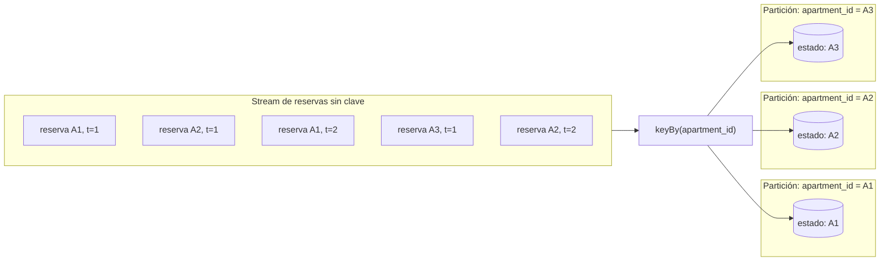
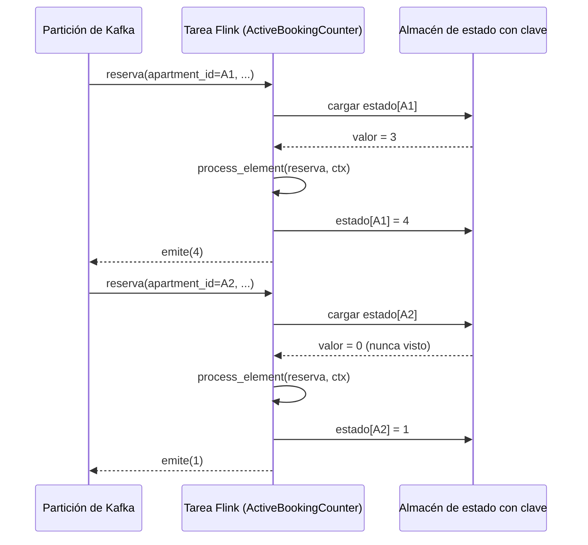
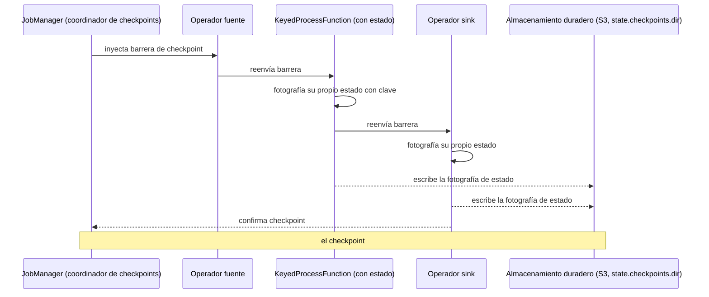
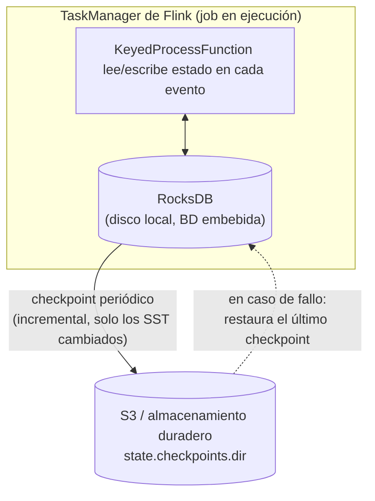

# Estado con clave (`keyed state`), `KeyedProcessFunction` y checkpointing

**Para quién es esto:** material de aprendizaje escrito durante el desarrollo de la Fase 26
(`streaming/market-pulse-job/`), para tener el modelo mental necesario antes de escribir una
`KeyedProcessFunction`. No es referencia de configuración de este proyecto — para eso está
[`technical-definitions.md`](../technical-definitions.md) §11-14.

---

## 1. `keyBy`: una partición lógica por clave

`env.from_source(...).key_by(lambda x: x.apartment_id)` no mueve datos por sí solo — etiqueta el
stream para que Flink sepa cómo repartirlo. A partir de ahí, todo operador con estado (una
`KeyedProcessFunction`, una ventana, un `MapState`) recibe **una instancia de estado independiente
y aislada por cada valor de clave**. Nada del procesamiento del apartamento `A2` puede ver ni
afectar al estado del apartamento `A1` — de hecho, podrían ejecutarse en máquinas distintas.



Piénsalo como un diccionario que Flink gestiona por ti: `estado = {apartment_id: valor}`. La
diferencia con un dict de Python escrito a mano es que Flink además **persiste** cada entrada
(sobrevive a un fallo — §3), la **escala** (las particiones se pueden redistribuir entre máquinas
si cambia el paralelismo), y te deja añadir **TTL** o **timers** a cada entrada por separado.

---

## 2. `KeyedProcessFunction`: estado + timers, sin ciclo de vida automático

Una ventana (`TumblingEventTimeWindows`) tiene un ciclo de vida que Flink gestiona por ti: se abre,
acumula, dispara y desaparece sola. Una `KeyedProcessFunction` **no tiene ese ciclo de vida
automático** — decides tú todo: cuándo se crea el estado, cuándo se lee/escribe, cuándo (si
alguna vez) se borra.

```python
class ActiveBookingCounter(KeyedProcessFunction):
    def open(self, runtime_context):
        self._count = runtime_context.get_state(
            ValueStateDescriptor("active_count", Types.LONG())
        )

    def process_element(self, booking, ctx):
        current = self._count.value() or 0
        current += 1
        self._count.update(current)
        yield current
```

`self._count` no es una variable de Python que guarda un único valor — es un **handle**. Cada
llamada a `process_element` está ligada a exactamente una clave (Flink carga el estado de esa
clave antes de llamarte, y persiste lo que hayas escrito al terminar). La misma línea de código,
`self._count.value()`, devuelve un número distinto según a qué clave le toque el turno.



Si quieres que el estado expire o dispare algo en un momento concreto — por ejemplo "olvida este
`booking_id` al cabo de 7 días" — registras un **timer**, y Flink te llama de vuelta a `on_timer`
en ese instante, siempre para la clave correcta:

```python
    def process_element(self, booking, ctx):
        ...
        # dispara on_timer(...) para ESTA clave, 7 días después del evento
        ctx.timer_service().register_event_time_timer(ctx.timestamp() + 7 * 86400 * 1000)

    def on_timer(self, timestamp, ctx):
        self._count.clear()
```

---

## 3. Checkpointing y state backends

Un estado que solo vive en memoria no sirve de nada en cuanto una tarea falla. La respuesta de
Flink es el **checkpointing**: periódicamente toma una fotografía *consistente* del estado de
todos los operadores del job, y la escribe en algún sitio duradero. Si algo falla, el job reinicia
desde el último checkpoint completado, no desde cero.

### 3.1 Cómo se toma un checkpoint (a nivel conceptual)

Flink inyecta un marcador especial — una **barrera de checkpoint** — en los streams de origen. A
medida que la barrera fluye por cada operador, ese operador fotografía su propio estado justo
cuando la barrera lo atraviesa, y la reenvía hacia adelante. Cuando todos los operadores del job
han confirmado su fotografía, el checkpoint está completo.



Esto es lo que garantiza el checkpointing `EXACTLY_ONCE` (usado en este proyecto, `job.py`): el
estado de cada operador refleja haber procesado cada registro de entrada **exactamente una vez**
hasta la barrera, de forma consistente en todo el pipeline — no solo dentro de un operador
aislado.

### 3.2 El state backend: dónde vive el estado en el día a día

El mecanismo de checkpoint de arriba responde a "cómo conseguimos una fotografía duradera". El
**state backend** responde a una pregunta distinta: "¿dónde vive la copia *viva*, de trabajo, del
estado mientras el job está corriendo, entre checkpoint y checkpoint?" Este proyecto configura
RocksDB (`job.py`, `_configure_checkpointing`):



| Backend | Dónde vive el estado en vivo | Trade-off |
|---|---|---|
| **`hashmap` (memoria/heap)** | Heap de la JVM, objetos en memoria pura | Lecturas/escrituras muy rápidas; el tamaño del estado está acotado por la memoria disponible — bien para un espacio de claves pequeño, peligroso en cuanto el estado crece sin límite (ver §4) |
| **`rocksdb`** (este proyecto) | Base de datos clave-valor embebida en disco, una instancia por TaskManager | Cada acceso es más lento que en memoria (serialización + I/O de disco), pero el tamaño del estado está acotado por el **disco local**, no por la RAM — necesario en cuanto el estado puede superar la memoria disponible. Permite **checkpoints incrementales** (`state.backend.incremental: true`): en cada checkpoint solo se copian al almacenamiento duradero los ficheros de disco que cambiaron, no todo el estado — crítico cuando el estado es grande, porque copiarlo entero en cada intervalo de checkpoint sería demasiado caro |

En concreto en este proyecto: RocksDB es la copia *local y rápida en disco* que recibe cada evento
en tiempo real; S3 (`state.checkpoints.dir`, aquí respaldado por LocalStack) es la copia *duradera,
fuera de la máquina* que se toma periódicamente para poder recuperarse. Perder el disco del
TaskManager entre checkpoints no pierde nada importante — el job se restaura desde el último
checkpoint en S3 y vuelve a procesar desde los offsets confirmados de Kafka hacia adelante.

---

## 4. ¿Que no haya ciclo de vida automático es bueno o malo?

Ni lo uno ni lo otro — es un conjunto de trade-offs distinto, y el riesgo real está en elegir la
herramienta equivocada para el problema, no en la característica en sí.

**Qué ganas, frente a una ventana:**
- El estado puede vivir **tanto tiempo como haga falta**, sin estar acotado a una caja de tiempo
  fija — correcto para algo como "¿sigue activa esta reserva?" o "¿ya he visto este
  `booking_id` alguna vez?" (el problema de deduplicación de la Decisión 1b), donde la respuesta
  correcta no tiene, por naturaleza, un límite temporal.
- Controlas exactamente cuándo se lee, se escribe y se borra el estado — el comportamiento de
  disparo/limpieza de una ventana es opinado y no siempre es lo que necesitas (por ejemplo,
  rectificar un resultado después de que se haya disparado, justo el problema que vimos en la
  Decisión 1a).

**Qué pagas por ello:**
- **Nada te limpia el estado automáticamente.** Una ventana se autodestruye al cerrarse; el estado
  de una `KeyedProcessFunction` no, a menos que *tú* lo borres o configures un TTL. Si te olvidas
  de esto, el estado de cada `booking_id`/`apartment_id` visto alguna vez se acumula en RocksDB
  para siempre — crecimiento sin límite, checkpoints más grandes, recuperación más lenta, y al
  final presión sobre el disco del TaskManager. Este es exactamente el trade-off detrás de la
  pregunta del TTL en la Decisión 1b: demasiado corto, y cuentas de menos (el estado expira antes
  de un replay legítimo); demasiado largo o ausente, y lo pagas en crecimiento de recursos, sin
  límite en el tiempo.
- **La corrección depende enteramente de ti.** Una ventana garantiza "exactamente un disparo por
  clave y por ventana, una vez, en orden" como contrato de fábrica. Una `KeyedProcessFunction` no
  garantiza más que "te llamo una vez por evento, para la clave correcta, con el estado que había
  antes" — cualquier otro invariante (idempotencia, expiración, cuándo emitir) es código que
  escribes tú y que puedes hacer mal.

**Regla práctica para este proyecto:** si la pregunta tiene un límite temporal natural que le
importa de verdad al negocio ("cuántas en este tramo de 5 minutos") → ventana. Si la pregunta es
sobre *identidad a lo largo del tiempo, independientemente de los límites temporales* ("¿he visto
ya este ID?", "¿cuál es el total corriente ahora mismo?") → estado con clave vía
`KeyedProcessFunction`, con un TTL explícito y justificado.

---

## 5. ¿Por qué la lectura en RocksDB no es un cuello de botella aquí?

Pregunta que surge de forma natural tras §3.2: si cada acceso a RocksDB es más lento que uno en
memoria pura (serialización + I/O de disco), ¿por qué este proyecto no lo nota como un problema de
rendimiento? Cuatro razones, específicas del patrón de acceso que tiene un job de Flink — no
aplican igual a una base de datos OLTP tradicional, donde sí importa mucho la latencia de lectura
porque hay un usuario esperando una respuesta en ~200ms:

1. **La carga de trabajo es casi toda escritura, no lectura.** El ciclo normal de un operador con
   estado (una `KeyedProcessFunction`, una ventana) es: llega un evento → se actualiza el estado
   (escritura) → solo de vez en cuando (al cerrar una ventana, o en un timer) se lee ese estado para
   emitir un resultado. Con miles de eventos por segundo actualizando estado y solo unos pocos
   disparos de lectura, el ratio real es abrumadoramente escrituras > lecturas — exactamente el caso
   para el que un LSM-Tree (la estructura de RocksDB) está optimizado.
2. **La RAM actúa de escudo delante del disco.** RocksDB mantiene en memoria (*block cache*) los
   bloques de datos leídos con más frecuencia — una clave "caliente" (un `apartment_id` con mucho
   tráfico) se sirve desde RAM, no desde disco. Y para una clave que sí requiere ir a disco, los
   *Bloom filters* (también en RAM) le dicen a RocksDB en microsegundos en qué fichero `.sst` mirar,
   o si la clave ni siquiera existe — evitando lecturas en vano a varios ficheros.
3. **El acceso es casi siempre un point lookup por clave exacta, nunca un rango.** Una base de datos
   relacional sufre en un LSM-Tree con consultas de rango (`WHERE fecha > ... AND monto > ...`),
   porque eso obliga a revisar muchos ficheros. El acceso a estado en Flink es distinto por
   construcción: `ValueState.value()` o `MapState.get(clave)` son siempre búsquedas por clave exacta
   — el caso que un LSM-Tree resuelve de forma más eficiente gracias a RAM + Bloom filters (punto 2).
4. **No hay latencia de red.** RocksDB corre embebido dentro del mismo proceso del TaskManager (la
   JVM), leyendo de disco local (SSD/NVMe de la propia máquina) — no hay una llamada de red de por
   medio, a diferencia de una base de datos remota. El peor caso (ir a disco local) tarda
   microsegundos, no milisegundos.

**En una frase:** a Flink no le preocupa el coste de lectura del LSM-Tree porque casi no lee (1), y
cuando lee, lo hace por clave exacta (3) con RAM/Bloom filters delante (2) y sin red de por medio
(4) — el patrón exacto para el que esta estructura de datos está diseñada.