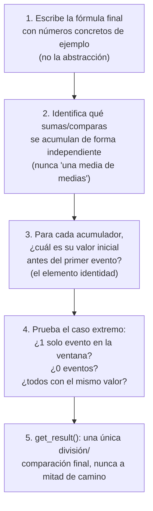

# Cómo diseñar una decisión de ventana, antes de escribir la spec

**Para quién es esto:** guía de proceso, no de configuración — el método para llegar a decisiones
como las de la Fase 26 (`specs/phases/26-market-pulse-job/spec.md` §0, §4.1, §4.2, §4.4), aplicable
a cualquier ventana futura de este proyecto. No sustituye a
[`technical-definitions.md`](../technical-definitions.md) (qué configura este proyecto y por qué) ni
a [`keyed-state-and-checkpointing.md`](keyed-state-and-checkpointing.md) (el modelo mental de estado
con clave) — es el paso anterior a los dos: cómo pensar el problema antes de que exista código o
configuración que revisar.

**Base:** no es un método inventado para este repo. Combina dos fuentes:
- **"The Dataflow Model"** (Akidau, Chernyak, Fernández-Moctezuma et al., Google, VLDB 2015) — el
  paper que formalizó el diseño de computación por ventanas con 4 preguntas (**What / Where / When
  / How**, §1 más abajo). Flink implementa este modelo casi directamente
  (`WindowAssigner`=Where, `WatermarkStrategy`+`Trigger`=When, `AggregateFunction`=How).
- **Kleppmann, *Designing Data-Intensive Applications*, cap. 11** ("Stream Processing") — para los
  conceptos de stragglers (eventos tarde), reprocesamiento, e idempotencia que entran en juego en
  **When** y en la deduplicación.

---

## 1. Las 4 preguntas del Dataflow Model, aplicadas como checklist

Antes de escribir una sola línea de spec, responde estas 4 preguntas en este orden — cada una
depende de la anterior:

### 1.1 What — ¿qué se está calculando?

No es "qué campo agrego" — es "¿qué pregunta de negocio responde este número, y a quién sirve?".
Aplicado en Fase 26 (§4.1): la pregunta no era "avg(avg_nightly_rate)", era "¿qué nivel de precio se
pide ahora mismo para este segmento?" — una vez que la pregunta de negocio estuvo clara, se vio que
un `avg()` sin ponderar por `sample_size` no la respondía bien.

**Pregúntate:** si le enseño este número a la persona que lo va a usar (un property manager), ¿sabe
qué significa sin que se lo explique? Si la respuesta requiere un párrafo de matizaciones, la
métrica probablemente está mal definida, no mal explicada.

### 1.2 Where — ¿en qué ventana de tiempo de evento?

Dos decisiones separadas, que se confunden con facilidad (ya pasó en la Fase 26, Decisión 2 punto 2):

- **El tamaño de la ventana** (cada cuánto tiempo real se emite un resultado: 5 min, 1 hora...).
- **La clave de agrupación** (qué atributos del dato hacen que dos eventos sean "comparables" dentro
  de la misma ventana — un eje totalmente distinto al anterior).

**Pregúntate para la clave:** si agrupo por X pero no por Y, ¿estoy mezclando cosas que un humano
consideraría incomparables? (Fase 26: mezclar `market_area` sin `property_profile` mezclaba un
estudio con un piso de 3 habitaciones.)

**Pregúntate para el tamaño:** ¿el tamaño de la ventana tiene relación con la frecuencia real de
publicación de la fuente? (Fase 26: `market-ingestor` publica 1 `target_date` por tick de 60s — una
ventana de 5 min ve ~5 `target_date`s distintos por segmento; ese dato cambió la decisión, y solo
apareció al mirar el código real, no al suponerlo.)

### 1.3 When — ¿cuándo se dispara el resultado, y qué pasa con lo tarde?

Aquí es donde entra Kleppmann: en un sistema real, los eventos no llegan en el orden en que
ocurrieron (particiones de Kafka sin orden garantizado entre sí, reintentos, colas). Tres preguntas
concretas, en este orden:

1. **¿Cómo defino "cuándo ya no espero más"?** → watermark. `for_bounded_out_of_orderness(D)` es la
   respuesta más simple: "espero como mucho `D` de desorden". Pero *solo funciona si todas las
   particiones de entrada producen tráfico con regularidad* — si una partición se queda sin eventos,
   su watermark se congela y arrastra el watermark global (mínimo de todas las particiones) con ella.
   **Antes de fijar un watermark, comprueba cuántas particiones tiene la fuente real** (`grep` sobre
   `docs/manual/MANUAL.md`/`infra/`, no lo asumas) — con 1 sola partición el problema de "una
   partición inactiva bloquea a las demás" ni siquiera puede darse (no hay "las demás"), pero puede
   aparecer un problema relacionado y distinto: el *topic entero* se queda sin avanzar si esa única
   partición calla. Con varias particiones, hay que decidir si `with_idleness(...)` hace falta y con
   qué umbral, derivado de la cadencia real de publicación de la fuente, no adivinado.
2. **¿Qué pasa con un evento que llega después de que su ventana ya se disparó, pero dentro de un
   margen razonable?** → `allowedLateness`. Si tu sistema puede tolerar recalcular y reemitir un
   resultado ya publicado, esto es tu red de seguridad.
3. **¿Qué pasa con un evento que llega después incluso de eso?** → nunca "se descarta en silencio".
   Un side output logueado, como mínimo (igual que `errors.tolerance: none` de Debezium en este
   proyecto) — mejor aún, un topic/tabla de "tarde" que se pueda auditar, no solo un log de texto.

### 1.4 How — ¿cómo se combinan varios resultados del mismo grupo a lo largo del tiempo?

Esta es la pregunta que casi siempre se salta, y es la que en la Fase 26 llevó al diseño del
acumulador (§3 más abajo). Concretamente: ¿el resultado de una ventana es independiente de las
demás ventanas de la misma clave (discarding), o cada disparo tiene que tener en cuenta lo ya
emitido antes (accumulating)? Fase 26 lo resolvió explícitamente para bookings: **descartó** intentar
que una cancelación "retractara" un conteo de creación ya emitido (no hay mecanismo de retracción
pasado `allowedLateness`), y en su lugar diseñó dos contadores independientes, dejando el neto para
tiempo de consulta — una decisión de **How**, no solo de **What**.

---

## 2. Watermarks, particiones y `with_idleness`: el criterio completo

Esta sección generaliza la Decisión 3 de la Fase 26 (spec §3.1). Es la parte del diseño de ventanas
donde más fácil es aplicar un parche genérico ("pongo `with_idleness` en todo, por si acaso") en vez
de entender qué problema concreto se está resolviendo.

### 2.1 Qué es un watermark, en una frase

Es una afirmación que el propio sistema se hace a sí mismo: "ya he visto todo lo que tiene
event-time menor o igual a T". Ninguna ventana puede decidir cuándo cerrarse sin esa señal, porque
sin ella no hay forma de distinguir "todavía puede llegar algo para esta ventana" de "ya no va a
llegar nada más".

### 2.2 La regla del mínimo, y por qué es la raíz de todo lo demás

El watermark de un operador con varias entradas (varias particiones asignadas a un mismo subtask, o
varios subtasks alimentando al siguiente operador del grafo) es el **mínimo** entre todas esas
entradas, nunca la media ni el máximo. Es una regla conservadora a propósito: si una sola entrada
va por detrás, asumir que el resto ya puede avanzar significaría arriesgarse a cerrar una ventana
antes de que le llegue un evento tardío que sí le correspondía.

Esta regla del mínimo es la causa de **todos** los problemas de esta sección. Cualquier entrada que
deje de producir watermark (por la razón que sea) arrastra hacia abajo el watermark de todo el
operador, aunque el resto de entradas funcione perfectamente.

### 2.3 Dos causas completamente distintas de que una entrada "no avance", y cómo distinguirlas

**Causa A, estructural: más subtasks paralelos que particiones reales de la fuente.** Kafka asigna
cada partición a exactamente un subtask, de forma fija al arrancar el job, nunca compartida y nunca
por turnos. Si el job tiene más subtasks que particiones, los subtasks sobrantes no reciben ninguna
partición asignada y por tanto no reciben nunca un solo evento, desde el instante en que arranca el
job, sin relación alguna con si hay tráfico real o no. Es un fallo permanente y garantizado, no
intermitente.

**Cómo detectarla:** compara el paralelismo configurado de esa fuente contra el número real de
particiones del topic (verificado en la configuración de infraestructura, nunca asumido). Si el
paralelismo es mayor, la causa A existe seguro, incluso con tráfico perfecto.

**El fix correcto no es `with_idleness`, es corregir el paralelismo de esa fuente concreta**
(la mayoría de motores de stream processing permiten fijar el paralelismo por operador, no solo de
forma global para todo el job). Aplicar `with_idleness` sobre este problema lo taparía (el
watermark avanzaría igual, excluyendo los subtasks vacíos del cálculo) pero dejaría corriendo
recursos que nunca van a procesar nada, en vez de eliminar la causa.

**Causa B, de tráfico real: una partición que sí tiene subtask asignado, pero deja de recibir
mensajes durante un rato.** Aquí sí hace falta `with_idleness`: marca esa entrada concreta como
inactiva tras un umbral de tiempo sin eventos, y mientras dure, la excluye del cálculo del mínimo
del punto 2.2, dejando que el resto del operador siga avanzando con normalidad.

**Punto importante que se presta a confusión:** `with_idleness` no detiene nada, no libera recursos,
no "apaga" la partición. El subtask sigue conectado y listo para procesar el siguiente evento en
cuanto llegue. Lo único que cambia es que ese watermark deja de contar en el mínimo mientras esté
inactivo.

### 2.4 Cómo fijar el umbral de `with_idleness`, sin adivinar

El umbral tiene que ser mayor que el intervalo normal entre eventos de una entrada sana (si no,
marcarías tráfico completamente normal como inactivo por error), y a la vez lo bastante corto para
detectar el problema real sin demasiado retraso. La forma de fijarlo con criterio, no al azar:

1. **Busca la cadencia real de publicación de la fuente en el código, nunca en una suposición.**
   ¿Publica a intervalos fijos (un tick determinista) o a intervalos variables (aleatorios dentro de
   un rango)? Un generador de prueba puede tener una cadencia predecible que una fuente real de
   producción nunca tendría, así que documenta explícitamente de qué cadencia se ha derivado el
   número.
2. **Toma el intervalo máximo normal (no el promedio) y multiplícalo por un margen de seguridad,
   típicamente 2x.** El promedio esconde la variabilidad real; el máximo es el caso que de verdad
   te interesa no confundir con un fallo.
3. **Documenta el umbral como configuración explícita**, no como una constante suelta en medio del
   código. Si la fuente cambia de cadencia (por ejemplo, al pasar de un mock a datos reales de
   producción), el valor tiene que poder ajustarse sin tocar el código del job.
4. **Decide cómo vas a monitorizar que el mecanismo está funcionando.** `with_idleness` no emite
   ningún evento de negocio que puedas observar directamente; las señales indirectas habituales son
   las métricas propias del motor de streaming (el watermark de cada operador, expuesto en su
   interfaz de monitorización) y una acumulación anómala en el side output de datos tardíos, si
   existe uno.

### 2.5 Checklist de esta sección

- [ ] ¿Cuántas particiones tiene realmente cada fuente, y cuál es el paralelismo configurado para
      leerla? Si el paralelismo supera al número de particiones, hay causa A garantizada, y el fix
      es de paralelismo, no de `with_idleness`.
- [ ] Una vez descartada o corregida la causa A, ¿puede la fuente quedarse sin tráfico real durante
      un rato bajo funcionamiento normal? Si sí, hace falta `with_idleness`.
- [ ] ¿El umbral está derivado de la cadencia real medida en el código de la fuente (con su margen
      de seguridad), o es un número puesto "para curarse en salud"?
- [ ] ¿El umbral vive como configuración ajustable, o como una constante hardcodeada?
- [ ] ¿Dónde se puede observar, en caso de que el job deje de producir resultados, si la causa fue
      una fuente marcada como inactiva?

---

## 3. Diseñar el `AggregateFunction`: encuentra el elemento identidad de cada operación

Una vez resueltas las 4 preguntas de arriba, si el resultado es una agregación (`avg`, `sum`,
`min`, `max`, ponderaciones), el patrón para no perder precisión ni corromper el resultado es
siempre el mismo, en este orden:

**Regla de oro para el paso 3 — el elemento identidad de cada operación:**

| Operación | Valor inicial correcto | Por qué |
|---|---|---|
| `+=` (suma, conteo, peso) | `0` | sumar `0` no cambia nada |
| `min(...)` | `+infinito` (`float('inf')`) | cualquier valor real es menor, así que el primer evento real siempre "gana" |
| `max(...)` | `-infinito` (`float('-inf')`) | simétrico al anterior — **nunca `0`**, aunque el dominio actual (p. ej. un precio, `ge=0`) haga que `0` "no falle por casualidad hoy". `0` solo es seguro si conoces y confías en una restricción del dominio que puede cambiar; `-infinito` es correcto siempre, sin depender de esa restricción (ver Fase 26 §4.1, la razón exacta por la que se descartó `0` para el máximo de precio, pensando en una reutilización futura con un campo que sí admita negativos, como un profit).

**Trampa común a vigilar (Fase 26 §4.4):** una media incremental tipo `nueva_media = (media_anterior + valor_nuevo) / n` está **mal**, incluso para una media simple sin ponderar — mezcla una cantidad ya dividida por `n-1` con un valor nuevo, y trata a ambos como si pesaran igual. La forma correcta es acumular siempre **sumas crudas** (nunca una media a medio calcular) y dividir **una sola vez**, en `get_result()`.

---

## 4. Deduplicación e idempotencia: la pregunta que Kleppmann obliga a hacer siempre

Cualquier fuente CDC (Debezium) puede reentregar el mismo evento de negocio más de una vez: por
redelivery de Kafka, por restart desde checkpoint, o por un resnapshot completo del conector. Antes
de decidir cómo deduplicar, separa los casos por **cuánto tiempo real ha pasado** entre la primera
entrega y la repetida — no todos necesitan la misma defensa (Fase 26 §4.4 los llama "casos con
distinto radio de explosión"):

1. **Redelivery/restart del mismo día** — el evento repetido llega con un timestamp de evento
   *reciente*, todavía dentro de la ventana+lateness. Esto sí puede corromper un resultado que
   Flink aún no ha cerrado → necesita un mecanismo activo de deduplicación (estado con clave, TTL
   corto).
2. **Resnapshot completo** — el evento repetido trae un timestamp de evento *viejo* (semanas). Si tu
   ventana ya tiene un `allowedLateness` razonable, este caso **ya se descarta gratis** como "tarde"
   antes de llegar a cualquier lógica de deduplicación — no le pongas un TTL largo pensando en este
   caso, eso solo paga crecimiento de estado sin necesidad (Fase 26 §4.4, alternativa 2 rechazada).

**Pregunta de cierre, siempre:** ¿la propiedad que estoy usando para detectar "ya visto" es un campo
propio del evento y su identidad (`booking_id`, estado con clave que tú controlas), o es un campo
que **otra aplicación** rellena por su cuenta (`updated_at` vía un trigger ajeno)? Un contrato
implícito sobre el comportamiento de otro sistema es exactamente el tipo de suposición que Kleppmann
avisa que se rompe sin aviso — la deduplicación nunca debería depender de eso si existe una
alternativa que dependa solo de tu propio estado (Fase 26 §4.4, por qué se rechazó
`updated_at IS NULL`).

---

## 5. Casos reales: intentos que parecían razonables y por qué fallaban

Estos son los intentos reales durante el diseño de la Fase 26, no ejemplos inventados a posteriori.
Se documentan con el mismo formato porque el patrón de error se repite: una intuición razonable que
falla en cuanto se prueba con números concretos o con un caso límite. Ver también §2-4 arriba, que
son la versión ya generalizada de estas mismas lecciones.

### 4.1 "¿Cómo distingo una reserva nueva de una actualizada?" → `status` y `updated_at`

**Intento:** usar `status` y `updated_at` juntos para distinguir un `booking_id` visto por primera
vez de uno reenviado.

**Por qué parecía razonable:** son los dos campos del evento que más directamente "hablan" de si
algo cambió.

**Por qué falla `status`:** no distingue nada por sí solo — solo filtra por un valor. Un `UPDATE`
que solo cambia `guests` en una reserva ya confirmada sigue llegando con `status == "confirmed"`,
indistinguible en ese campo de la primera confirmación.

**`updated_at` sí sirve, pero con una grieta:** `updated_at IS NULL` identifica correctamente un
insert frente a un update **mientras la fila solo se haya visto una vez en la vida real**. Se rompe
en un caso concreto y real de este propio proyecto: un resnapshot de Debezium (`snapshot.mode:
initial`, ver `technical-definitions.md` §1) reemite el valor *tal como está guardado* — una fila
que nunca se editó reaparece con `updated_at = NULL`, indistinguible de un insert genuino. Además,
depende de un contrato implícito: `updated_at` lo rellena un trigger de **otra** aplicación
(`mock-pm-app`), no algo que este job controle o pueda garantizar que siga existiendo.

**Corrección:** deduplicar con estado propio (`ValueState[bool]` por `booking_id`, TTL corto) — algo
que depende solo de la propia identidad del evento, nunca de un campo cuyo comportamiento decide otra
aplicación. Detalle completo: spec Fase 26 §4.4.

### 4.2 "El agregado sería sumar contador + sumar el valor" → media sin ponderar, sin darse cuenta

**Intento:** `add()` = sumar 1 al contador, sumar `avg_nightly_rate` a un total; `get_result()` =
total / contador.

**Por qué parecía razonable:** es la definición literal de una media.

**Por qué falla para lo que se necesitaba:** es una media **simple**, no ponderada — nunca menciona
`sample_size`, así que no puede estar dándole menos peso a un snapshot de baja confianza. Con
snapshots `(100, sample_size=50)`, `(100, 50)`, `(300, 2)`: esta fórmula da `(100+100+300)/3 =
166.7` — dominado por el snapshot de solo 2 muestras, exactamente el problema que se quería evitar.

**Corrección:** dos acumuladores separados — `Σ(rate·sample_size)` y `Σ(sample_size)` — dividiendo
uno entre el otro solo al final. Con los mismos datos: `10600/102 ≈ 103.9`. Ver §3 arriba y spec
Fase 26 §4.1.

### 4.3 "La nueva media es la media anterior más el valor nuevo, entre n" → media incremental incorrecta

**Intento:** `nueva_media = (media_anterior + valor_actual) / n`.

**Por qué parecía razonable:** "actualizar la media con cada dato nuevo" suena a ir incorporando
información gradualmente, como el resto de acumuladores de este documento.

**Por qué falla, con números:** aplicado a `[100, 100, 300]` —
- Evento 1: sin media anterior → `avg = 100`, `n = 1`.
- Evento 2: `avg = (100 + 100) / 2 = 100`.
- Evento 3: `avg = (100 + 300) / 3 = 133.3`.

La media real de `[100, 100, 300]` es `500/3 = 166.7`. El resultado, `133.3`, está mal — y esto es
**antes** de meter ninguna ponderación. El fallo: `media_anterior` ya es el resultado de haber
dividido por `n-1` eventos; sumarla directamente a un único valor nuevo y volver a dividir por `n`
trata la media acumulada y el valor individual como si pesaran lo mismo, y no es así.

**Corrección:** nunca reconstruir una media a partir de otra media. Acumular siempre la **suma
cruda** y el **contador** por separado, y dividir una única vez en `get_result()` — la regla general
de §3 arriba.

### 4.4 Un desliz de aritmética que casi pasa desapercibido

**Intento:** al aplicar el acumulador ponderado al tercer evento (`avg_nightly_rate=300,
sample_size=2`), se calculó `300 × 20 = 6000` en vez de `300 × 2 = 600` — un `sample_size` mal
leído, no un error de método.

**Por qué importa incluirlo aquí:** el *método* (multiplicar antes de sumar en el numerador, sumar
solo el peso en el denominador) era correcto — el error estaba en un dato de entrada, no en el
razonamiento. Esto es precisamente lo que hace valioso el paso 1 del proceso de §3 ("escribe la
fórmula con números concretos"): al tener los números delante y compararlos contra un resultado ya
conocido (`103.9`), el desliz se detecta de inmediato. Si el cálculo se hubiera quedado en la
abstracción ("multiplico y sumo"), un error así podría pasar sin que nadie lo notara hasta ver un
número final rocambolesco en producción.

### 4.5 "Agrupar por tipo de apartamento" y "un agregado general que englobe todo"

**Intento 1:** usar solo `property_type`/`bedrooms` como clave del pulso de mercado.

**Por qué falla:** ignora la ubicación. Un estudio en un barrio caro y un estudio en uno barato
tienen niveles de precio completamente distintos — agruparlos juntos responde a una pregunta
("¿cuánto vale un estudio, en general?") que no es útil para nadie que gestione una propiedad
concreta.

**Intento 2 ("un agregado general, así engloba todo"):** frente a la pregunta de si ponderar por
`sample_size`, la respuesta fue evitar la pregunta agrupando de forma más amplia.

**Por qué no resuelve nada:** ponderar y agrupar son dos ejes distintos e independientes (Where vs.
How, en los términos de §1). Ampliar o cambiar la clave de agrupación no cambia en nada si, dentro
de cada grupo, cada snapshot pesa igual o pesa según su `sample_size` — el problema de fondo (un
snapshot de 2 muestras pesando igual que uno de 200) reaparece sea cual sea la clave elegida.

**Corrección:** las dos decisiones se resolvieron por separado — la clave pasó a ser el segmento
completo (`market_area` + `property_type` + `bedrooms`, la unidad que ya usa `market-ingestor`), y
el agregado pasó a ser una media ponderada por `sample_size` (§4.2 de este documento). Ver spec Fase
26 §4.1 para el detalle y las alternativas descartadas.

### 4.6 "`0` o `-infinito`" para el máximo — dudar entre lo que "no falla hoy" y lo que "no puede fallar"

**Intento:** inicializar el acumulador de `max_price_eur` en `0` (ya visto en §3, se repite aquí
porque fue un intento real, no solo un ejemplo del documento).

**Por qué parecía razonable:** `avg_nightly_rate` tiene una restricción de schema `ge=0` — nunca es
negativo — así que `max(0, precio_real)` nunca da un resultado incorrecto **para este campo
concreto, hoy**.

**Por qué es una elección frágil de todos modos:** depende de conocer y confiar en una restricción
externa (el `Field(ge=0)` de `market_price.py`) que vive en otro fichero y podría cambiar. Si el
mismo patrón de acumulador se reutiliza para un campo que sí admite negativos — un `profit_eur`,
por ejemplo — y todos los valores de una ventana fueran negativos, `max(0, ...)` reportaría `0` como
"máximo", un valor que nunca ocurrió realmente.

**Corrección:** `-infinito`, el elemento identidad general de `max` que no depende de ninguna
restricción de dominio — funciona igual de bien hoy (porque los precios son `≥0`) y sigue siendo
correcto si el patrón se reutiliza mañana para un campo que sí pueda ser negativo.

---

## 6. Checklist final, para copiar y rellenar en la siguiente spec

- [ ] **What:** ¿qué pregunta de negocio responde esta métrica, en una frase que entendería quien la
      use, sin matices?
- [ ] **Where (clave):** ¿qué atributos hacen a dos eventos comparables? ¿Estoy mezclando algo que
      un humano consideraría distinto?
- [ ] **Where (tamaño):** ¿el tamaño de ventana tiene relación con la cadencia real de publicación
      de la fuente (verificada en código, no supuesta)?
- [ ] **When (watermark):** ¿cuántas particiones tiene la fuente real? ¿Puede alguna quedarse sin
      tráfico y bloquear el avance del watermark? ¿Hace falta `with_idleness`, con qué umbral
      derivado de datos reales?
- [ ] **When (lateness):** ¿qué pasa con un evento tarde dentro del margen? ¿Y fuera del margen —
      dónde queda registrado, nunca solo descartado en silencio?
- [ ] **How:** ¿el resultado de una ventana es independiente de las demás (discarding), o necesito
      relacionar disparos sucesivos? ¿Hay algún caso (como una cancelación) que "querría" retractar
      un resultado ya cerrado — y si sí, cómo lo resuelvo sin retracción?
- [ ] **Acumulador (si aplica):** fórmula final con números concretos primero. Elemento identidad
      correcto para cada campo (`0`/`+inf`/`-inf`), no el que "no falla hoy por casualidad".
      Probado contra el caso de 1 solo evento y 0 eventos.
- [ ] **Deduplicación (si aplica):** ¿de qué casos me protejo (redelivery reciente vs. resnapshot
      viejo)? ¿El mecanismo depende solo de mi propio estado, o de un contrato implícito de otra
      aplicación?
