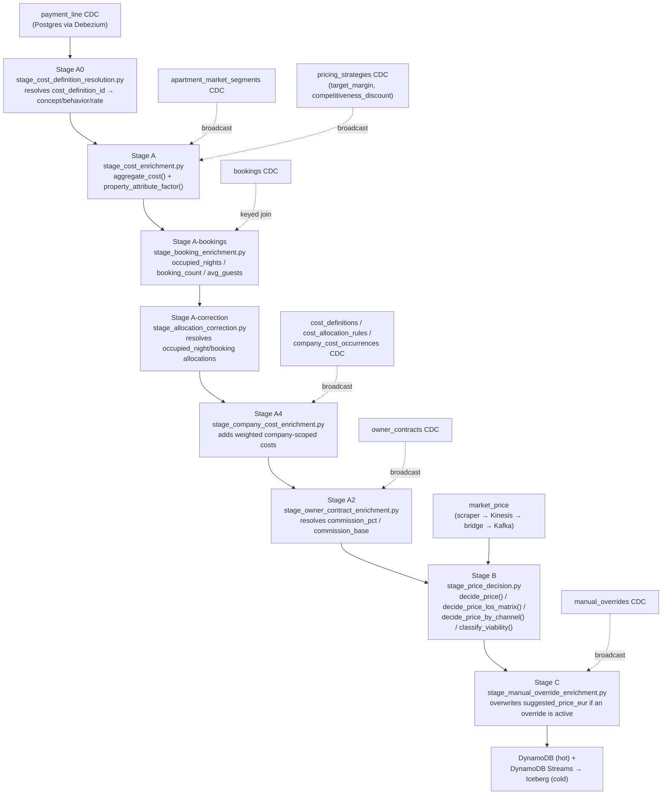
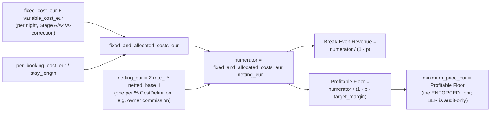

# Glossary: Profitable Dynamic Pricing (explained without industry jargon)

**Who this is for:** someone with no prior background in vacation rental or revenue management
who needs to understand what the concepts in
`docs/adr/ADR-0011-profitable-pricing-target-architecture.md` and `docs/post-poc-roadmap.md`
mean, and why they matter.

**What this is not:** it is not an ADR (it does not record a decision) and not a phase spec (it
does not define acceptance criteria to implement anything). It is a map of concepts, in plain
language, with its current status in this repo. When a concept is already implemented, it links to
the phase that implemented it. When it is not, it links to the backlog item in
`post-poc-roadmap.md`.

---

## 1. The core idea, in one sentence

In vacation rental, two forces compete to decide the price of a night: the market (how much people
are willing to pay) and the real cost of that specific booking (cleaning, OTA commission, the
apartment's own share of rent, and so on). A "normal" pricing engine only looks at the market. This
project builds one that never lets the market price push the price below what it actually costs to
run that booking, and that also explains why it landed on that number.

---

## 2. The price ladder (from abstract to concrete)

These are 6 concepts that are not synonyms, even though they are sometimes confused. Each one is a
more concrete step than the previous one.

| Concept | In one line | Analogy |
|---|---|---|
| Market Reference Price | What comparable apartments in the same area are charging right now. | The "market price" of a used car of the same model. |
| Property Reference Price | The above, adjusted because this specific apartment is better or worse than average (it has a pool, no elevator, and so on). | The same car, corrected for its real condition and extras. |
| Base Price | The Property Reference Price, adjusted by the chosen commercial strategy (aggressive, conservative, and so on). | The listing price you would set before negotiating. |
| Break-Even ADR | The minimum price to avoid losing money on that specific booking. | The price at which a car dealer neither gains nor loses. |
| Profitable Floor | The Break-Even price plus the minimum margin the business requires. | The lowest price the dealer accepts and still sleeps soundly. |
| Final Rate | The price that actually gets published, after market, channel, and rules are applied. Never below the Floor, except with an authorised exception. | The final price on the tag. |

**Why it matters:** tools like PriceLabs or Beyond only calculate up to a market-adjusted "Base
Price". They do not know the real cost of this specific booking, so they sometimes recommend
prices below Break-Even without knowing it. This project calculates the full ladder.

---

## 3. Bonus/Malus (Property Attribute Factor)

**What it is:** a multiplier that raises or lowers the market price based on the apartment's own
features (terrace, pool, floor, noise, review quality) instead of treating every apartment in an
area as worth the same.

**Example:** if the market pays an average of 185 euros a night in the area, but this specific
apartment has no elevator and no parking, Bonus/Malus might lower it to around 157 euros. That is
the apartment's "structural value", not the final price for one specific night.

**Status:** implemented. See [Phase 8](../specs/phases/08-property-bonus-malus/spec.md).

---

## 4. Stay cost and why duration matters (LOS)

**LOS means Length of Stay**: how many nights the booking lasts.

**The counterintuitive part:** a fixed booking cost (cleaning plus laundry, say 110 euros) weighs a
lot if the stay is 1 night (110 euros per night), but almost nothing if the stay is 10 nights (11
euros per night). Because of this, the same date can be profitable for a long booking and not
viable for a single-night one, at the same nightly price.

**Practical consequence:** the "minimum profitable price" is not a single number per apartment. It
is a matrix: one value per combination of arrival date and number of nights.

**Status:** implemented. [Phase 9](../specs/phases/09-los-floor-matrix/spec.md) calculates that
matrix. What is not done yet: using that matrix to actively recommend raising the minimum stay when
a single night is not profitable (see the "min-stay lever" item in `post-poc-roadmap.md`).

---

## 5. Break-Even and Profitable Floor (the formula, in words)

- Break-Even Revenue: the minimum you need to charge to cover expenses. When some costs are a
  percentage of what you charge (OTA commission, payment processing commission), the formula is
  not "add up the costs". It requires dividing by what remains after those percentages, because
  the more you raise the price, the more the commission grows too.
- Profitable Floor: the same idea, but also requiring the business's minimum profit margin, not
  just covering expenses.

**Status:** implemented, with the correct formula (division, not multiplication). Fixed in
ADR-0009 after an earlier calculation error was found and corrected.

---

## 6. Owner Contract (contract with the apartment owner)

**The problem:** most property managers do not keep the entire booking revenue. They pay a
commission or "payout" to the apartment owner. But that commission is not always calculated on the
same base. It can be over the total booking, over the total minus the OTA commission, over the
total minus OTA and cleaning, and so on. If the pricing engine assumes the wrong base, it
miscalculates what the manager actually keeps, and therefore miscalculates the floor.

**Status:** implemented for the common cases (closed, known bases). See
[Phase 11](../specs/phases/11-owner-contract/spec.md). Deliberately not implemented: a generic
"solver" for non-standard or non-linear contract formulas. This was a conscious decision, not an
oversight, documented in Phase 11's own spec.

---

## 7. Layered Revenue Management

**What "Revenue Management" is:** the set of rules that adjust the price up or down based on
context: high season, weekends, low occupancy, last-minute bookings, a nearby event (concert,
trade fair), and so on. This is the "smart" part that reacts to the moment, on top of the
apartment's structural price.

**Why "layered":** if every rule adds or subtracts a percentage with no control, discounts can
stack up until the price falls below cost without anyone noticing. Organising this into layers
(structure, market, own performance, lead time, availability, promotions, guardrails) allows a
limit per layer and a global limit, and above all it prevents the final result from crossing the
Profitable Floor, except with an authorised exception.

**Status:** implemented. See [Phase 13](../specs/phases/13-layered-rm-engine/spec.md).

---

## 8. Channel pricing and "gross-up"

**The problem:** selling through Booking.com is not the same as selling direct. Booking takes a
much higher commission than charging directly by card (in the spec's example, around 17% versus
around 2%). If the same price is applied on both channels, one of them earns much less margin
without it showing in the published price.

**"Gross-up"** simply means raising the published price on the expensive channel just enough that,
after the channel takes its commission, the same margin remains as on the cheap channel. It is not
an arbitrary markup. It is math derived from the real cost of selling through that channel.

**Status:** not implemented. The system today uses a single commission figure, blind to channel.
See backlog items `#2` and `#8` (`post-poc-roadmap.md`).

---

## 9. Guardrails and Hard/Soft Floor policy

**What it is:** the rule that decides what happens when the price the market or the commercial
rules "want" falls below the Profitable Floor.

- Hard floor: never publish below the floor, period.
- Soft floor: selling below is allowed, but only with explicit authorisation, and it always
  records the expected loss. Never silently.

**Status:** implemented. See [Phase 12](../specs/phases/12-floor-policy/spec.md).

---

## 10. Explainability (Decision Components and reason codes)

**The problem this solves:** a property manager will not trust a price just because "the machine
said so". They need to see something like: "this price went up 10% for high season, down 3% for
low occupancy, and the profitability floor was 142 euros for this date and channel combination."

**What "reason codes" are:** instead of just free text, each adjustment is stored as structured
data (for example `RULE_SEASON_HIGH`, `FLOOR_PROTECTED`) that can be queried, filtered, and
audited, not just read.

**Status:** implemented. See [Phase 10](../specs/phases/10-decision-components/spec.md).

---

## 11. Manual Override (authorised manual exception)

**What it is:** sometimes the business deliberately wants to sell below the profitability floor.
For example, to avoid leaving an apartment empty before an event, or for a one-off commercial
relationship. This should be possible, but with a responsible user, a reason, an expiry date, and
the expected loss recorded. Never as a silent exception that breaks trust in the system.

**Status:** not implemented. Today the system is read-only downstream of the pricing engine. There
is no path for a human to write an exception back into the system. This is the largest pending
architecture change (backlog item `#9`).

---

## 12. Market Snapshot and comp-set

**Comp-set** ("competitive set"): the group of comparable apartments (same area, size, quality)
used as the market reference. Comparing against the average of an entire city with no filtering
would compare apples to oranges.

**Market Snapshot:** a "photo" of the market at a given moment (average price, percentiles,
occupancy, source, and date of the photo), so a price decision can be audited later against the
information it was made with.

**Status:** the data model is already prepared for this (percentiles, source, capture date). See
[Phase 3](../specs/phases/03-market-ingestion/spec.md). The source is still synthetic (simulated
segments), not real market data. See backlog item `#11`.

---

## 13. Quick acronym glossary

| Acronym | Meaning |
|---|---|
| ADR | Average Daily Rate. Average price per night. |
| LOS | Length of Stay. Number of nights in the booking. |
| OTA | Online Travel Agency. Booking, Airbnb, Vrbo, and so on. |
| RM | Revenue Management. |
| PMS | Property Management System. The software used to manage the apartment and bookings. |
| PoC | Proof of Concept. This project, a technical trial, not a finished product. |

---

## 14. How it is actually calculated (code map)

This section is the concrete counterpart to the plain-language sections above: for every
concept, the real formula, the exact function that computes it, and where in the pipeline it
runs. All formulas live in `libs/pricing-formulas/src/pricing_formulas/` (pure Python, no Flink
dependency, unit-tested in isolation) and are invoked from `streaming/flink-jobs/src/flink_jobs/`
(the PyFlink job that runs the formulas per event). Nothing downstream (dbt, the dashboard)
recalculates any of this — dbt only reads the already-computed fields back out of Iceberg/DynamoDB.

### 14.1 Pipeline stages that feed the price ladder



### 14.2 Market Reference Price

- **Formula:** `market_reference_price_eur = property_reference_price_eur * (1 - competitiveness_discount)`
- **Code:** `layers/market.py:market_reference_price()`
- **Stage:** Stage B (`stage_price_decision.py`, inside `decide_price()`), per event — recomputed
  every time either the cost side or the market side changes for that (apartment, night).
- **Persisted:** `calculation.market_reference_price_eur`

### 14.3 Property Reference Price (and Bonus/Malus)

- **Bonus/Malus multiplier:**
  `property_attribute_factor = clamp(1 + Σ(quality_tier_adj, rating_adj, view_adj, parking_adj), 0.5, 2.0)`
  where `rating_adj = (rating - 4.0) * 0.10`, `quality_tier_adj ∈ {-0.15, 0, 0.15, 0.30}`,
  `view_adj = 0.05` if has_view else 0, `parking_adj = 0.04` if has_parking else 0.
  - **Code:** `layers/structural.py:property_attribute_factor()` — computed **once per apartment**,
    in Stage A (`stage_cost_enrichment.py`), from the `apartment_market_segments` broadcast, not
    per pricing decision.
- **Property Reference Price:**
  `property_reference_price_eur = avg_nightly_rate_eur * property_attribute_factor`, then
  multiplied by the (currently neutral, 1.0) Performance and Inventory layer stubs and by the
  Booking Window factor (§14.7).
  - **Code:** `layers/structural.py:property_reference_price()`, combined in `engine.py:decide_price()`.
  - **Stage:** Stage B, per decision.
- **Persisted:** `calculation.property_attribute_factor`, `calculation.property_reference_price_eur`;
  the four individual Bonus/Malus components (`property_quality_tier`, `property_rating`,
  `property_view`, `property_parking`) are in `calculation.decision_components`.

### 14.4 Break-Even ADR and Profitable Floor



- `p` = sum of the rates of every applicable percentage `CostDefinition` for that apartment/period
  (OTA commission, owner commission, etc.), resolved once per decision.
- `netting_eur` reduces the numerator when a percentage cost's `revenue_base` excludes some
  concepts (e.g. commission charged on `revenue_minus_ota_minus_cleaning`, not total revenue).
- **Code:** `engine.py:decide_price()`, lines computing `break_even_revenue_eur` /
  `profitable_floor_eur` / `minimum_price_eur`. `netted_revenue_base_amount()` in
  `layers/commercial.py` computes the 5 possible revenue bases.
- **Stage:** Stage B, per decision. Raw cost inputs (`fixed_cost_eur`, `variable_cost_eur`,
  `per_booking_cost_eur`, `ota_related_cost_eur`, `cleaning_cost_eur`, `laundry_cost_eur`,
  `booking_scope_cost_eur`) are produced earlier by `cost_aggregation.py:aggregate_cost()` (Stage A),
  corrected by `stage_allocation_correction.py` (occupied-night/booking allocations) and
  `stage_company_cost_enrichment.py` (shared company costs, weighted per apartment).
- **Persisted:** `calculation.break_even_revenue_eur` (informational only, never enforced),
  `calculation.profitable_floor_eur`, `calculation.minimum_price_eur`.

### 14.5 Final Rate (Guardrails: Hard/Soft Floor)

- **Rule** (`layers/guardrails.py:apply_guardrails()`, unrounded comparisons):
  ```
  if minimum_price_eur <= market_reference_price_eur:
      rule_applied = "market_competitive"; suggested_price_eur = market_reference_price_eur
  elif minimum_price_eur <= property_reference_price_eur:
      rule_applied = "minimum_floor"; suggested_price_eur = minimum_price_eur
  else:
      rule_applied = "minimum_profitable_price"; suggested_price_eur = minimum_price_eur
  ```
- **Hard vs Soft floor:** `floor_policy_for(target_margin)` in `engine.py` — `"hard"` iff
  `target_margin == 0` (break-even == profitable floor, never crossed); `"soft"` whenever a margin
  is targeted (relaxable down to break-even only via an authorised Manual Override, §14.9).
- **Stage:** Stage B, per decision (final step of `decide_price()`).
- **Persisted:** `output.suggested_price_eur` (this is the "Final Rate" published downstream, unless
  overwritten by an active Manual Override in Stage C), `calculation.rule_applied`,
  `calculation.floor_policy`.

### 14.6 LOS Floor Matrix

- **Formula:** `decide_price()` evaluated once per candidate stay length
  `LOS_CANDIDATES = (1, 2, 3, 7, 14)`, varying only
  `per_booking_cost_per_night_eur = per_booking_cost_eur / stay_length` — the fixed booking cost
  gets diluted as nights grow, everything else (market side) stays constant across candidates.
- **Code:** `engine.py:decide_price_los_matrix()`.
- **Stage:** Stage B, per decision (called alongside the top-level `decide_price()` call in
  `stage_price_decision.py`).
- **Persisted:** `calculation.los_floor_matrix[]` (one entry per stay length).
- **Minimum-stay recommendation** (not in the original glossary table, but derived from the
  matrix): `engine.py:recommend_minimum_stay()` walks the matrix and returns the shortest stay
  length whose `rule_applied != "minimum_profitable_price"`, i.e. the shortest stay that clears the
  cost floor. Persisted in `calculation.minimum_stay_recommendation`.

### 14.7 Booking Window (implemented, not yet documented above — Phase 22)

Not one of the glossary's original 6 rungs, but a real, implemented layer that adjusts the
Property Reference Price before Market:

| Days to arrival | Tier | Adjustment |
|---|---|---|
| ≥ 45 | standard_window | 0% |
| 15–44 | early_bird | −3% |
| 3–14 | standard_window | 0% |
| 1–2 | last_minute | −5% |
| 0 | same_day | −8% |

- **Code:** `layers/booking_window.py:booking_window_factor()` / `booking_window_component()`.
- **Stage:** Stage B — `days_to_arrival = target_date - decided_at.date()` computed in
  `stage_price_decision.py`, fed into `decide_price()` before the Market layer.
- **Persisted:** folded into `calculation.property_reference_price_eur`; when non-zero, a
  `rule_early_bird` / `rule_last_minute` / `rule_same_day` entry appears in
  `calculation.decision_components`.

### 14.8 Owner Contract (payout base / commission netting)

- Each apartment's `owner_contracts.cost_definition_id` resolves, via the `cost_definitions`
  broadcast, to a `rate` (commission %) and a `revenue_base` (one of 5: `total_revenue`,
  `revenue_minus_ota`, `revenue_minus_ota_minus_cleaning`,
  `revenue_minus_ota_minus_cleaning_minus_laundry`, `revenue_minus_all_booking_costs`).
- That `revenue_base` determines `netting_eur` (§14.4) via `netted_revenue_base_amount()`.
- **Code:** `stage_owner_contract_enrichment.py:OwnerContractEnrichmentFunction` (resolution),
  `layers/commercial.py:netted_revenue_base_amount()` (the netting math).
- **Stage:** Stage A2 (resolution, once per apartment config change) → consumed in Stage B (per
  decision).
- **Persisted:** `calculation.commission_pct`, `calculation.commission_base`; the netting effect
  itself appears as a `revenue_base_netting` entry in `calculation.decision_components`.

### 14.9 Manual Override (Guardrail exception)

- **Formula:** `expected_loss_eur = max(0, minimum_price_eur - override_price_eur)`;
  `effective_margin = override_price_eur / total_cost_eur - 1`. The override price fully replaces
  `output.suggested_price_eur`.
- **Code:** `stage_manual_override_enrichment.py:apply_manual_override()`.
- **Stage:** Stage C — the only stage in the pipeline that runs **after** a price decision is
  already computed (chained after Stage B), consuming the `manual_overrides` CDC topic.
- **Persisted:** `calculation.manual_override` (price, reason, authorised_by, valid_until,
  expected_loss_eur), `calculation.viability_status = "override_active"`,
  `manual_override_applied` decision component.
- Note: this makes the "not implemented" line in §11 above stale — Manual Override *is*
  implemented (Phase 14). Channel gross-up (§8) is still genuinely not implemented: each channel
  uses a hard-coded flat commission (`CHANNEL_COMMISSION_PCT` in `engine.py`:
  airbnb 12%, booking 15%, vrbo 8%), not a real gross-up solved against a "same margin as direct"
  target.

### 14.10 Viability status (explainability layer on top of the ladder)

- Priority-ordered classification combining `rule_applied`, `below_market_by`,
  `recommended_min_stay`, whether any channel is `market_competitive`, an active override, and a
  ≥30-day floor-breach streak (`floor_breach_days`, tracked in Flink keyed state per
  apartment+night).
- **Code:** `viability.py:classify_viability()`.
- **Stage:** Stage B computes it with `manual_override_active=False` always; Stage C overwrites it
  to `"override_active"` directly when an override actually applies (Stage B has no visibility into
  overrides — they're resolved one stage later).
- **Persisted:** `calculation.viability_status`, `calculation.floor_breach_days`.

### 14.11 Concepts explicitly NOT implemented (confirmed in code, not just docs)

- **Channel gross-up** (§8): `decide_price_by_channel()` exists and produces one candidate per
  channel, but each candidate uses a flat hard-coded commission, not a solved gross-up targeting
  equal margin across channels.
- **Comp-set / real market data** (§12): `market.py` and `MarketSnapshot` carry `occupancy_rate` /
  `sample_size`, but nothing in `pricing_formulas` reads them — Performance and Inventory layers
  (`layers/performance.py`, `layers/inventory.py`) are permanent `1.0` stubs.
- **dbt / transform:** no `.sql` model recomputes or overrides any of the above — confirmed via
  `grep` across `transform/models/`; dbt only builds marts on top of the already-decided
  `price_decision` records in Iceberg.

---

## How this relates to the rest of the documentation

- `docs/adr/ADR-0011-profitable-pricing-target-architecture.md`: the decision to adopt the
  external spec as the target architecture.
- `docs/post-poc-roadmap.md`: the prioritised backlog, item by item, with what is done and what is
  missing.
- `docs/metrics-dictionary.md`: the field-by-field reference (cost types, cost concepts, and every
  metric column), one level more concrete than this document.
- This document: the "translator" of the above two, for someone new to the domain.
