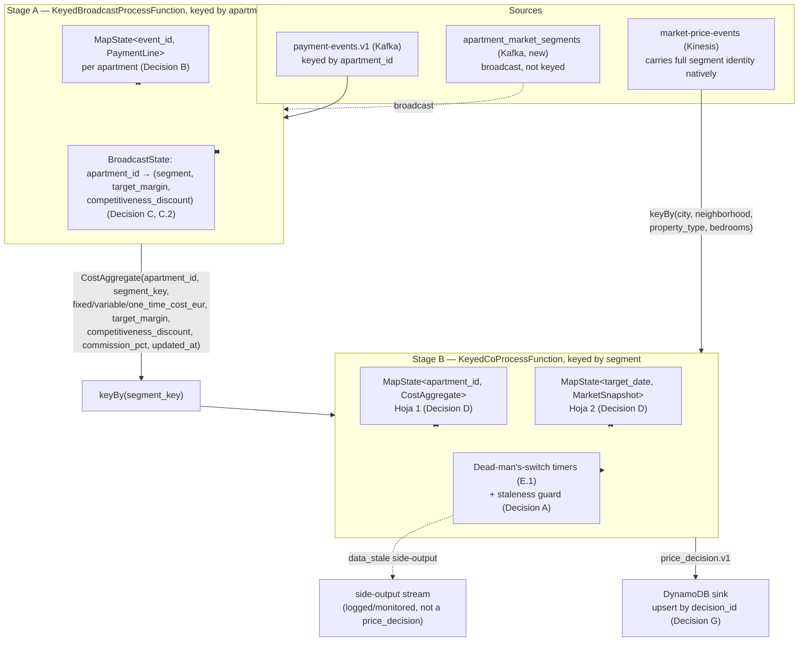

# Phase 4 — Flink Processing (Cost ⋈ Market → Pricing Decisions)

**Status:** Draft
**Depends on:** Phase 2 (`payment-events.v1`), Phase 3 (`market-price-events`, D.1/D.2 already implemented), Phase 1's `apartment_market_segments` ([Decision C.1](../01-mock-app-db/apartment_market_segments.sql))
**Blocks:** Phase 5 (Iceberg via DynamoDB Streams CDC — [ADR-0006](../../../docs/adr/ADR-0006-dynamodb-single-writer-iceberg-cdc.md)), Phase 6 (dashboard reads `price_decision.v1` from DynamoDB)
**Related:** [ADR-0002](../../../docs/adr/ADR-0002-pyflink-over-java-flink.md) (PyFlink), [ADR-0003](../../../docs/adr/ADR-0003-payment-line-cdc-contract.md) (upsert-by-`event_id`), [ADR-0005](../../../docs/adr/ADR-0005-market-price-partition-key.md) (segment key), [ADR-0006](../../../docs/adr/ADR-0006-dynamodb-single-writer-iceberg-cdc.md), [ADR-0007](../../../docs/adr/ADR-0007-price-decision-cost-protected-rule.md), [ADR-0008](../../../docs/adr/ADR-0008-kinesis-kafka-bridge.md) (Kinesis→Kafka bridge), [ADR-0009](../../../docs/adr/ADR-0009-profitability-floor-reform.md) (division-based floor, commissions, antelación tiers), [`docs/phase-4-streaming-design-decisions.md`](../../../docs/phase-4-streaming-design-decisions.md) (pre-spec, decisions A–H), [`error-handling/anticipated-risks-flink-processing.md`](../../../error-handling/anticipated-risks-flink-processing.md)

---

## 1. Executive summary

Phase 2 gives cost per apartment. Phase 3 gives market price per segment. Neither alone is a price — Phase 4 joins them into one number per apartment, per future night.

- **Cost side:** a running, always-current monthly cost total per apartment, upserted per row, never summed (ADR-0003).
- **Market side:** a running price snapshot per segment (city/neighborhood/property type/bedrooms), per night, 60 days out.
- **On any change**, recompute and re-emit every combination it affects: a new invoice reprices every known night for that apartment; a new market snapshot reprices every apartment in that segment for that one night.

**The non-negotiable rule:** cost plus a minimum profit margin is a floor the engine itself never crosses. Undercutting it is the property owner's call (lower the margin, or delist) — never Flink's. Above that floor, the engine tries to stay competitive with the market. Which force won is recorded explicitly (§8) — including a third, actionable case: the floor itself exceeds the raw market average, meaning the apartment's costs are pricing it out of its own market.

**Done when:** a cost or market update for a known apartment/segment produces a correct `price_decision.v1` in DynamoDB within seconds, survives a job restart without duplicating or losing state, and never recommends below the cost floor.

**Not in this phase:** Iceberg writes (Phase 5, ADR-0006), seasonality (lives in Phase 3, D.2), dashboard (Phase 6).

---

## 2. Scope

### In scope

- `streaming/flink-jobs/` — one PyFlink DataStream job (no Table API — pre-spec Decision D), consuming `payment-events.v1` (Kafka), `apartment_market_segments` (Kafka, broadcast — §4), and market prices via `market-price-bridge.v1` (Kafka, ADR-0008's bridge in front of the real `market-price-events` Kinesis stream). Writes `price_decision.v1` to DynamoDB only.
- The two-stage architecture in §3: apartment-keyed cost aggregation + segment/margin enrichment (Stage A), then segment-keyed cost⋈market join with fan-out (Stage B).
- Processing-time semantics with the one-line replay-safety mitigation (§5).
- Explicit, bounded keyed state with a stated eviction rule for every `MapState` (§6) — required, not left implicit.
- The freshness dead-man's-switch watchdog (§7) and its interaction with Flink's per-key timer model.
- The pricing formula: ADR-0007's three-way `rule_applied` rule over ADR-0009's division-based, antelación-tiered floor (§8).
- Checkpointing: `EmbeddedRocksDBStateBackend` + S3 (LocalStack), `EXACTLY_ONCE`, 60s interval (§9).
- The single DynamoDB sink, idempotent by `decision_id` (§10).
- Wiring `apartment_market_segments` into the existing Debezium connector's `table.include.list` (§4) — this phase's work, not Phase 1's (Phase 1 only built the table and its seed script).

### Out of scope (explicitly deferred)

- **Writing to Iceberg** — Phase 5, via a DynamoDB Streams CDC consumer, not a second Flink sink (ADR-0006).
- **Seasonality** — lives entirely in Phase 3's `market-ingestor` (D.2); this job reads `avg_nightly_rate_eur` as-is, calendar-agnostic.
- **`apartment_market_segments` maintenance** (an apartment changing segment after the initial seed) — confirmed out of scope (C.1).
- **A client/owner hierarchy for `target_margin`/`competitiveness_discount`** — flat, per-apartment, default `0.05` (C.2); no default-with-override model.
- **Real occupancy/calendar/blocking data** — see §14's `available_days` limitation.
- **Dashboard, Metabase, Athena queries** (Phase 6).
- **A full-stack automated integration harness** — matches Phases 2–3's precedent of manual, live verification. Not the same as untested — see §13 for the unit/component/MiniCluster test strategy this spec requires.

---

## 3. Architecture

Cost events arrive keyed by `apartment_id` (Kafka); Decision D's join needs them keyed by `segment`. Getting from one to the other is this spec's job, not an implicit detail:



**Stage A** (keyed by `apartment_id`) combines Decision B (cost aggregation) and Decision C/C.2 (segment + margin enrichment) — both need the same key and the same broadcast side:

1. **Cost side** (`payment-events.v1`): upsert the incoming `PaymentLine` into `MapState<event_id, PaymentLine>` by `event_id` (never sum — ADR-0003). "Current billing period" = whichever `billing_period_end` is latest among this apartment's known entries (data-driven, not wall-clock — §6). Group that period's lines by `cost_type` (ADR-0009): `fixed`/`variable` summed then divided by `available_days` (§14) → `fixed_cost_eur`/`variable_cost_eur`; `one_time` lines averaged, not summed → `one_time_cost_eur` (each is already the cost of one turnover). Look up `(segment, target_margin, competitiveness_discount, commission_pct)` from broadcast state; if not yet present, skip rather than emit with a missing segment (§6).
2. **Broadcast side** (`apartment_market_segments`): update `BroadcastState<apartment_id, (segment, target_margin, competitiveness_discount)>`.
3. Emits a `CostAggregate` downstream on every cost-side update.

**Stage B** (keyed by `segment`), a `.connect()` of Stage A's re-keyed output and the market-price stream (already carries full segment identity — no enrichment needed on this side): implements Decision D's two-`MapState` cross-join, Decision A's staleness guard, and Decision E.1's timers (§7).

---

## 4. Data contract

| Contract | Transport | Direction | Notes |
|---|---|---|---|
| [`payment_line.v1.json`](../../events/payment_line.v1.json) | Kafka, `payment-events.v1` | in | Upsert by `event_id`, never sum (ADR-0003). |
| `apartment_market_segments` rows | Kafka, new topic (this phase's work — see below) | in (broadcast) | Schema: [`apartment_market_segments.sql`](../01-mock-app-db/apartment_market_segments.sql). |
| [`market_price.v1.json`](../../events/market_price.v1.json) | Kinesis, `market-price-events`, via `market-price-bridge.v1` (Kafka, ADR-0008) | in | Point-in-time snapshot, not upsert-by-`event_id` (Phase 3 §3) — "current" = latest `collected_at` for a `(market_area, property_profile, target_date)`. |
| [`price_decision.v1.json`](../../events/price_decision.v1.json) | DynamoDB only ([ADR-0006](../../../docs/adr/ADR-0006-dynamodb-single-writer-iceberg-cdc.md)) | out | Idempotent `put_item` by `decision_id` (Decision G). |

**Field rename during Stage B's transform, not a mismatch bug:** `market_price.v1.pricing.avg_nightly_rate` → `price_decision.v1.market_inputs.avg_nightly_rate_eur`. `market_price.v1.market_context.{occupancy_rate,sample_size}` → `market_inputs.{occupancy_rate,sample_size}`. `market_area.city`/`market_area.neighborhood` collapse into one string, e.g. `"Barcelona/Eixample"` (matches the contract-test fixtures). Comment this at the code site (Phase 3 §4 precedent).

**Wiring `apartment_market_segments` into CDC (this phase's work, not Phase 1's):** Phase 1 built the table and its self-healing migration; it never added the table to `infra/debezium/postgres-connector.json`'s `table.include.list` (which only listed `payment_lines`). This phase adds `public.apartment_market_segments` to that list, routes it via the same `RegexRouter` pattern as Phase 2 to `apartment-market-segments.v1`, keyed by `apartment_id` — already this table's own PK, so (unlike Phase 2's `message.key.columns` fix) no override should be needed. Verify this live rather than assume it, per Phase 2's own hard-won lesson about connector defaults.

---

## 5. Time semantics & replay safety (Decision A)

**Processing-time**, confirmed — no fixed-time windows to close, only reactive `MapState` upserts and `onTimer` watchdogs (§7), so `WatermarkStrategy` buys nothing here. (Full reasoning: pre-spec doc, Decision A.)

**The one residual risk, and its mitigation:** `MapState.put()` overwrites unconditionally. Safe under normal ordering (Kafka/Kinesis preserve per-key order). Unsafe during a **manual reprocess** (replaying old offsets without a valid checkpoint, or a deliberate backfill) — an old event arriving *after* a newer one already in state would silently overwrite good data.

**Mitigation, in exactly two places — both `MapState.put()` calls in Stage B:**

```
# apartments_in_segment (Hoja 1)
existing = apartments_in_segment.get(cost_aggregate.apartment_id)
if existing is None or cost_aggregate.updated_at >= existing.updated_at:
    apartments_in_segment.put(cost_aggregate.apartment_id, cost_aggregate)
    # ... proceed to fan-out emission
else:
    # older data arriving late — discard, do not fan out
    return

# nights_in_segment (Hoja 2) — identical shape, keyed on collected_at instead
```

A one-line comparison, not a `WatermarkStrategy`. With checkpointing (§9), "reprocess from offset 0" is no longer the normal recovery path, so this guards a residual case (manual backfill), not normal operation.

---

## 6. State model & bounds

Every `MapState` has an explicit size bound and eviction rule — required by this project's own pre-spec checklist, not left implicit.

| State | Keyed by | Entry key | Expected size | Bound & eviction |
|---|---|---|---|---|
| `MapState<event_id, PaymentLine>` (Stage A) | `apartment_id` | `event_id` | Grows with cost-line history | Evict entries whose `billing_period_end` is older than the *previous* period — keep only current + immediately-prior period. Without this, unbounded growth over the demo's lifetime. |
| `BroadcastState<apartment_id, (segment, margin, discount)>` (Stage A) | *(broadcast)* | `apartment_id` | ~100 apartments | No eviction — one entry per apartment, replaced in place. Bounded by the catalog's own size (C.1, out of scope to grow). |
| `MapState<apartment_id, CostAggregate>` "Hoja 1" (Stage B) | `segment` | `apartment_id` | ~5–6 per segment | Defensive hard cap: **500/segment**, logged `WARNING`, oldest-`updated_at` evicted if exceeded — signals a data problem (e.g. mis-keyed events), not an expected scale. |
| `MapState<target_date, MarketSnapshot>` "Hoja 2" (Stage B) | `segment` | `target_date` | ≤ `forecast_days` (60) | Evict on every market event received: remove entries where `target_date < today`. Necessary — Decision D's guard only stops *adding* past dates, it doesn't remove entries that *age into* the past. |
| Timer deadline maps (§7) | `segment` | `apartment_id` / `target_date` | Mirrors its Hoja map | Removed in the same pass as its Hoja entry's eviction — a deadline must never outlive the data it watches (Risk 3, `error-handling/anticipated-risks-flink-processing.md`). |

**Ordering note:** an apartment's segment (broadcast) must arrive before its first cost event can be usefully enriched. The seed script (C.1) populates this once, before the generators produce real volume, so this resolves within seconds in practice — but the implementation must not crash on a missing broadcast entry; log and skip (no buffering — an accepted, narrow startup race, not worth a queueing mechanism for a PoC).

---

## 7. Freshness watchdog (Decision E.1) — and a Flink timer subtlety

Dead-man's-switch, confirmed: every Hoja 1/2 update resets a 48h processing-time timer for that entry; if it fires, nothing touched the entry in 48h, so a `data_stale` side-output fires.

**The subtlety:** Stage B is keyed by `segment`, not `apartment_id`/`target_date`. Flink's timer service ties a registered timer to the *operator's* current key — there's no built-in "one timer per sub-key within my `MapState`."

**Resolved with a deadline-map + scan-on-fire pattern**, avoiding ever needing to cancel a timer (which risks colliding with another sub-key's exact deadline):

```
# Two more MapStates in Stage B, alongside Hoja 1 / Hoja 2:
apartment_deadlines: MapState<apartment_id, timestamp>   # mirrors Hoja 1's keys
date_deadlines:      MapState<target_date, timestamp>    # mirrors Hoja 2's keys

# On every Hoja 1 / Hoja 2 write (after the staleness guard in §5 passes):
new_deadline = now + 48h
apartment_deadlines.put(apartment_id, new_deadline)      # overwrites any prior deadline
ctx.timerService().registerProcessingTimeTimer(new_deadline)   # old timer is simply never cancelled

# onTimer(fired_timestamp, ctx):
for apartment_id, deadline in apartment_deadlines.entries():
    if deadline == fired_timestamp:              # exact match = genuinely expired,
        emit_side_output(data_stale, segment, apartment_id)   # nothing superseded it
    # deadline != fired_timestamp means a newer update already moved the goalposts —
    # this firing is stale and is silently ignored, not an error
# same pattern for date_deadlines
```

Accepts a harmless number of "firing for nothing" callbacks (cheap `O(map size)` scan, already bounded per §6) in exchange for never needing exact timer cancellation.

Every `price_decision.v1` also carries `data_age_seconds` (ADR-0007), computed inline at emission (`decided_at - market_inputs.collected_at`) — a freshness signal independent of the side-output stream.

---

## 8. Pricing formula (ADR-0007's three-way rule over ADR-0009's floor)

Computed at every fan-out emission in Stage B (§3). The floor itself (`minimum_price_eur`) is now division-based, includes commissions, and depends on how far out the night is — replacing the original multiplicative formula, which was the same "common error" a stakeholder profitability review flagged (multiplying understates the real margin on the final price; dividing is the only form where the configured margin actually holds).

```
n = 1   # ADR-0009 D5: no per-stay-length model yet — see docs/post-poc-roadmap.md
days_to_arrival = target_date - decided_at.date()

if days_to_arrival > 30:
    floor_type = "structural_full_margin"
    M = target_margin
elif days_to_arrival >= 15:
    floor_type = "structural_reduced_margin"
    M = target_margin * 0.75
else:
    floor_type = "contribution"          # 7-14d and 0-3d share this formula

if floor_type == "contribution":
    # Cf excluded: a fixed cost (IBI, comunidad...) is sunk whether or not
    # this booking happens, so it can't be "saved" by turning one down.
    minimum_price_eur = (n * variable_cost_eur + one_time_cost_eur) / (1 - commission_pct)
else:
    minimum_price_eur = (n * fixed_cost_eur + n * variable_cost_eur + one_time_cost_eur) / (1 - M - commission_pct)

market_reference_price_eur = avg_nightly_rate_eur * (1 - competitiveness_discount)

if minimum_price_eur <= market_reference_price_eur:
    rule_applied = "market_competitive"
    suggested_price_eur = market_reference_price_eur
elif minimum_price_eur <= avg_nightly_rate_eur:
    rule_applied = "minimum_floor"
    suggested_price_eur = minimum_price_eur
else:
    rule_applied = "cost_protected"
    suggested_price_eur = minimum_price_eur

below_market_by = avg_nightly_rate_eur - suggested_price_eur   # always computed, can be negative
total_cost_eur = n * fixed_cost_eur + n * variable_cost_eur + one_time_cost_eur
effective_margin = (suggested_price_eur / total_cost_eur) - 1
```

`fixed_cost_eur`/`variable_cost_eur`/`one_time_cost_eur` come from Stage A's `cost_type`-grouped aggregation (§3). `commission_pct` (`Cp`, default `0.15`) travels alongside `target_margin`/`competitiveness_discount` in the same broadcast state (C.2's pattern).

### Antelación tiers (ADR-0009)

| `days_to_arrival` | `floor_type` | Margin term |
|---|---|---|
| `> 30` | `structural_full_margin` | full `target_margin` |
| `15–30` | `structural_reduced_margin` | `target_margin × 0.75` |
| `< 15` | `contribution` | none — break-even by construction |

### Worked examples — one per `rule_applied`, all at `days_to_arrival = 45` (`structural_full_margin`)

Match `specs/contracts/fixtures/price_decision/`'s three fixtures exactly.

| Case | `Cf` / `Cv` / `Cr` | `M` / `Cp` | `minimum_price_eur` | `avg_nightly_rate_eur` (`discount`) | `market_reference_price_eur` | `rule_applied` | `suggested_price_eur` | `below_market_by` |
|---|---|---|---|---|---|---|---|---|
| `market_competitive` | 8.0 / 5.67 / 0.0 | 0.20 / 0.15 | 21.03 | 120.5 (0.05) | 114.47 | **`market_competitive`** | 114.47 | 6.03 |
| `minimum_floor` | 70.0 / 38.0 / 10.0 | 0.05 / 0.15 | 147.5 | 150.0 (0.05) | 142.5 | **`minimum_floor`** | 147.5 | 2.5 |
| `cost_protected` | 60.0 / 30.0 / 10.0 | 0.05 / 0.15 | 125.0 | 90.0 (0.05) | 85.5 | **`cost_protected`** | 125.0 | −35.0 |

---

## 9. Checkpointing (Decision F)

- **State backend:** `EmbeddedRocksDBStateBackend` — not required by this job's data volume (would fit in heap), chosen because incremental disk-based checkpoints are the real production pattern worth exercising.
- **Checkpoint storage:** S3 (LocalStack), per the README's declared stack.
- **Mode:** `EXACTLY_ONCE`.
- **Interval:** 60s, aligned to `market-ingestor`'s tick cadence.
- **What it buys:** on restart, Stage A/B's `MapState`/`BroadcastState`/timer state (§6, §7) restores from the last checkpoint, and consumption resumes from the checkpointed offsets, not each source's earliest offset — keeping §5's replay guard a residual concern, not the normal recovery path.

---

## 10. Sink (Decision G, ADR-0006)

**Single sink: DynamoDB.** No Iceberg sink from this job (ADR-0006) — Phase 5 populates Iceberg via CDC on this table's DynamoDB Streams.

- **Idempotency key:** `decision_id` — a fresh UUID per emission; every fan-out emission is a distinct decision for a specific `(apartment_id, target_date)`, recomputed from scratch each time.
- **Primary key:** partition key `apartment_id`, sort key `target_date` — makes "all decisions for one apartment" (Phase 6's need) a single-partition query, and makes a repeated `put_item` for the same pair naturally idempotent at the table level: the fresher decision replaces the older one, which is correct (a night's recommendation reflects the latest known state; Iceberg via Phase 5 holds the historical trace).
- **DynamoDB Streams:** must be enabled at table creation — a Phase 5 prerequisite (ADR-0006), not optional infra to add later.
- **Failure handling:** throttling handled with bounded retry + exponential backoff — same Kleppmann delivery-semantics framing as Phase 3's Kinesis `put_records`, but simpler: every retry is a `put_item` keyed by the same `(apartment_id, target_date)`, so at-least-once retry is safe with no caveat. Exhausted retries log `WARNING` (apartment, date, error) and the tick continues — one unhealthy write must not stall the job.

---

## 11. Configuration

| Setting | Value | Why |
|---|---|---|
| Job parallelism | `min(6, 4) = 4` effective for the two source operators; Stage A up to 6 (Kafka partitions); Stage B bounded by whichever source has fewer keys | Kafka (`payment-events.v1`) has 6 partitions, Kinesis (`market-price-events`) has 4 shards (Decision H) — parallelism above a source's own partition/shard count leaves subtasks idle. Phase 3's shard imbalance (30/30/10/20) is inherited as-is (ADR-0005 already accepted this trade-off). |
| Freshness threshold | 48h (E.1) | With Phase 3's D.1 cyclic coverage live, every segment/date refreshes at least hourly in steady state, so this should only fire on a genuine incident. |
| Hoja 1 per-segment cap | 500 entries (§6) | Defensive, not an expected scale. |
| Checkpoint interval | 60s | Matches `market-ingestor`'s tick cadence (§9). |
| `apartment_market_segments` topic | `apartment-market-segments.v1` (confirmed live) | Same `<business-name>.v1` convention as `payment-events.v1`. |
| `market-price-bridge.v1` topic | 4 partitions, RF 1 | Populated by `services/kinesis-kafka-bridge` (ADR-0008) — Stage B's actual market-data input, not Kinesis directly. |

### 11.1 Commands used for the live deployment (2026-07-30)

Reproduces the manual steps this phase's live verification actually used — same rigor as Phase 2 §6/Phase 3 §6.

```bash
# One-time: create the two new Kafka topics (auto-create is off, per Phase 2)
docker exec pms_kafka kafka-topics --bootstrap-server localhost:9092 --create \
  --topic apartment-market-segments.v1 --partitions 1 --replication-factor 1
docker exec pms_kafka kafka-topics --bootstrap-server localhost:9092 --create \
  --topic market-price-bridge.v1 --partitions 4 --replication-factor 1

# One-time: extend the existing Debezium connector to also capture
# apartment_market_segments (PUT takes the bare config, not the {name, config} wrapper POST uses)
curl -X PUT -H "Content-Type: application/json" \
  --data @<(python3 -c "import json; print(json.dumps(json.load(open('infra/debezium/postgres-connector.json'))['config']))") \
  http://localhost:8083/connectors/pms-payment-lines-connector/config

# One-time: price_decision DynamoDB table (also in infra/localstack/init-aws.sh for fresh volumes)
aws --endpoint-url=http://localhost:4566 --region eu-west-1 dynamodb create-table \
  --table-name price_decision \
  --attribute-definitions AttributeName=apartment_id,AttributeType=S AttributeName=target_date,AttributeType=S \
  --key-schema AttributeName=apartment_id,KeyType=HASH AttributeName=target_date,KeyType=RANGE \
  --billing-mode PAY_PER_REQUEST \
  --stream-specification StreamEnabled=true,StreamViewType=NEW_AND_OLD_IMAGES

# Build and start the Flink cluster (custom image — see streaming/flink-jobs/Dockerfile) and the bridge
docker compose -f infra/docker-compose.yml build flink-jobmanager kinesis-kafka-bridge
docker compose -f infra/docker-compose.yml up -d flink-jobmanager flink-taskmanager kinesis-kafka-bridge

# Submit the job — both -pyclientexec and -pyexec must point at the venv's
# Python, not the system one (spec dependencies live only in the venv)
docker exec -d pms_flink_jobmanager flink run \
  -pyclientexec /app/.venv/bin/python3 -pyexec /app/.venv/bin/python3 \
  -py /app/streaming/flink-jobs/src/flink_jobs/main.py

# Verify: Flink UI / REST
curl -s http://localhost:8081/jobs
curl -s "http://localhost:8081/jobs/<job-id>/exceptions?maxExceptions=5"

# Verify: data actually landed
aws --endpoint-url=http://localhost:4566 --region eu-west-1 dynamodb scan --table-name price_decision --select COUNT
```

---

## 12. Acceptance criteria

- **AC-01 — Cost aggregation is upsert, never a sum.** Two `payment_line` events with the same `event_id`, different `amount_gross` (an UPDATE) → the apartment's `fixed_cost_eur`/`variable_cost_eur`/`one_time_cost_eur` reflect only the latest value, not the sum.
- **AC-02 — Segment/margin enrichment resolves before fan-out.** Once `apartment_market_segments` has delivered an apartment's assignment, a cost event for it emits a `CostAggregate` with the correct `segment`/`target_margin`/`competitiveness_discount` — verified against seed data.
- **AC-03 — Cost-triggered fan-out.** N known nights in Hoja 2, a cost update for an apartment in that segment → exactly N `price_decision.v1` events, one per night, each with the *new* cost.
- **AC-04 — Market-triggered fan-out.** M known apartments in Hoja 1, a market update for one night in that segment → exactly M `price_decision.v1` events, one per apartment, each with that night's *new* market snapshot.
- **AC-05 — Pricing formula, all three branches.** Live-verified numeric cases for `market_competitive`, `minimum_floor`, `cost_protected` (§8) each produce the exact `suggested_price_eur`/`below_market_by`/`rule_applied` — arithmetically correct, not just schema-valid.
- **AC-06 — Past dates never added, and age out.** A market event with `target_date < today` is dropped, no Hoja 2 entry created. An existing Hoja 2 entry whose date has since passed is evicted (with its deadline) on the next market event for that segment.
- **AC-07 — Reprocessing does not resurrect stale data.** A checkpoint-free manual replay where an older event arrives after a newer one already in state is discarded (§5), no fan-out emitted.
- **AC-08 — Checkpointed restart resumes correctly.** TaskManager killed and restarted → Stage A/B state and timers restore from the last checkpoint, consumption resumes from checkpointed offsets, no cost duplicated (AC-01 still holds).
- **AC-09 — Freshness watchdog fires only on genuine silence.** No update for 48h → `data_stale` fires exactly once. A newer update superseding a deadline before it fires → the old timer is silently ignored, no spurious `data_stale`.
- **AC-10 — DynamoDB sink is idempotent and single.** A retried `put_item` for the same `(apartment_id, target_date)` converges to the latest write, no duplicates. Architectural check: no second sink writes to Iceberg (ADR-0006).
- **AC-11 — `apartment_market_segments` CDC actually flows.** With the table in `table.include.list` (§4), inserting a seed-script row produces a matching message on its Kafka topic, validating structurally against the table's own columns — this project's already been burned four times by assuming a "healthy" connector is actually delivering (`error-handling/`).

---

## 13. Test strategy for the PyFlink job

PyFlink jobs are notoriously hard to unit-test — this project's standing instruction ("apply tests at all times") requires a concrete answer, not silence.

- **Pure functions, plain `pytest`, no Flink runtime:** the pricing formula (§8), the staleness guard (§5), the deadline-map scan-on-fire logic (§7), and the Hoja 1/2 eviction predicates (§6) are all plain Python functions — the majority of this job's coverage, and the cheapest to write and run.
- **`ProcessFunction`/`KeyedBroadcastProcessFunction` wiring, via mocked state:** calling `process_element`/`on_timer` directly against a mocked `RuntimeContext`/`TimerService` and an in-memory state backend verifies state reads/writes and timer registration without a running MiniCluster.
- **One MiniCluster-based smoke test** (`tests/test_minicluster_smoke.py`), scoped to Stage B only: runs Stage B's real `connect()`/`keyBy` wiring against an embedded MiniCluster, asserting the fan-out shape (AC-03/AC-04) end-to-end. Stage A is deliberately excluded — Flink gives no ordering guarantee between a broadcast stream and its keyed counterpart, which would make a Stage A MiniCluster test flaky; that ordering-sensitivity is already covered at the component level (`test_stage_cost_enrichment.py`). Stage B's own two-input join has the same theoretical risk, sidestepped by construction: each `(apartment, night)` pair fans out exactly once, on whichever side arrives *second* — true for any interleaving, so the test asserts the exact M×N cross product without controlling arrival order. `env.from_collection` only accepts pickle-simple types (a Java-side decoder) — plain strings go in, `.map()` builds the actual `CostAggregate`/`MarketPrice` objects, mirroring the split `KafkaSource` + `.map()` pattern already in `job.py`.
- **Everything else stays manual/live-verified**, matching Phases 2–3's precedent — a MiniCluster doesn't exercise real RocksDB-on-S3 checkpointing or a real Debezium connector, so simulating them would test the simulation, not the real failure modes. AC-08 confirmed live via a TaskManager kill/restart. AC-11 confirmed 2026-07-30: inserted a new row into `apartment_market_segments`, confirmed a matching message on `apartment-market-segments.v1` (offset 10→11), fields matched exactly.

---

## 14. Known limitations

- **`available_days` is a simplification, not a modeled reality.** `fixed_cost_eur`/`variable_cost_eur` are each `sum(cost_type lines) / available_days`, where `available_days` is the plain calendar length of the billing period — this project has no occupancy/blocking/maintenance-calendar system anywhere, so "available" can't mean more than "every day in the period." Never resolved by any earlier phase; made explicit here rather than silently assumed. The one line to change if a future phase adds real availability tracking.
- **Stay length (`n`) and per-channel pricing are deferred post-PoC** (ADR-0009 D5/D6, `docs/post-poc-roadmap.md`) — `n` is fixed at `1` and `commission_pct` is a single blended value per apartment, not per channel.
- **"Current billing period" is derived, not configured** — whichever `billing_period_end` is latest among an apartment's known cost lines (§3), with no wall-clock dependency. Worth revisiting once real invoicing cadences are considered (a very-late invoice for an old period probably shouldn't silently become "current").
- **No automated integration harness spinning up the full stack** — matches Phases 2–3's precedent; see §13 for what *is* tested.
- **Stage A's broadcast-not-yet-arrived race** (§6) is accepted as a narrow startup condition, not solved with buffering/reconciliation.

---

## 15. Follow-ups for later phases

- **Phase 5** owns Iceberg population via DynamoDB Streams CDC (ADR-0006) — including shard-iteration/checkpoint-tracking for that consumer, and verifying LocalStack's DynamoDB Streams support holds up.
- **Phase 5** should decide whether `apartment_market_segments`' new CDC capture (§4) is also a candidate for its own Iceberg dimension table, independent of `price_decision.v1`'s CDC path.
- **Phase 6** reads `price_decision.v1` from DynamoDB by `apartment_id` (§10) for current recommendations, and from Iceberg/dbt (Phase 5) for historical trends.
- **A real availability/blocking calendar**, if ever added, changes §14's `available_days` computation — flagged now so it isn't rediscovered as a surprise.
