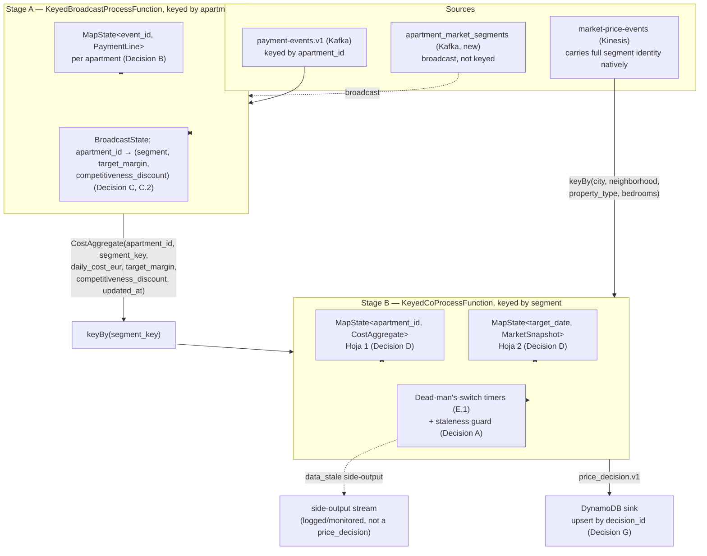

# Phase 4 — Flink Processing (Cost ⋈ Market → Pricing Decisions)

**Status:** Draft
**Depends on:** Phase 2 (`payment-events.v1`), Phase 3 (`market-price-events`, including the D.1/D.2 follow-ups already implemented — deterministic cyclic date coverage and seasonality), Phase 1's `apartment_market_segments` (Decision C.1, already implemented — see [`apartment_market_segments.sql`](../01-mock-app-db/apartment_market_segments.sql))
**Blocks:** Phase 5 (Iceberg persistence, populated via DynamoDB Streams CDC — [ADR-0006](../../../docs/adr/ADR-0006-dynamodb-single-writer-iceberg-cdc.md), not by this phase), Phase 6 (dashboard reads `price_decision.v1` from DynamoDB)
**Related:** [ADR-0002](../../../docs/adr/ADR-0002-pyflink-over-java-flink.md) (PyFlink), [ADR-0003](../../../docs/adr/ADR-0003-payment-line-cdc-contract.md) (upsert-by-`event_id`), [ADR-0005](../../../docs/adr/ADR-0005-market-price-partition-key.md) (market segment key), [ADR-0006](../../../docs/adr/ADR-0006-dynamodb-single-writer-iceberg-cdc.md), [ADR-0007](../../../docs/adr/ADR-0007-price-decision-cost-protected-rule.md), [`docs/phase-4-streaming-design-decisions.md`](../../../docs/phase-4-streaming-design-decisions.md) (pre-spec — decisions A–H, this document is their consolidation into one buildable spec), [`error-handling/anticipated-risks-flink-processing.md`](../../../error-handling/anticipated-risks-flink-processing.md)

---

## 1. Executive summary (plain language)

Phase 2 gave the engine what an apartment costs. Phase 3 gave it what similar apartments charge. Neither on its own is a price — a property manager needs one number per apartment, per future night: *"charge €X for this apartment on this date."* Phase 4 is where those two streams actually meet and become that number.

Concretely: for every apartment, keep a running, always-current total of its monthly operating cost (Phase 2's stream, upserted — never summed — per row, per ADR-0003). For every market segment (city/neighborhood/property type/bedrooms), keep a running, always-current price snapshot for every night in the next 60 days (Phase 3's stream). The moment either side changes — a new invoice lands, or the market moves for a given night — recompute and emit a fresh recommendation for every combination that change actually affects: a new invoice repriced every future night already known for that apartment; a new market snapshot repriced every apartment sharing that segment for that one night.

The recommendation itself follows one non-negotiable rule, confirmed explicitly during this phase's design conversation: **cost plus a minimum profit margin is a floor the engine itself never crosses.** Undercutting it is never something Flink decides — only the property owner can, by lowering their margin or delisting the apartment. Above that floor, the engine tries to stay competitively priced against the market. Which of those two forces actually won for a given decision is recorded explicitly (§8) — including a specific, actionable third case: when the floor is so high it exceeds even the raw market average, meaning the apartment's costs are pricing it out of its own market.

By the end of this phase we can prove: *"a cost update or a market update for a known apartment/segment produces a correct `price_decision.v1` in DynamoDB within seconds, survives a job restart without duplicating or losing state, and never recommends a price below the apartment's true cost floor."* This phase does **not** write to Iceberg (ADR-0006 — that's Phase 5, via CDC on DynamoDB Streams), does not touch seasonality (lives in Phase 3, D.2), and does not build a dashboard (Phase 6).

---

## 2. Scope

### In scope

- `streaming/flink-jobs/` — a single PyFlink DataStream API job (no Table API — see Decision D in the pre-spec doc for why), consuming `payment-events.v1` (Kafka), `market-price-events` (Kinesis), and `apartment_market_segments` (Postgres, via a new Debezium-captured topic — see §4), producing `price_decision.v1` to DynamoDB only.
- The two-stage architecture in §3: apartment-keyed cost aggregation + segment/margin enrichment (Stage A), then segment-keyed cost⋈market join with fan-out (Stage B).
- Processing-time semantics with the one-line replay-safety mitigation (§5).
- Explicit, bounded keyed state with a stated eviction rule for every `MapState` (§6) — a hard requirement, not implementation detail to figure out later.
- The freshness dead-man's-switch watchdog (§7) and its interaction with Flink's per-key timer model.
- The pricing formula, including the `cost_protected` rule from ADR-0007 (§8).
- Checkpointing: `EmbeddedRocksDBStateBackend` + S3 (LocalStack) checkpoint storage, `EXACTLY_ONCE`, 60s interval (§9).
- The single DynamoDB sink, idempotent by `decision_id` (§10).
- Wiring `apartment_market_segments` into the existing Debezium connector's `table.include.list` (§4) — this phase's implementation work, not Phase 1's (Phase 1 only built the table and its seed script).

### Out of scope (explicitly deferred)

- **Writing to Iceberg** — Phase 5 owns this, via a DynamoDB Streams CDC consumer, not a second Flink sink (ADR-0006).
- **Seasonality** — lives entirely in Phase 3's `market-ingestor` (D.2); this job reads `avg_nightly_rate_eur` as-is and is calendar-agnostic.
- **`apartment_market_segments` maintenance** (an apartment changing segment after the initial seed) — confirmed out of scope for this phase (C.1).
- **A client/owner hierarchy for `target_margin`/`competitiveness_discount`** — flat, per-apartment configuration only, default `0.05` (C.2); no default-with-override model.
- **Real occupancy/calendar/blocking data** — see §14's `available_days` limitation.
- **Dashboard, Metabase, Athena queries** (Phase 6).
- **A full-stack automated integration harness** (spin up Kafka + Kinesis + Flink + DynamoDB together) — matches Phases 2–3's precedent of manual, live verification for acceptance criteria. This does **not** mean untested — see §13 for the PyFlink-specific unit/component test strategy, which is a hard requirement of this spec, not an afterthought.

---

## 3. Architecture

The pre-spec's individual decisions (B: cost aggregation, C/C.2: segment+margin enrichment, D: the cost⋈market join) each assume a keyed input that doesn't exist yet at the point they're needed — cost events arrive keyed by `apartment_id` (Kafka), but Decision D's join is keyed by `segment`. Getting from one to the other is itself part of this spec, not implicit:



**Stage A (keyed by `apartment_id`)** combines Decision B (cost aggregation) and Decision C/C.2 (segment + margin enrichment) into one operator, because both need the same keyed-by-`apartment_id` state and the same broadcast side:

1. `processElement` (cost side, `payment-events.v1`): upsert the incoming `PaymentLine` into `MapState<event_id, PaymentLine>` by `event_id` (never sum — ADR-0003). Determine "the current billing period" as whichever `billing_period_end` is the latest among all entries currently in the map for this apartment (data-driven, not wall-clock-driven — see §6). Sum `amount_gross` for every entry sharing that `billing_period`, divide by `available_days` (§14) to get `daily_cost_eur`. Look up this apartment's `(segment, target_margin, competitiveness_discount)` from the broadcast state; if not yet present (broadcast hasn't delivered it yet — see §6's ordering note), buffer or skip this element rather than emit with a missing segment.
2. `processBroadcastElement` (`apartment_market_segments`): update `BroadcastState<apartment_id, (segment, target_margin, competitiveness_discount)>`.
3. Emits a `CostAggregate` record downstream whenever the cost side updates.

**Stage B (keyed by `segment`)**, a `.connect()` of Stage A's re-keyed output and the raw `market-price-events` stream (which already carries full segment identity — no enrichment needed on this side, unlike the cost side): implements Decision D's two-`MapState` cross-join exactly as pseudocoded in the pre-spec doc, plus Decision A's staleness guard and Decision E.1's timers (§7).

---

## 4. Data contract

| Contract | Transport | Direction | Notes |
|---|---|---|---|
| [`payment_line.v1.json`](../../events/payment_line.v1.json) | Kafka, `payment-events.v1` | in | Consumed per ADR-0003 — upsert by `event_id`, never sum. |
| `apartment_market_segments` rows | Kafka, new topic (this phase's implementation work — see below) | in (broadcast) | Schema: [`apartment_market_segments.sql`](../01-mock-app-db/apartment_market_segments.sql). |
| [`market_price.v1.json`](../../events/market_price.v1.json) | Kinesis, `market-price-events` | in | Consumed per its own idempotency model — a point-in-time snapshot, not an upsert-by-`event_id` row (Phase 3 spec §3); "current" is whichever event has the latest `collected_at` for a given `(market_area, property_profile, target_date)`. |
| [`price_decision.v1.json`](../../events/price_decision.v1.json) | DynamoDB only ([ADR-0006](../../../docs/adr/ADR-0006-dynamodb-single-writer-iceberg-cdc.md)) | out | Idempotent `put_item` by `decision_id` (Decision G). |

**Field rename to get right, not a mismatch bug:** `market_price.v1.pricing.avg_nightly_rate` becomes `price_decision.v1.market_inputs.avg_nightly_rate_eur` — the field name changes (adds `_eur`, drops the nesting under `pricing`) during Stage B's transform. Similarly `market_price.v1.market_context.{occupancy_rate,sample_size}` map to `price_decision.v1.market_inputs.{occupancy_rate,sample_size}`, and `market_area.city`/`market_area.neighborhood` collapse into the single string `market_inputs.market_area` (e.g. `"Barcelona/Eixample"`, matching the existing contract-test fixtures) — worth a code comment at the exact point this mapping happens, per this project's own established practice (Phase 3 spec §4, on the partition-key rationale needing to live as a comment, not just in a spec).

**Wiring `apartment_market_segments` into CDC (this phase's work, not Phase 1's):** Phase 1 built the table and its self-healing migration (idempotent DDL, reused `dbz_publication`); it did **not** wire it into `infra/debezium/postgres-connector.json`'s `table.include.list`, which today only lists `payment_lines`. This phase must add `public.apartment_market_segments` to that list and decide its topic name (likely `apartment-market-segments.v1`, via the same `RegexRouter` pattern Phase 2 already uses) and its Kafka record key (`apartment_id` — already the table's own primary key, so unlike Phase 2's `message.key.columns` fix, no override should be needed here; verify this rather than assume it, per this project's own hard-won Phase 2 lesson about connector defaults).

---

## 5. Time semantics & replay safety (Decision A)

**Processing-time**, confirmed — this job has no fixed-time windows to close, only reactive `MapState` upserts and `onTimer`-based watchdogs (§7), so `WatermarkStrategy` complexity buys nothing here. Full reasoning: pre-spec doc, Decision A.

**The one residual risk this creates, and its mitigation:** `MapState.put()` does not compare anything — it overwrites unconditionally. Under normal operation (Kafka/Kinesis preserve per-key ordering) this is safe. It stops being safe during a **manual reprocess** (replaying old offsets after a failure without a valid checkpoint, or a deliberate backfill) — an old event arriving *after* a newer one already in state would silently overwrite good data with stale data.

**Mitigation, applied in exactly two places — both `MapState.put()` calls in Stage B:**

```
# apartments_in_segment (Hoja 1)
existing = apartments_in_segment.get(cost_aggregate.apartment_id)
if existing is None or cost_aggregate.updated_at >= existing.updated_at:
    apartments_in_segment.put(cost_aggregate.apartment_id, cost_aggregate)
    # ... proceed to fan-out emission
else:
    # older data arriving late — discard, do not fan out
    return

# nights_in_segment (Hoja 2) — identical shape, keyed on collected_at instead
```

This is a one-line comparison per write, not a `WatermarkStrategy`. With checkpointing enabled (§9), "reprocess from offset 0" is no longer the normal recovery path — the job resumes from its last checkpoint — so the scenario this guards against is residual (manual backfill only), not part of normal operation.

---

## 6. State model & bounds

Every `MapState` in this job has an explicit size bound and eviction rule — required by this project's own pre-spec checklist ("Qué debe asegurar el spec de Flink, sin excepción"), not left implicit.

| State | Keyed by (operator) | Entry key | Expected size | Bound & eviction |
|---|---|---|---|---|
| `MapState<event_id, PaymentLine>` (Stage A) | `apartment_id` | `event_id` | Grows with an apartment's cost-line history | **Bounded by billing period, not globally**: at each write, evict entries whose `billing_period_end` is older than the *previous* billing period (i.e., keep only the current and immediately-prior period's lines — enough to handle a late-arriving correction to last month's invoice, no more). Without this, the map would grow forever across the demo's lifetime. |
| `BroadcastState<apartment_id, (segment, margin, discount)>` (Stage A) | *(broadcast, not keyed)* | `apartment_id` | ~100 (README's target apartment count) | No eviction needed — one entry per apartment, replaced in place on update. Bounded by the apartment catalog's own size, which this phase doesn't grow (C.1, out of scope). |
| `MapState<apartment_id, CostAggregate>` "Hoja 1" (Stage B) | `segment` | `apartment_id` | ~5–6 per segment (100 apartments ÷ 18 segments) | Defensive hard cap: **500 entries per segment key**, logged as a `WARNING` and the oldest-`updated_at` entry evicted if ever exceeded — this indicates a data problem (e.g. a mis-keyed event flooding one segment), not a scale the real apartment catalog should ever reach. |
| `MapState<target_date, MarketSnapshot>` "Hoja 2" (Stage B) | `segment` | `target_date` | ≤ `forecast_days` (60, per Phase 3's `MARKET_INGESTOR_FORECAST_DAYS`) | **Evict on every market event received**: scan for entries whose `target_date < today` and remove them (cheap — the map is bounded to ~60 entries already). Necessary and not automatic — Decision D's own guard (`if target_date < today: return`) only stops *adding* past dates, it does not remove entries that *age into the past* as `today` advances. Without this, a night's entry would sit in state forever after it occurs. |
| Timer deadline maps (§7) | `segment` | `apartment_id` / `target_date` | Same as their corresponding Hoja map | Removed in the same pass as their corresponding Hoja entry's eviction above — a timer deadline entry must never outlive the data entry it watches (this is exactly the "orphaned timer" leak named as Risk 3 in `error-handling/anticipated-risks-flink-processing.md`). |

**Ordering dependency worth being explicit about:** Stage A's broadcast state (`apartment_market_segments`) must have delivered an apartment's segment assignment before that apartment's first cost event can be usefully enriched. Since the seed script (C.1) populates this table once, before the mock apps' continuous generators produce meaningful volume, this is expected to resolve within the job's first few seconds in practice — but the implementation must not crash on a cost event with no broadcast entry yet; it should log and skip (buffering for later reconciliation is explicitly not built here — this is an accepted, narrow startup race, not a case worth a queueing mechanism for a PoC).

---

## 7. Freshness watchdog (Decision E.1) — and a Flink timer subtlety worth getting right

The dead-man's-switch pattern (silence, not an event, is the signal) is confirmed: every update to a Hoja 1 or Hoja 2 entry resets a 48h processing-time timer for that entry; if the timer fires, nothing touched that entry in 48h, so a `data_stale` side-output fires.

**The subtlety:** Stage B's operator is keyed by `segment`, not by `apartment_id` or `target_date`. Flink's timer service associates a registered timer with the *operator's* current key (segment) — there is no built-in "one timer per sub-key within my `MapState`." Naively registering a timer per apartment/date would not do what the pre-spec doc's pseudocode implies.

**Resolved with a deadline-map + scan-on-fire pattern**, avoiding the need to ever explicitly cancel a timer (which has its own collision risk if two sub-keys' deadlines ever land on the exact same millisecond):

```
# Two more MapStates in Stage B, alongside Hoja 1 / Hoja 2:
apartment_deadlines: MapState<apartment_id, timestamp>   # mirrors Hoja 1's keys
date_deadlines:      MapState<target_date, timestamp>    # mirrors Hoja 2's keys

# On every Hoja 1 / Hoja 2 write (after the staleness guard in §5 passes):
new_deadline = now + 48h
apartment_deadlines.put(apartment_id, new_deadline)      # overwrites any prior deadline
ctx.timerService().registerProcessingTimeTimer(new_deadline)   # old timer is simply never cancelled

# onTimer(fired_timestamp, ctx):
for apartment_id, deadline in apartment_deadlines.entries():
    if deadline == fired_timestamp:              # exact match = genuinely expired,
        emit_side_output(data_stale, segment, apartment_id)   # nothing superseded it
    # deadline != fired_timestamp means a newer update already moved the goalposts —
    # this firing is stale and is silently ignored, not an error
# same pattern for date_deadlines
```

This accepts a harmless number of "firing for nothing" timer callbacks (cheap — an `O(map size)` scan, and the map is already bounded per §6) in exchange for never needing exact timer cancellation, which would otherwise require reasoning about whether another sub-key coincidentally shares the exact deadline being cancelled.

Each `price_decision.v1` also carries `data_age_seconds` (ADR-0007) computed inline at emission time (`decided_at - market_inputs.collected_at`, in seconds) — free, and gives any downstream consumer a freshness signal without depending on the side-output stream at all.

---

## 8. Pricing formula (ADR-0007's three-way rule)

Computed at every fan-out emission in Stage B (§3):

```
minimum_price_eur         = daily_cost_eur * (1 + target_margin)
market_reference_price_eur = avg_nightly_rate_eur * (1 - competitiveness_discount)

if minimum_price_eur <= market_reference_price_eur:
    rule_applied = "market_competitive"
    suggested_price_eur = market_reference_price_eur
elif minimum_price_eur <= avg_nightly_rate_eur:
    rule_applied = "minimum_floor"
    suggested_price_eur = minimum_price_eur
else:
    rule_applied = "cost_protected"
    suggested_price_eur = minimum_price_eur

below_market_by = avg_nightly_rate_eur - suggested_price_eur   # always computed, can be negative
effective_margin = (suggested_price_eur / daily_cost_eur) - 1
```

### Worked example — one segment, two apartments, two nights

Segment: Barcelona/Eixample/studio. `target_margin = 0.05`, `competitiveness_discount = 0.05` for both apartments (the confirmed defaults, C.2).

Starting state — Hoja 1 has `apt-A` (`daily_cost_eur = 100.0`) and `apt-B` (`daily_cost_eur = 140.0`); Hoja 2 has `2026-08-10` (`avg_nightly_rate_eur = 90.0`) and `2026-08-20` (`avg_nightly_rate_eur = 150.0`).

A market update arrives for `2026-08-10` unchanged in value (`avg_nightly_rate_eur = 90.0`) — this fans out across **both** apartments for that one night:

| Apartment | `minimum_price_eur` | `market_reference_price_eur` (90 × 0.95) | Comparison | `rule_applied` | `suggested_price_eur` | `below_market_by` |
|---|---|---|---|---|---|---|
| apt-A (cost 100) | 105.0 | 85.5 | 105.0 > 90.0 | **`cost_protected`** | 105.0 | **−15.0** |
| apt-B (cost 140) | 147.0 | 85.5 | 147.0 > 90.0 | **`cost_protected`** | 147.0 | **−57.0** |

A cost update then arrives for `apt-A` (a new invoice raises its `daily_cost_eur` to `140.0`) — this fans out across **both** known nights for that one apartment:

| Night | `avg_nightly_rate_eur` | `minimum_price_eur` (140 × 1.05) | `market_reference_price_eur` | Comparison | `rule_applied` | `suggested_price_eur` | `below_market_by` |
|---|---|---|---|---|---|---|---|
| 2026-08-10 | 90.0 | 147.0 | 85.5 | `147.0 > 90.0` | **`cost_protected`** | 147.0 | −57.0 |
| 2026-08-20 | 150.0 | 147.0 | 142.5 | `142.5 < 147.0 <= 150.0` | **`minimum_floor`** | 147.0 | 3.0 |

The second row is the illustrative case for `minimum_floor` (matches `specs/contracts/fixtures/price_decision/valid_minimum_floor.json` exactly). For `market_competitive`: if instead `daily_cost_eur = 80.0` for `apt-A` against the `2026-08-20` night, `minimum_price_eur = 84.0 <= market_reference_price_eur (142.5)` → `rule_applied = "market_competitive"`, `suggested_price_eur = 142.5`, `below_market_by = 150.0 - 142.5 = 7.5`.

These three branches are exactly the three fixtures in `specs/contracts/fixtures/price_decision/` (`valid_market_competitive.json`, `valid_minimum_floor.json`, `valid_cost_protected.json`) — same formula, different numbers.

---

## 9. Checkpointing (Decision F)

- **State backend:** `EmbeddedRocksDBStateBackend` — not required by this job's data volume (it would comfortably fit in heap memory), chosen because incremental, disk-based checkpoints are the real production pattern worth learning here, and the cost of doing so at this small scale is negligible.
- **Checkpoint storage:** S3 (LocalStack), matching the README's declared stack.
- **Mode:** `EXACTLY_ONCE`.
- **Interval:** 60s, aligned to `market-ingestor`'s own tick cadence.
- **What this actually buys:** on a job restart, all of Stage A's and Stage B's `MapState`/`BroadcastState`/timer state (§6, §7) is restored from the last checkpoint, and consumption resumes from the offsets recorded in that same checkpoint — not from each source's earliest available offset. This is what keeps §5's replay-safety mitigation a residual concern rather than the normal recovery path.

---

## 10. Sink (Decision G, ADR-0006)

**Single sink: DynamoDB.** No Iceberg sink from this job (ADR-0006) — Phase 5 populates Iceberg via CDC on this table's DynamoDB Streams.

- **Idempotency key:** `decision_id` (a fresh UUID per emission — every fan-out emission is a distinct decision, not an update to a previous one, since it's for a specific `(apartment_id, target_date)` combination recomputed from scratch each time).
- **Primary key design:** partition key `apartment_id`, sort key `target_date` — this is what makes "all decisions for one apartment" (Phase 6's dashboard need) a single partition-key query with no secondary index, and what makes a repeated `put_item` for the same `(apartment_id, target_date)` naturally idempotent at the table level regardless of `decision_id`'s own uniqueness (the fresher decision simply replaces the older one for that same night, which is the correct behavior — a night's price recommendation should reflect the latest known state, not accumulate history in the hot-path table; Iceberg, via Phase 5, is where the historical trace lives).
- **DynamoDB Streams:** must be enabled on this table at creation time — a prerequisite Phase 5 depends on (ADR-0006), not optional infrastructure to add later.
- **Failure handling:** DynamoDB throttling (`ProvisionedThroughputExceededException` or LocalStack's equivalent) is handled with bounded retry and exponential backoff, the same Kleppmann delivery-semantics framing Phase 3 already applied to Kinesis `put_records` — except simpler here: because every retry is a `put_item` keyed by the same `(apartment_id, target_date)`, at-least-once retry is safe with **no caveat**, unlike Phase 3's producer-side ambiguity about whole-call failures. A retry exhausting its budget is logged at `WARNING` (apartment, date, error code) and the tick continues — a single unhealthy write must not stall the whole job.

---

## 11. Configuration

| Setting | Value | Why |
|---|---|---|
| Job parallelism | `min(6, 4) = 4` for the two source operators' effective parallelism; Stage A can run at up to 6 (Kafka's partition count); Stage B is bounded by whichever source has fewer distinguishable keys feeding it in practice | Kafka (`payment-events.v1`) has 6 partitions, Kinesis (`market-price-events`) has 4 shards (Decision H) — parallelism above a source's own partition/shard count leaves subtasks idle for that source. The Kinesis-side shard imbalance already observed in Phase 3 (30/30/10/20) is inherited as-is; it is not something Flink's parallelism setting can correct (ADR-0005 already accepted this trade-off). |
| Freshness threshold | 48h (E.1) | Confirmed in the pre-spec doc; with Phase 3's D.1 cyclic coverage now live, every segment/date is refreshed at least hourly in steady state, so this threshold should only ever fire on a genuine incident (e.g. `market-ingestor` down), not in normal operation. |
| Hoja 1 per-segment cap | 500 entries (§6) | Defensive, not a real expected scale — see §6. |
| Checkpoint interval | 60s | Matches `market-ingestor`'s tick cadence (§9). |
| `apartment_market_segments` topic name | `apartment-market-segments.v1` (proposed; confirm against whatever the Debezium `RegexRouter` config actually produces once wired — §4) | Follows the same `<business-name>.v1` convention as `payment-events.v1`. |

---

## 12. Acceptance criteria

- **AC-01 — Cost aggregation is upsert, never a sum.** Given two `payment_line` events with the same `event_id` and different `amount_gross` (an UPDATE), when both are processed, then the apartment's `daily_cost_eur` reflects only the latest value for that `event_id`, not the sum of both.
- **AC-02 — Segment/margin enrichment resolves before fan-out.** Given `apartment_market_segments` has delivered an apartment's assignment, when a cost event for that apartment arrives, then the emitted `CostAggregate` carries the correct `segment`, `target_margin`, and `competitiveness_discount` — verified against the seed data's known assignments.
- **AC-03 — Cost-triggered fan-out.** Given a segment with N known nights in Hoja 2, when a cost update arrives for an apartment in that segment, then exactly N `price_decision.v1` events are emitted, one per known night, each with the apartment's *new* cost.
- **AC-04 — Market-triggered fan-out.** Given a segment with M known apartments in Hoja 1, when a market update arrives for one night in that segment, then exactly M `price_decision.v1` events are emitted, one per known apartment, each with that night's *new* market snapshot.
- **AC-05 — Pricing formula, all three branches.** Live-verified numeric cases for `market_competitive`, `minimum_floor`, and `cost_protected` (§8) each produce the exact `suggested_price_eur`/`below_market_by`/`rule_applied` the formula predicts — not just schema-valid, arithmetically correct.
- **AC-06 — Past dates are never added, and age out.** Given a market event with `target_date < today`, when processed, then it is dropped (Decision D's guard) and produces no Hoja 2 entry. Separately, given an existing Hoja 2 entry whose `target_date` has since passed, when the next market event for that segment is processed, then the aged-out entry (and its deadline entry, §6) is evicted.
- **AC-07 — Reprocessing does not resurrect stale data.** Given a checkpoint-free manual replay where an older cost or market event arrives after a newer one already in state, when processed, then the older event is discarded (§5) and no fan-out is emitted for it.
- **AC-08 — Checkpointed restart resumes correctly.** Given the job is checkpointing (F), when the TaskManager is killed and restarted, then Stage A/B state and timers are restored from the last checkpoint, consumption resumes from the checkpointed offsets (not from each source's earliest offset), and no cost is duplicated (AC-01 still holds post-restart).
- **AC-09 — Freshness watchdog fires only on genuine silence.** Given an entry in Hoja 1 or Hoja 2 with no update for 48h, when its deadline timer fires, then a `data_stale` side-output is emitted exactly once; given a *newer* update supersedes a scheduled deadline before it fires, when the old timer eventually fires, then it is silently ignored (§7) — no duplicate or spurious `data_stale`.
- **AC-10 — DynamoDB sink is idempotent and single.** Given a retried `put_item` for the same `(apartment_id, target_date)`, when applied twice, then the table converges to the latest write with no duplicate rows; and — a static/architectural check, not a runtime one — the job has no second sink writing to Iceberg (ADR-0006).
- **AC-11 — `apartment_market_segments` CDC actually flows.** Given the Debezium connector's `table.include.list` includes this table (§4), when a seed script row is inserted, then a corresponding message appears on its Kafka topic and validates structurally against the table's own column set — the Phase 4 equivalent of Phase 2's AC-01/AC-03, since this project has already been burned four times by assuming a "healthy" connector is actually delivering (see `error-handling/`).

---

## 13. Test strategy for the PyFlink job

PyFlink jobs are notoriously hard to unit-test — this project's standing instruction ("apply tests at all times") requires a concrete answer here, not silence.

- **Pure functions, tested with plain `pytest`, no Flink runtime involved:** the pricing formula (§8) and its three-way branch, the staleness-guard comparison (§5), the deadline-map scan-on-fire logic (§7), and the Hoja 1/2 eviction predicates (§6) are all extractable as plain Python functions operating on simple inputs/outputs — no `ProcessFunction` context needed to test their logic. This should be the majority of this job's test coverage, and the cheapest to write and run.
- **`ProcessFunction`/`KeyedBroadcastProcessFunction` behavior, tested via Flink's own test harnesses:** `pyflink.datastream.functions`' test utilities (`KeyedProcessFunction` can be exercised via a `TestHarness`-equivalent, or by calling the function's `process_element`/`on_timer` methods directly against a mocked `RuntimeContext`/`TimerService` and an in-memory state backend) — verifies the *wiring* (state reads/writes, timer registration) without needing a running Flink MiniCluster.
- **One MiniCluster-based smoke test**, not a full acceptance-criteria harness: a small, fast test that runs the actual job graph (Stage A + Stage B wired together) against an embedded Flink MiniCluster with in-memory/collection sources and a collecting sink, asserting the fan-out shape (AC-03/AC-04) end-to-end. This is the one test worth paying MiniCluster startup cost for — it catches wiring bugs (wrong `keyBy`, wrong `connect()` side) that pure-function tests structurally cannot.
- **Everything else (AC-08 checkpoint/restart, AC-11 live CDC flow) stays manual/live-verified**, matching Phases 2–3's precedent — a MiniCluster does not exercise real RocksDB-on-S3 checkpointing or a real Debezium connector, so simulating them would test the simulation, not the real failure modes those ACs care about.

---

## 14. Known limitations

- **`available_days` is a simplification, not a modeled reality.** `daily_cost_eur = total_monthly_cost_eur / available_days`, and `available_days` is computed as the plain calendar length of the current billing period (`billing_period_end - billing_period_start + 1`) — this project has **no occupancy/blocking/maintenance-calendar system** (no OTA sync, no manual block entry) anywhere in its pipeline, so "available" cannot mean anything more precise than "every day in the period." This was never resolved by any earlier phase and is being made explicit here rather than silently assumed. If a future phase adds real availability tracking, this formula is the one line that needs to change.
- **"Current billing period" is derived, not configured.** Defined as whichever `billing_period_end` is the latest among an apartment's currently-known cost lines (§3) — purely data-driven, with no dependency on wall-clock month boundaries beyond what the underlying data already encodes. Worth confirming this still matches property-manager intuition once real invoicing cadences are considered (e.g. an invoice arriving very late for a much older period should probably not silently become "current").
- **No automated integration harness spinning up the full stack** — matches Phases 2–3's precedent; see §13 for what *is* tested and how.
- **Stage A's broadcast-not-yet-arrived race** (§6) is accepted as a narrow startup condition, not solved with a buffering/reconciliation mechanism.

---

## 15. Follow-ups for later phases

- **Phase 5** owns Iceberg population via DynamoDB Streams CDC (ADR-0006) — including the shard-iteration/checkpoint-tracking design for that consumer, and verifying LocalStack's DynamoDB Streams support actually holds up.
- **Phase 5** should decide whether `dbz_publication`'s new `apartment_market_segments` capture (§4) is also a candidate for its own Iceberg dimension table (a slowly-changing-dimension pattern), independent of `price_decision.v1`'s own CDC path.
- **Phase 6** reads `price_decision.v1` from DynamoDB by `apartment_id` (partition key, §10) for a property's current recommendations, and from Iceberg/dbt (via Phase 5) for historical trend views.
- **A real availability/blocking calendar**, if ever added, changes §14's `available_days` computation — flagged now so it isn't rediscovered as a surprise.
