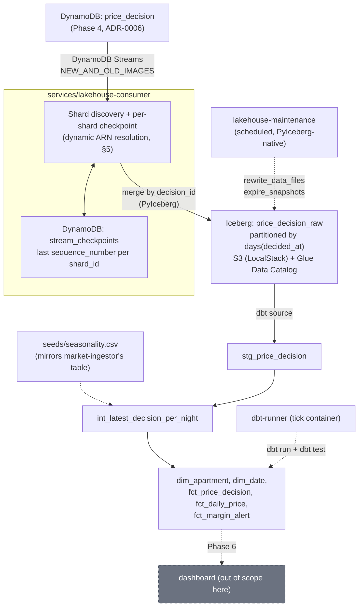

# Phase 5 — Persistence (DynamoDB Streams CDC → Iceberg → dbt)

**Status:** Draft
**Depends on:** Phase 4 (`price_decision.v1` written to DynamoDB with Streams enabled — [ADR-0006](../../../docs/adr/ADR-0006-dynamodb-single-writer-iceberg-cdc.md))
**Blocks:** Phase 6 (dashboard reads dbt marts / Iceberg directly)
**Related:** [ADR-0006](../../../docs/adr/ADR-0006-dynamodb-single-writer-iceberg-cdc.md) (single-writer DynamoDB, CDC-derived Iceberg), [`docs/phase-5-persistence-design-decisions.md`](../../../docs/phase-5-persistence-design-decisions.md) (pre-spec, decisions A–K, includes live verification of DynamoDB Streams on LocalStack)

---

## 1. Executive summary

Phase 4 writes `price_decision.v1` to DynamoDB only (ADR-0006) — a single, idempotent sink. Phase 5's job is everything downstream: read DynamoDB's own change log (DynamoDB Streams), land it in an Iceberg table without ever dual-writing, and transform that historical record into something a dashboard (Phase 6) can actually query.

Two independent pieces, deliberately kept separate:

1. **A CDC consumer** (`services/lakehouse-consumer`, Python, `boto3`) reads DynamoDB Streams and appends every captured change into `price_decision_raw`, an Iceberg table on S3, cataloged via AWS Glue Data Catalog.
2. **dbt** (`dbt-duckdb`) transforms that raw, append-only history into a small Kimball star schema — 2 dimensions, 3 facts — that Phase 6 reads directly.

**The non-negotiable rule, inherited from ADR-0006:** DynamoDB is the leader; Iceberg is derived. Nothing ever writes to Iceberg except this consumer, and the consumer only ever reads DynamoDB Streams — never DynamoDB itself. Same shape as Phase 2's Debezium pipeline, a different WAL.

**Done when:** a `price_decision` written to DynamoDB shows up in `price_decision_raw` within seconds, survives a consumer restart without duplicating or losing rows, and a `dbt run` turns that raw history into query-ready dimension/fact tables — verified live, not just unit-tested.

**Not in this phase:** the dashboard itself (Phase 6), real per-channel/per-stay-length pricing (deferred post-PoC, `docs/post-poc-roadmap.md`), a production-grade orchestrator (Phase 7 promotes the local tick container to CodeBuild + EventBridge — see §9).

---

## 2. Scope

### In scope

- `services/lakehouse-consumer/` — the DynamoDB Streams CDC consumer: dynamic stream/shard discovery, per-shard checkpointing, idempotent writes to Iceberg by `decision_id`.
- The Iceberg table itself: schema (mirrors `price_decision.v1`), partitioning (`days(decided_at)`), catalog (AWS Glue Data Catalog), storage location (a bucket dedicated to the lakehouse, separate from Flink's checkpoint bucket).
- Table maintenance: a separate scheduled process running PyIceberg's native `rewrite_data_files`/`expire_snapshots` — no Spark, no Glue Job.
- `transform/` (dbt project): staging → intermediate → marts, materializing `dim_apartment`, `dim_date`, `fct_price_decision`, `fct_daily_price`, `fct_margin_alert`.
- A local orchestration container (`dbt-runner`, same "tick" shape as `market-ingestor`) running `dbt run` + `dbt test` on an interval.
- Wiring `price_decision`'s `StreamSpecification` (already `NEW_AND_OLD_IMAGES` per Phase 4's own deployment commands) — this phase consumes it, doesn't need to re-enable it, but the consumer must resolve the stream ARN dynamically at every startup (§5 — a live LocalStack finding, not a defensive habit adopted for its own sake).

### Out of scope (explicitly deferred)

- **The dashboard** (Phase 6) — reads what this phase produces, builds nothing itself.
- **`dim_market_segment` and a `rule_applied`/`floor_type` junk dimension** — deliberately folded into `dim_apartment` and the facts respectively for this first version (pre-spec, Decision K). Noted as a future extension, not a silent gap.
- **Real multi-shard/expiry behavior of DynamoDB Streams** — LocalStack only ever exposes one static shard (verified live, pre-spec Decision F). The consumer is built correctly for the general case, but that generality is only unit-tested against synthetic shard trees, never live-verified locally. Real verification is a Phase 7 (AWS) concern.
- **AWS Glue Jobs (Spark) for compaction** — rejected for this PoC (pre-spec Decision D); noted as the production promotion path if PyIceberg-native maintenance ever falls short at scale.
- **CodeBuild/EventBridge for dbt orchestration** — same shape of deferral as Glue Jobs; the local tick container is what actually runs and gets verified this phase (§9).

---

## 3. Architecture



**Two independently-failing halves, on purpose:** the consumer's job stops at `price_decision_raw` — a faithful, append-only mirror of every DynamoDB change. dbt's job starts there and never touches DynamoDB or the Streams API at all. A dbt failure never blocks the consumer from keeping the raw history current, and a consumer outage never corrupts already-materialized marts — it just means the next `dbt run` sees stale source data (caught by dbt source freshness, §8).

---

## 4. Data contract

| Contract | Transport | Direction | Notes |
|---|---|---|---|
| [`price_decision.v1.json`](../../events/price_decision.v1.json) | DynamoDB Streams | in | Same contract Phase 4 writes — the consumer reads `NewImage`, structurally identical to the DynamoDB item. |
| `price_decision_raw` (Iceberg) | S3 (LocalStack) + Glue Data Catalog | out (consumer) / in (dbt) | Schema mirrors `price_decision.v1` field-for-field, flattened only where Iceberg's struct types don't already cover the JSON Schema's own nesting (they do — `cost_inputs`, `market_inputs`, `calculation`, `output` all become Iceberg `struct` columns, not flattened). |
| `stg_price_decision` → marts | dbt (DuckDB reading Iceberg) | internal | dbt's own layering (§8) — not a cross-service contract, no JSON Schema needed. |

**Iceberg table schema** (`price_decision_raw`, Glue database `pms_lakehouse`):

```
decision_id        string      (not null)
apartment_id        string      (not null)
apartment_reference  string
target_date          date
decided_at           timestamp  (not null)   -- partition source column
cost_inputs          struct<billing_period: struct<start: date, end: date>,
                             total_monthly_cost_eur: double,
                             available_days: int,
                             fixed_cost_eur: double,
                             variable_cost_eur: double,
                             one_time_cost_eur: double,
                             cost_lines_count: int>
market_inputs        struct<market_area: string,
                             avg_nightly_rate_eur: double,
                             occupancy_rate: double,
                             sample_size: int,
                             collected_at: timestamp,
                             data_age_seconds: int>
calculation          struct<target_margin: double,
                             minimum_price_eur: double,
                             floor_type: string,
                             commission_pct: double,
                             days_to_arrival: int,
                             competitiveness_discount: double,
                             market_reference_price_eur: double,
                             rule_applied: string>
output               struct<suggested_price_eur: double,
                             currency: string,
                             effective_margin: double,
                             below_market_by: double>
dynamodb_event_name   string      (not null)   -- "INSERT" | "MODIFY" | "REMOVE", from the stream record itself
ingested_at           timestamp  (not null)   -- when the consumer wrote this row, not when Flink decided it
```

Partitioned by `days(decided_at)` (pre-spec Decision B) — Iceberg's hidden partitioning, so neither the consumer nor dbt need to compute a partition value themselves.

---

## 5. The DynamoDB Streams consumer

**Resolve the stream ARN dynamically, every startup — never hardcode it.** Live-verified against LocalStack (pre-spec Decision F): a stream's ARN does not reliably survive a container restart even though the table's own item data does. The consumer's first action is always:

```
table = dynamodb.describe_table(TableName="price_decision")
stream_arn = table["Table"]["LatestStreamArn"]
# Then confirm it's actually registered — don't trust describe_table alone:
streams = dynamodbstreams.list_streams(TableName="price_decision")
assert stream_arn in [s["StreamArn"] for s in streams["Streams"]]
```

**Shard discovery and ordering — built for the general case, even though LocalStack only ever exercises the single-shard path (pre-spec Decision F):**

```
shards = dynamodbstreams.describe_stream(StreamArn=stream_arn)["Shards"]

for shard in shards:
    if shard.get("ParentShardId") and not is_fully_drained(shard["ParentShardId"]):
        continue  # must finish a parent before its children — real AWS ordering rule
    checkpoint = stream_checkpoints.get(shard["ShardId"])
    iterator_type = "AFTER_SEQUENCE_NUMBER" if checkpoint else "TRIM_HORIZON"
    read_shard(shard, iterator_type, checkpoint)
```

**Checkpointing:** a small DynamoDB table, `stream_checkpoints` (partition key `shard_id`), storing the last successfully processed `sequence_number`. Written *after* the Iceberg merge succeeds, not before — so a crash mid-batch re-reads (and re-merges) the same records rather than skipping them. Safe because of the next point:

**Idempotency — merge by `decision_id`, not append.** DynamoDB Streams is at-least-once (same Kleppmann framing already used for Kinesis in Phase 3 and the DynamoDB sink itself in Phase 4, ADR-0006's own closing note): a replayed record from a restarted shard read must not create a duplicate row. Every write to `price_decision_raw` is a PyIceberg `overwrite`/merge keyed by `decision_id`, mirroring the same idempotency key Phase 4's own DynamoDB `put_item` already uses.

---

## 6. Table maintenance (compaction)

A separate scheduled process, `lakehouse-maintenance` — not code inside the consumer (pre-spec Decision D: writing and maintaining are different responsibilities). On an interval (proposed: hourly, coarser than the consumer's own near-real-time writes since compaction is a batch-shaped operation):

```
table = catalog.load_table("pms_lakehouse.price_decision_raw")
table.rewrite_data_files()   # PyIceberg-native, no Spark
table.expire_snapshots(older_than=now() - timedelta(days=7))
```

No Glue Job — rejected for this PoC (pre-spec Decision D) because Glue Jobs aren't in LocalStack Community and would reintroduce a Spark/JVM dependency this project has consistently avoided (same reasoning Phase 4 already used to reject Table API in Flink).

---

## 7. dbt project layout

```
transform/
  seeds/
    seasonality.csv          # month → season_label → multiplier, MUST mirror
                              # services/market-ingestor/src/market_ingestor/seasonality.py
                              # exactly (AC-09) — same "kept in sync by hand, flagged in both
                              # places" pattern as apartment_market_segments.sql/migrations.py
  models/
    staging/
      stg_price_decision.sql       # 1:1 cleanup of the Iceberg source, no business logic
    intermediate/
      int_latest_decision_per_night.sql   # last known decision per (apartment, target_date, day)
    marts/
      dim_apartment.sql
      dim_date.sql
      fct_price_decision.sql
      fct_daily_price.sql
      fct_margin_alert.sql
  sources.yml                # declares price_decision_raw as a dbt source, with a
                              # freshness check (§8) against ingested_at
```

`seasonality.csv` content (mirrors `seasonality.py`'s `_HIGH_SEASON_MONTHS`/`_SHOULDER_SEASON_MONTHS` exactly):

| month | season_label | multiplier |
|---|---|---|
| 7, 8 | alta | 1.30 |
| 5, 6, 9, 10 | media | 1.05 |
| 11, 12, 1, 2, 3, 4 | baja | 0.85 |

---

## 8. Kimball model (pre-spec Decision K)

| Table | Grain | Kimball type | Source |
|---|---|---|---|
| `dim_apartment` | 1 row per apartment | Dimension (SCD1) | Latest `apartment_id`/`apartment_reference`/`city`/`neighborhood`/`property_type`/`bedrooms` seen in the raw history |
| `dim_date` | 1 row per calendar day | Conformed dimension | Calendar attributes + `seasonality.csv` join — day/month/quarter/year/day_of_week/is_weekend/season_label |
| `fct_price_decision` | 1 row per decision emitted | Transaction fact | Straight from `stg_price_decision` — same grain as the source, the audit trail `price_decision.v1` itself promises |
| `fct_daily_price` | 1 row per (apartment, target_date, day) | Periodic snapshot fact | From `int_latest_decision_per_night` — the "last known decision as of this day," what a price-evolution chart actually plots |
| `fct_margin_alert` | 1 row per decision where `rule_applied = 'cost_protected'` | Factless / accumulating fact | Filter on `fct_price_decision` — the README's own "margin alerts" model |

`dim_market_segment` and a `rule_applied`/`floor_type` junk dimension are explicitly out of scope for this version (§2) — `city`/`neighborhood`/`property_type`/`bedrooms` live directly on `dim_apartment`, `rule_applied`/`floor_type` live directly on the facts.

---

## 9. Orchestration

**Local/PoC: a tick container**, same shape as `market-ingestor` — a small Python loop calling `dbt run` then `dbt test` on an interval, inside `infra/docker-compose.yml`. No new infrastructure, actually runs and gets verified against the real local stack.

**Not built this phase, explicitly noted as the production path (pre-spec Decision J):** AWS CodeBuild triggered by EventBridge Scheduler. Rejected for now because CodeBuild's native trigger is a code change, not a cron, and because it's a real AWS service not meaningfully testable against LocalStack Community — same category of deferral as Glue Jobs (§6). Revisit in Phase 7 alongside the real AWS demo deployment.

---

## 10. Configuration

| Setting | Value | Why |
|---|---|---|
| Iceberg catalog | AWS Glue Data Catalog (`pms_lakehouse` database), via LocalStack locally | Same service used in real AWS — promotion to Phase 7 is a credentials/endpoint change, not a rewrite (pre-spec Decision C) |
| Iceberg warehouse bucket | `pms-lakehouse` (new, separate from Flink's `pms-iceberg` checkpoint bucket) | Different lifecycles — checkpoints are disposable, the lakehouse is the permanent record (pre-spec Decision E) |
| Partitioning | `days(decided_at)` | Matches the actual query axis (time), low cardinality, leaves room to add `city` later via partition evolution without rewriting (pre-spec Decision B) |
| Consumer checkpoint table | DynamoDB, `stream_checkpoints`, PK `shard_id` | Same shape as a Kafka consumer group's offsets, hand-rolled because no mature Python KCL exists for DynamoDB Streams |
| Compaction interval | Hourly | Batch-shaped maintenance, coarser than the consumer's near-real-time writes |
| dbt run interval | Same cadence family as `market-ingestor`'s tick (proposed: every 5 minutes) | Frequent enough to keep marts fresh without running dbt on every single Iceberg write |
| dbt engine | `dbt-duckdb` | Embedded OLAP engine, native Iceberg read support, zero extra infrastructure (pre-spec Decision H) |

---

## 11. Acceptance criteria

- **AC-01 — A DynamoDB change lands in `price_decision_raw`.** Inserting a `price_decision` item produces a matching row (all fields, including nested structs) within seconds.
- **AC-02 — Idempotent merge by `decision_id`.** A replayed stream record for the same `decision_id` (simulating at-least-once delivery) does not create a duplicate row in `price_decision_raw`.
- **AC-03 — Stream ARN resolved dynamically, not hardcoded.** Restarting the consumer against a table whose stream was re-created (a new ARN) still works — verified against the exact live failure mode found in the pre-spec (Decision F).
- **AC-04 — Checkpointed restart doesn't duplicate or lose records.** Killing the consumer mid-batch and restarting it resumes from the last committed checkpoint — same rigor as Phase 4's AC-08.
- **AC-05 — Schema evolution without rewriting history.** Adding a column to `price_decision_raw`'s schema doesn't require touching already-written data files; old rows read back with the new column null.
- **AC-06 — Compaction reduces file count, not row count.** Before/after `rewrite_data_files()`: same row count and content, fewer distinct data files.
- **AC-07 — `dbt run` + `dbt test` succeed end-to-end.** All five marts build; dbt's own referential/not-null tests pass (every `apartment_id` in the facts exists in `dim_apartment`, every date in `dim_date`).
- **AC-08 — `seasonality.csv` matches `seasonality.py` exactly.** A cross-check test comparing the seed's month→multiplier mapping against the live Python module's constants — same contract-test spirit as `specs/contracts/`, just checking two hand-kept-in-sync copies instead of a hand-kept-in-sync SQL/Python DDL pair.
- **AC-09 — `fct_margin_alert` contains only `cost_protected` rows.** No row where the underlying decision's `rule_applied` was anything else.
- **AC-10 — dbt source freshness fires on a stale raw table.** Stopping the consumer long enough for `price_decision_raw` to go stale makes `dbt source freshness` report it, mirroring Flink's `data_stale` watchdog concept in the transformation layer.

---

## 12. Test strategy

Same pyramid Phase 4 established (spec §13):

- **Pure functions, no infrastructure:** stream record parsing, checkpoint/shard-ordering logic (including the parent-before-child rule) — tested against synthetic shard trees, since LocalStack only ever gives one shard (§2, known limitation).
- **Component tests, against a local/temporary Iceberg catalog:** the `decision_id` merge doesn't duplicate; a schema-evolution test that adds a column and confirms old rows still read (AC-05, the actual feature that justified choosing Iceberg over Parquet in the pre-spec).
- **dbt's own test framework:** not-null/relationship tests on the marts (AC-07), plus the `seasonality.csv` cross-check (AC-08) as a `dbt test` or a small pytest reading both files directly.
- **Manual/live verification, matching Phases 2–4's precedent:** the consumer against a real LocalStack DynamoDB Streams + Glue Data Catalog + S3, and `dbt run` against the real DuckDB+Iceberg wiring — a MiniCluster-style automated integration test doesn't exist for this stack the way it did for Flink, and simulating one would test the simulation, not the real failure modes.

---

## 13. Known limitations

- **LocalStack never exercises multi-shard DynamoDB Streams behavior** (§2, pre-spec Decision F) — the consumer's shard-splitting/parent-child logic is unit-tested against synthetic data only; real verification is a Phase 7 (AWS) concern.
- **DynamoDB Streams retains 24h of data** (ADR-0006's own closing note) — a consumer outage longer than that permanently loses those changes from the stream. Not solved here; a candidate for its own `error-handling/` write-up if actually observed.
- **`dim_market_segment` and a `rule_applied`/`floor_type` junk dimension are folded into other tables for now** (§2, §8) — a deliberate scope cut, not an oversight, revisited if a future consumer of the marts needs them as first-class conformed dimensions.
- **No production-grade orchestrator** — the local tick container is a PoC stand-in for CodeBuild + EventBridge Scheduler (§9), which is Phase 7's job to actually stand up.

---

## 14. Follow-ups for later phases

- **Phase 6** reads `fct_daily_price` (current/near-term pricing) and `fct_margin_alert` directly for the dashboard; `fct_price_decision` is available for any "why was this price set" drill-down view.
- **Phase 7** promotes: the dbt tick container → CodeBuild + EventBridge Scheduler; LocalStack's Glue Data Catalog/S3 → real AWS Glue + S3; and is the first real chance to verify the consumer's multi-shard logic against DynamoDB Streams' actual shard-splitting behavior.
- **Post-PoC roadmap** (`docs/post-poc-roadmap.md`): once real per-stay-length and per-channel pricing land in `price_decision.v1`, this phase's raw table and marts inherit those fields for free (schema evolution, §5/AC-05) — no redesign needed, just new columns.
