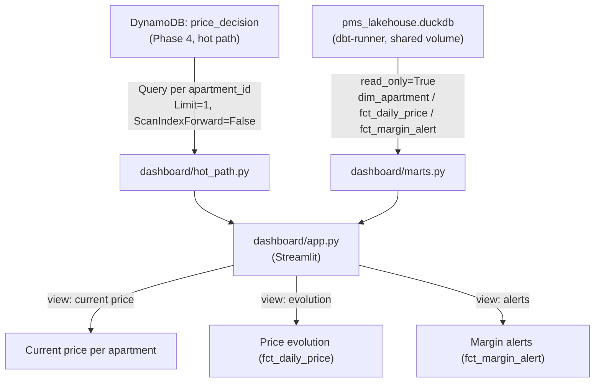

# Phase 6 — Dashboard (Streamlit reading DynamoDB + dbt marts)

**Status:** Draft
**Depends on:** Phase 4 (`price_decision` in DynamoDB, hot path — [ADR-0006](../../../docs/adr/ADR-0006-dynamodb-single-writer-iceberg-cdc.md)), Phase 5 (`dim_apartment`/`fct_daily_price`/`fct_margin_alert` materialized by dbt, cold path)
**Blocks:** Phase 7 (demo & docs) — the dashboard is what gets demoed
**Related:** [`docs/phase-6-dashboard-design-decisions.md`](../../../docs/phase-6-dashboard-design-decisions.md) (pre-spec, decisions A–H, 5-advisor panel on A/B/C)

---

## 1. Executive summary

Phases 4–5 already produced every piece of data this phase needs: DynamoDB (`price_decision`, hot path, real-time) and dbt-materialized marts in a shared DuckDB file (`fct_daily_price`, `fct_margin_alert`, `dim_apartment`, cold path, up to 15 min stale). Phase 6 builds nothing new upstream — it's a read-only Streamlit app (`dashboard/`, already scaffolded as an empty package since Phase 0) that queries both paths and renders three views: current price per apartment, price evolution, and margin alerts.

**The non-negotiable rule, inherited from the pre-spec:** the dashboard never writes to DynamoDB or Iceberg, and never re-derives business logic (pricing formula, margin rules) that Flink/dbt already computed — it renders what those layers already produced. Same "read-only consumer" shape Phase 5's dbt project has toward DynamoDB.

**Done when:** a property manager can open the dashboard and see, for any known apartment, its current suggested price (hot path), how that price evolved over the last N nights (cold path), and which decisions were flagged `cost_protected` (cold path) — verified live against the real running stack, not just unit-tested.

**Not in this phase:** any new business logic, authentication (§9), a production deployment (Phase 7's job), the `fct_price_decision` drill-down view (optional stretch, §5).

---

## 2. Scope

### In scope

- `dashboard/src/dashboard/hot_path.py` — DynamoDB access: one `Query` per known `apartment_id` (from `dim_apartment`), `Limit=1`, descending, never a table `Scan`.
- `dashboard/src/dashboard/marts.py` — cold path access: read-only connection to the shared DuckDB file dbt-runner materializes, one function per mart consumed (`dim_apartment`, `fct_daily_price`, `fct_margin_alert`).
- `dashboard/src/dashboard/app.py` — the Streamlit entrypoint: three views (current price, price evolution, margin alerts), each showing a freshness timestamp for cold-path data.
- Wiring `dashboard` as a new `infra/docker-compose.yml` service (Streamlit on `8501`, already reserved in the README since Phase 0), mounting `dbt_warehouse` read-only, with DynamoDB env vars matching every other service in this stack.
- **Live verification of DuckDB concurrent read-while-write** (pre-spec Decision C) — the one open question carried into this spec as AC-05, not assumed.

### Out of scope (explicitly deferred)

- **Authentication / access control** — local-only (`localhost`), no login. A real deployment (Phase 7, outside `localhost`) needs this first (§9).
- **A GSI on `target_date`** — the N-`Query` pattern (§5) is correct DynamoDB practice at this PoC's apartment count; a GSI is the scale-up path if that count grows, not built now (pre-spec Decision B).
- **`fct_price_decision` drill-down ("why was this price set")** — the data already exists (Phase 5), rendering it is a stretch goal if time allows, not a blocking view.
- **Any new pricing/margin logic** — the dashboard renders `rule_applied`/`effective_margin`/etc. verbatim from the marts; it never recomputes them.
- **A production orchestrator or CDN/hosting for Streamlit** — Phase 7's concern, same deferral shape as Phase 5's CodeBuild/EventBridge.

---

## 3. Architecture



**Two independent read paths, never merged upstream:** `hot_path.py` never touches the DuckDB file; `marts.py` never touches DynamoDB. `app.py` is the only place that combines both, and only for rendering — no join logic lives in the dashboard. This mirrors Phase 5's own "two independently-failing halves" principle: a DynamoDB outage degrades only the current-price view; a stale dbt run degrades only the history/alerts views (each shows its own freshness timestamp, §7).

---

## 4. Data contract

No new contract is published by this phase — the dashboard is a pure consumer of contracts Phases 4–5 already own.

| Contract | Transport | Direction | Notes |
|---|---|---|---|
| [`price_decision.v1.json`](../../events/price_decision.v1.json) | DynamoDB (`price_decision` table) | in | Read via `Query`, never `Scan` (§5). `apartment_id`/`target_date` are the table's key schema (Phase 4 §10). |
| `dim_apartment`, `fct_daily_price`, `fct_margin_alert` (dbt marts) | DuckDB file (shared volume `dbt_warehouse`) | in | Physical tables, not views (`transform/dbt_project.yml`: `marts: +materialized: table`) — the dashboard never triggers an Iceberg/S3 read itself, only dbt does. |

---

## 5. Hot path access (`hot_path.py`)

**Never a table `Scan`.** The list of `apartment_id`s to query comes from the cold path's `dim_apartment` (already the catalog of known entities, per the pre-spec's Decision B), not from DynamoDB itself:

```python
apartment_ids = marts.list_apartment_ids()  # from dim_apartment

for apartment_id in apartment_ids:
    response = table.query(
        KeyConditionExpression=Key("apartment_id").eq(apartment_id),
        ScanIndexForward=False,  # most recent target_date first
        Limit=1,
    )
```

**Not "today's price," the most recently decided one.** Stage B's fan-out (Phase 4) doesn't guarantee a decision exists for every calendar night for every apartment — querying by the highest `target_date` with a decision, rather than assuming `target_date == today` has one, avoids showing "no data" for apartments that do have a valid recent price. Documented as a deliberate interpretation, not a gap (§10).

**Deferred, not built:** a GSI on `target_date` would collapse this to one `Query` instead of N. Not needed at this PoC's apartment count (§2) — revisit if `dim_apartment` ever lists more than a few hundred rows.

---

## 6. Cold path access (`marts.py`)

**Read-only connection, opened per query, never held open across Streamlit reruns:**

```python
con = duckdb.connect(DUCKDB_PATH, read_only=True)
```

Streamlit re-executes the whole script on every interaction — a fresh short-lived connection per query avoids holding a stale handle across a `dbt-runner` write cycle (15 min interval, Phase 5 §10). `st.cache_data(ttl=...)` wraps each read function so repeated reruns within the same interaction don't re-open the file needlessly, with a TTL shorter than the dbt run interval so the UI never shows data staler than dbt's own freshness guarantee.

**Concurrency with `dbt-runner`'s writes is the one thing this spec does not assume — see AC-05.** If live verification (§11) finds a lock conflict during an active `dbt run`, the fallback (pre-spec Decision C) is: retry the read with a short backoff (a `dbt run` commit is seconds, not minutes, so a couple of retries is enough), and only if that's insufficient, have `dbt-runner` write to a temp file and `mv` it into place atomically on completion. The retry is implemented regardless of what live verification finds — cheap insurance, matching Kleppmann's at-least-once framing already used for every other consumer in this project (retry-then-give-up, never silently show wrong data).

---

## 7. Views

| View | Source | Path | Freshness shown |
|---|---|---|---|
| Current price per apartment | `hot_path.py` (§5) | Hot | None needed — DynamoDB read is live |
| Price evolution (per apartment, selectable) | `fct_daily_price` | Cold | `max(ingested_at)` from the mart, not a wall clock |
| Margin alerts (`cost_protected` only) | `fct_margin_alert` | Cold | Same as above |

**Confirmed (pre-spec §D):** these three are the phase's minimum scope. `fct_price_decision` (full decision detail, "why this price") is a stretch goal — if built, it reads the same way as the other cold-path views, no new access pattern.

---

## 8. Configuration

| Setting | Value | Why |
|---|---|---|
| Streamlit port | `8501` | Already reserved in the README's service table since Phase 0 |
| `DUCKDB_PATH` | `/data/dbt/pms_lakehouse.duckdb` (read-only mount of `dbt_warehouse`) | Same volume `dbt-runner` already writes to (Phase 5 `infra/docker-compose.yml`) |
| Cold-path cache TTL | 5 minutes | Shorter than dbt's 15-minute run interval (Phase 5 §10) — bounds staleness without re-reading the file on every Streamlit rerun |
| DynamoDB table | `price_decision` | Same table Phase 4 writes, read-only from this service |
| AWS/LocalStack env vars | Same pattern as every other service (`AWS_ACCESS_KEY_ID=test`, `AWS_REGION=eu-west-1`, endpoint override for LocalStack) | Consistency with the rest of the stack, no new credential shape |

### 8.1 IAM permissions (design intent — not enforced by LocalStack today)

Same convention Phase 5 §10.1 established — least privilege, written now so Phase 7's real AWS promotion has a spec to implement against:

| Service | Needs | On |
|---|---|---|
| `dashboard` | `dynamodb:Query` only (never `Scan`, never any write action) | `price_decision` table |
| `dashboard` | Read-only filesystem mount, no AWS permission at all for the cold path | `dbt_warehouse` volume (not an S3/Glue permission — the dashboard never touches Iceberg/Glue directly, only the materialized DuckDB file) |

---

## 9. Security note

No authentication in this phase — local-only (`localhost:8501`), consistent with every other service in this Docker Compose stack. **Explicit known limitation, not an oversight:** a deployment reachable outside `localhost` (Phase 7's real AWS demo) needs auth in front of it (e.g. a login proxy or Cognito) before that happens — noted here so Phase 7 doesn't improvise it at deploy time, same pattern as Phase 5's IAM section.

---

## 10. Acceptance criteria

- **AC-01 — Current price renders per known apartment.** For every `apartment_id` in `dim_apartment`, the current-price view shows its most recent decision's `suggested_price_eur` (or an explicit "no decision yet" state, not a crash) — verified against the real running stack.
- **AC-02 — Hot path never issues a `Scan`.** Verified by asserting on the actual `boto3` call arguments in a component test — only `Query` calls with a `KeyConditionExpression` on `apartment_id` reach DynamoDB.
- **AC-03 — Price evolution view matches `fct_daily_price`.** Selecting an apartment renders exactly the rows that mart has for it, in `target_date` order.
- **AC-04 — Margin alerts view contains only `cost_protected` rows.** No row where the underlying decision's `rule_applied` differs — same invariant Phase 5's AC-09 already proved at the mart level; this AC confirms the UI doesn't leak a different filter.
- **AC-05 — Concurrent read while `dbt-runner` writes doesn't crash the dashboard.** Live-verified: trigger a real `dbt run` and read the marts from the dashboard at the same time. If a lock conflict is observed, the retry-with-backoff (§6) resolves it without a visible error to the user.
- **AC-06 — Freshness timestamp is real, not a wall clock.** The displayed "last updated" for each cold-path view equals `max(ingested_at)` from the underlying mart, confirmed by comparing against the raw table directly.
- **AC-07 — Restarting the dashboard container loses nothing.** The service is stateless (no local state beyond Streamlit's own cache) — a restart immediately serves correct data again, no re-seeding needed.

---

## 11. Test strategy

Same pyramid every prior phase in this project has used (Phase 4 §13, Phase 5 §12):

- **Pure functions, no infrastructure:** row formatting/aggregation helpers, `Query` parameter construction (assert the call shape, not a live result) — AC-02's core check lives here.
- **Component tests:** `hot_path.py` against a LocalStack DynamoDB table seeded with synthetic decisions; `marts.py` against a fixture DuckDB file with known rows — confirms each module reads the right columns without needing the full stack up.
- **Manual/live verification, matching this project's precedent:** the dashboard against the real running stack (LocalStack DynamoDB + the real `dbt-runner`-produced DuckDB file) — AC-01, AC-05, AC-06 specifically need the real timing/concurrency behavior, not a simulation of it.

---

## 12. Known limitations

- **No GSI on `target_date`** (§2, §5, pre-spec Decision B) — the hot path issues one `Query` per apartment. Fine at this PoC's apartment count; revisit if `dim_apartment` ever grows into the hundreds.
- **No authentication** (§9) — `localhost`-only by design for this phase; a real deployment needs this resolved first.
- **`fct_price_decision` drill-down not built** (§7) — the data exists from Phase 5, rendering it is a stretch goal, not guaranteed by this spec.
- **DuckDB concurrent-read behavior confirmed only against this project's specific `dbt-duckdb`/`duckdb` versions and LocalStack setup** (§6, AC-05) — not a general claim about DuckDB's locking model across versions.
- **"Most recent decision," not "today's decision"** (§5) — if Stage B's fan-out (Phase 4) hasn't produced a decision for the actual current night for some apartment, the dashboard shows the latest one that does exist rather than a gap. Consistent with how the rest of this project treats incomplete fan-out (Phase 4's own known cost-side fan-out gap, `error-handling/stage-b-cost-side-fanout-can-emit-for-already-past-nights.md`), not silently hidden.

---

## 13. Follow-ups for later phases

- **Phase 7** promotes: `localhost`-only access → real auth in front of a real deployment; and is the natural point to revisit a `target_date` GSI if the real AWS demo's apartment count is large enough to matter.
- **Post-PoC roadmap** (`docs/post-poc-roadmap.md`): once real per-stay-length/per-channel pricing land, the evolution and drill-down views inherit those fields for free from the marts (Phase 5's own schema-evolution story) — no dashboard redesign needed, just new columns rendered.
