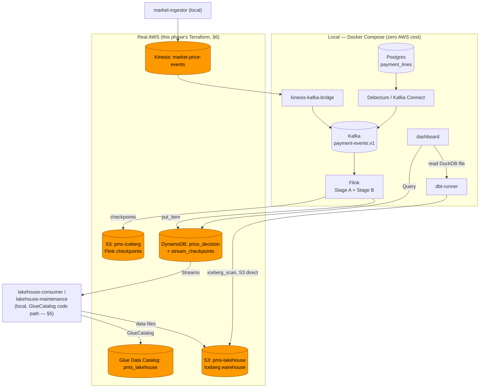

# Phase 7 — Demo & docs (real AWS deployment + project close-out)

**Status:** Draft
**Depends on:** Phases 1–6 (everything this project has built, locally verified)
**Blocks:** Nothing — this is the last phase
**Related:** [`docs/phase-7-demo-docs-design-decisions.md`](../../../docs/phase-7-demo-docs-design-decisions.md) (pre-spec, decisions A–I), [ADR-0006](../../../docs/adr/ADR-0006-dynamodb-single-writer-iceberg-cdc.md), [`docs/phase-5-persistence-design-decisions.md`](../../../docs/phase-5-persistence-design-decisions.md) §C (Glue deferred to this phase), [`docs/phase-6-dashboard-design-decisions.md`](../../../docs/phase-6-dashboard-design-decisions.md) §H (IAM deferred to this phase)

---

## 1. Executive summary

Every prior phase built and verified against LocalStack — a deliberate choice (README's own cost guardrails) to keep development free until the very end. Phase 7 does two things, kept as separate tracks with different risk profiles:

1. **Documentation close-out** (zero cost, zero AWS): a final ADR, one new architecture diagram, and a lessons-learned writeup that distills the project rather than repeating `AUDIT_DIARY.md`/`error-handling/`.
2. **A real AWS demo deployment**, scoped to the smallest footprint that makes the demo real: S3, Kinesis, DynamoDB, and Glue Data Catalog provisioned via Terraform. Kafka, Kafka Connect (Debezium), Flink, and Postgres keep running locally via Docker Compose, reconfigured to point at the real AWS resources instead of LocalStack.

**Confirmed with the user before any code:** documentation track first (§9, §10, §11), the AWS deployment (§8) last, executed only once — `terraform apply`, demo, `terraform destroy` — never left running.

**The non-negotiable rule:** AWS Budget alerts at $5 and $10 must already exist on the target account before `terraform apply` runs (confirmed in place for this session). `terraform destroy` happens immediately after the demo, not "later" — the same discipline this project already applies to disposable local state (Kafka offsets, LocalStack volumes), now with real money attached.

**Done when:** the documentation track is complete and reviewable without touching AWS; separately, when the AWS track actually runs, the demo works end-to-end against real S3/Kinesis/DynamoDB/Glue with local compute, and `terraform destroy` leaves zero billable resources behind.

**Not in this phase:** any new business logic, a production-grade compute deployment (MSK, Kinesis Data Analytics, EMR/Flink-on-AWS) — deliberately rejected for cost reasons (§2), a permanent AWS presence — this is a one-shot demo, not a hosted service.

---

## 2. Scope

### In scope

- `libs/lakehouse-shared/src/lakehouse_shared/catalog.py` — a `GlueCatalog` branch in `build_catalog()`, alongside the existing `SqlCatalog` path (§5).
- `infra/terraform/` — rewritten to match what `infra/localstack/init-aws.sh` actually provisions today: two S3 buckets, two DynamoDB tables (one with Streams), one Kinesis stream, one Glue database, plus IAM roles/policies per service (§6, §7).
- Per-service configuration for pointing at real AWS instead of LocalStack — env var changes only, no code, for every service except `lakehouse-consumer`/`lakehouse-maintenance` (§4).
- A demo runbook (§8) — the exact order of operations for the one-time real deployment.
- **[ADR-0010](../../../docs/adr/ADR-0010-aws-demo-footprint.md)** — the footprint decision itself (§2 of the pre-spec, "storage/state real, compute local").
- One new diagram: the local/AWS boundary (§10).
- A lessons-learned writeup (§11).

### Out of scope (explicitly rejected)

- **Managed Kafka (MSK) or managed Flink (KDA/EMR)** — real per-hour cost that would blow past a $5–10 budget in minutes, not the demo's duration. Compute stays local, zero AWS compute cost.
- **A persistent/always-on AWS deployment** — this is a one-shot, torn-down-immediately demo, not a hosted environment.
- **Filling in the missing Phase 2/5/6 diagrams** — noted as a nice-to-have (pre-spec §H), not part of this phase's "done when."
- **Automating `terraform apply`/`destroy` in CI** — a real-AWS action triggered by a human, deliberately, once. No pipeline should ever run this unattended.

---

## 3. Architecture — the local/AWS boundary



**Everything orange is billable.** Everything else runs at zero AWS cost, exactly as it does today against LocalStack — the only thing that changes for those services is which endpoint they talk to (§4).

---

## 4. Per-service configuration changes

| Service | Change | Code change? |
|---|---|---|
| `market-ingestor` | Unset `MARKET_INGESTOR_KINESIS_ENDPOINT_URL` (boto3 defaults to the real regional endpoint); real AWS credentials, not `test`/`test` | No |
| `lakehouse-consumer` / `lakehouse-maintenance` | Unset `*_DYNAMODB_ENDPOINT_URL`/`*_S3_ENDPOINT_URL`; real credentials; **switch catalog to `GlueCatalog`** | **Yes — §5** |
| `dbt-runner` | `DBT_S3_ENDPOINT` → the real regional S3 endpoint; real credentials. `unsafe_enable_version_guessing` stays on (see note below) | No |
| `dashboard` | Unset `DASHBOARD_DYNAMODB_ENDPOINT_URL`; real credentials | No |
| `flink-jobmanager`/`flink-taskmanager` | Unset `FLINK_JOB_DYNAMODB_ENDPOINT_URL`/`FLINK_JOB_S3_ENDPOINT_URL`; `FLINK_PROPERTIES`' `s3.endpoint` → the real regional S3 endpoint; real credentials | No |

**Note on dbt-duckdb and Glue:** DuckDB's `iceberg_scan()` reads a table's data/metadata files directly from S3 by path — it never calls the Glue API, regardless of whether the table's *writer* uses `SqlCatalog` or `GlueCatalog`. Switching the consumer's catalog (§5) does not change how dbt reads. `unsafe_enable_version_guessing` remains necessary unless a future phase teaches `transform/profiles.yml`'s `external_location` to resolve the exact current metadata pointer Glue reports — out of scope here, noted as a possible future improvement, not a blocker.

---

## 5. `GlueCatalog` in `lakehouse-shared`

**Confirmed 2026-08-04 (Phase 5 spec §10):** this promotion "requires an actual code change (`GlueCatalog`), not just an endpoint/credential swap" — anticipated then, implemented now.

`libs/lakehouse-shared/src/lakehouse_shared/catalog.py`'s `build_catalog()` gains a second branch: when `IcebergCatalogSettings` indicates real-AWS mode, instantiate PyIceberg's `GlueCatalog` (`pyiceberg.catalog.glue`) instead of `SqlCatalog`. Both `lakehouse-consumer` and `lakehouse-maintenance` call this same shared function — the switch is one place, not duplicated per service (the exact reason `lakehouse-shared` was extracted in Phase 5's refactor pass).

```python
def build_catalog(settings: IcebergCatalogSettings) -> Catalog:
    if settings.catalog_backend == "glue":
        return load_catalog(
            settings.iceberg_database,
            **{
                "type": "glue",
                "s3.endpoint": settings.s3_endpoint_url or "",
                "s3.access-key-id": ...,
                "s3.secret-access-key": ...,
            },
        )
    return load_catalog(
        settings.iceberg_database,
        **{"type": "sql", "uri": f"sqlite:///{settings.catalog_path}"},
    )
```

`catalog_backend` (new setting, default `"sql"`) is the one new knob — everything else about the calling code (`ensure_table`, `merge_rows`, `compact_once`) is catalog-agnostic PyIceberg `Table` API already, unaffected by which catalog produced the `Table` object.

---

## 6. Terraform — rewritten to match reality

**The Phase 0 stub is stale** (§2 of the pre-spec) — wrong DynamoDB schema, one S3 bucket instead of two, no Glue, no IAM. Rewritten to mirror `infra/localstack/init-aws.sh` resource-for-resource:

```
infra/terraform/
  main.tf          # provider, all resources below
  variables.tf      # aws_region, environment, bucket name prefixes (must be globally unique)
  outputs.tf        # ARNs/names every reconfigured local service needs (§4)
  iam.tf            # per-service roles/policies (§7)
```

**Resources:**

| Resource | Matches |
|---|---|
| `aws_s3_bucket.iceberg_checkpoints` (`pms-iceberg`) | Flink checkpoint bucket — disposable, no versioning |
| `aws_s3_bucket.lakehouse` (`pms-lakehouse`) | Iceberg warehouse — versioned (Phase 5 pre-spec Decision E) |
| `aws_dynamodb_table.price_decision` | `apartment_id` HASH + `target_date` RANGE, `PAY_PER_REQUEST`, `stream_view_type = "NEW_AND_OLD_IMAGES"` |
| `aws_dynamodb_table.stream_checkpoints` | `shard_id` HASH, `PAY_PER_REQUEST` |
| `aws_kinesis_stream.market_price_events` | 1 shard for the demo (cost — real AWS bills per shard-hour, unlike LocalStack's free 4) |
| `aws_glue_catalog_database.pms_lakehouse` | The catalog database `GlueCatalog` (§5) targets |

**Not provisioned here:** AWS Budget alerts — already set up manually on the target account per this session's confirmation; adding a `aws_budgets_budget` resource now risks a conflicting duplicate definition, not a safety improvement.

---

## 7. IAM — from design table to real Terraform

Phase 5 §10.1 and Phase 6 §8.1 already wrote, per service, the exact least-privilege permission table — explicitly "not enforced by LocalStack today, written so Phase 7 has something to implement against." This phase converts those tables into `aws_iam_role`/`aws_iam_role_policy` resources, one role per service, zero wildcard resources, exactly as already specified:

- `lakehouse-consumer` — DynamoDB Streams read actions on `price_decision` + its stream ARN; read/write on `stream_checkpoints`; Glue table read/write on `pms_lakehouse`; S3 read/write scoped to `pms-lakehouse` only (never `pms-iceberg`).
- `lakehouse-maintenance` — Glue table read/write; S3 read/write/delete scoped to `pms-lakehouse`.
- `dbt-runner` — Glue read-only; S3 read-only on `pms-lakehouse`.
- `dashboard` — DynamoDB `Query` only on `price_decision` (never `Scan`, never write) — no AWS permission at all for the cold path (reads a local file, §4 of the Phase 6 pre-spec).
- `market-ingestor` — Kinesis `PutRecords` on `market-price-events` only.
- Flink's own task role — DynamoDB `PutItem` on `price_decision`; S3 read/write on `pms-iceberg` (checkpoints only).

**Known open question, carried from Phase 5 (§10.1), still not resolved:** DynamoDB Streams API actions don't always support resource ARNs as finely as the base table API. Confirm against the real IAM policy simulator once these roles exist — do not assume LocalStack's total permissiveness generalizes.

---

## 8. Demo runbook

1. `terraform apply` (§6). Record every output (bucket names, table names, stream ARN, Glue database name).
2. Reconfigure the local services' env vars (§4) and restart only those containers via Docker Compose — Kafka/Zookeeper/Kafka Connect/Postgres/Flink stay as they are, they never talk to AWS directly except through the services above.
3. Register the Debezium connector and submit the Flink job — identical commands to every local run so far, now writing to real DynamoDB/S3/Kinesis instead of LocalStack.
4. Let it run long enough to generate real history (same seeding pattern already used for local verification if a faster demo is needed — direct `put_item`s are fine here too, this is a demo, not a correctness test).
5. Open the dashboard, walk through the three views against real AWS data.
6. **`terraform destroy` immediately after** — confirm zero resources remain (`terraform state list` empty, a final `aws` CLI spot-check on the S3 buckets/DynamoDB tables/Kinesis stream/Glue database).

---

## 9. ADR-0010

**[`docs/adr/ADR-0010-aws-demo-footprint.md`](../../../docs/adr/ADR-0010-aws-demo-footprint.md)** — the one new ADR this phase produces: real AWS for storage/state (S3, Kinesis, DynamoDB, Glue), compute stays local (Kafka, Flink, Postgres). Meets this project's own bar for an ADR (Phase 4/5's own criterion): it decides how the whole system gets deployed, not an internal detail of one phase. The catalog switch (§5) does not get its own ADR — it was already a decided consequence of ADR-0006/the Phase 5 spec, this phase just implements it.

---

## 10. Diagram

One new diagram: the local/AWS boundary (§3's mermaid, promoted into its own `diagrams/phase-7-aws-demo-footprint.md` with the same component/sequence-diagram convention every other phase's diagram already uses). Higher-value than filling the still-missing Phase 2/5/6 diagrams (pre-spec §H) — this is the one diagram that couldn't have existed before this phase, since the local/AWS split didn't exist yet.

---

## 11. Lessons-learned

`docs/lessons-learned.md` — distills `AUDIT_DIARY.md`/`error-handling/`, does not repeat them:

1. **Executive summary** — what was built, what it demonstrates.
2. **Per technology** (Debezium/CDC, Flink/streaming state, Iceberg/dbt, LocalStack) — 3–5 real lessons each, linking to the relevant `error-handling/` write-up instead of restating it.
3. **What surprised us** — findings that overturned an initial assumption (Glue Ultimate-tier-only, PyIceberg 0.8.1 missing native compaction, DuckDB blocking concurrent reads under a writer lock).
4. **What we'd do differently** — with full-project hindsight, not per-phase.
5. **What's explicitly out of scope** — a pointer to `docs/post-poc-roadmap.md`, not a restatement.

---

## 12. Acceptance criteria

- **AC-01 — `build_catalog()` selects the right catalog.** Given `catalog_backend="glue"` vs the default, returns a `GlueCatalog`/`SqlCatalog` respectively — unit-tested against a fake `load_catalog`, no real AWS needed for this branch-selection logic itself.
- **AC-02 — `terraform plan` succeeds with zero errors and the resource list matches `init-aws.sh` 1:1.** Checked by inspection/diff against the local provisioning script — not by `apply` (that's the one-time real deployment, §8, not part of this doc-first pass).
- **AC-03 — No IAM policy in `iam.tf` uses a wildcard resource (`"*"`).** Verified by reading every policy document generated.
- **AC-04 — Every local service can point at real AWS by config alone, except `lakehouse-consumer`/`lakehouse-maintenance`.** Confirmed by reading each service's `settings.py` — no `endpoint_url` is hardcoded anywhere that would prevent unsetting it.
- **AC-05 — The real demo runs end-to-end and `terraform destroy` leaves nothing billable.** Only checked live, once, when the AWS track (§8) actually executes — not part of the documentation-first pass this spec's initial implementation covers.
- **AC-06 — ADR-0010 exists and is merged.**
- **AC-07 — The new diagram renders as valid Mermaid** (component + sequence, matching every other phase's diagram convention).
- **AC-08 — The lessons-learned doc covers every technology bucket in §11** and links to at least one `error-handling/` file per bucket where one exists.

---

## 13. Test strategy

- **Pure logic:** `build_catalog()`'s branch selection (AC-01) — no infrastructure needed.
- **Static review, not live infrastructure:** Terraform resource list (AC-02), IAM wildcard check (AC-03), settings.py audit (AC-04) — all checkable without touching AWS.
- **Live, once, deliberately:** the actual demo (AC-05) — the only AC in this project's entire history that is inherently non-repeatable-for-free. Run once, verified once, torn down immediately.

---

## 14. Known limitations

- **DynamoDB Streams IAM fine-grained ARN support is unconfirmed against real AWS** (§7) — carried forward from Phase 5, still open.
- **`dbt-duckdb` never queries Glue directly** (§4) — reads S3 by path regardless of which catalog wrote the table; `unsafe_enable_version_guessing` stays on. A tighter integration (resolving the exact current pointer via Glue) is a possible future improvement, not built here.
- **No managed-compute path exists or is planned** (§2) — MSK/KDA/EMR were evaluated and rejected for cost reasons specific to a demo's timescale; a real production deployment (beyond this PoC's scope entirely) would need to revisit this with a real budget, not a $5–10 one.
- **This is a one-shot deployment, not a repeatable environment** — re-running the demo means `apply` → demo → `destroy` again; nothing here is designed to stay up.

---

## 15. Follow-ups

- **Post-PoC roadmap** (`docs/post-poc-roadmap.md`) already tracks what's deferred beyond this PoC entirely (real stay-length pricing, per-channel pricing) — Phase 7 doesn't add to that list, it closes out what was already in scope.
- **If this project ever becomes a real production service**, the compute-stays-local decision (ADR-0010) is exactly the first thing to revisit, with a real budget and a real uptime requirement neither of which this PoC ever had.
